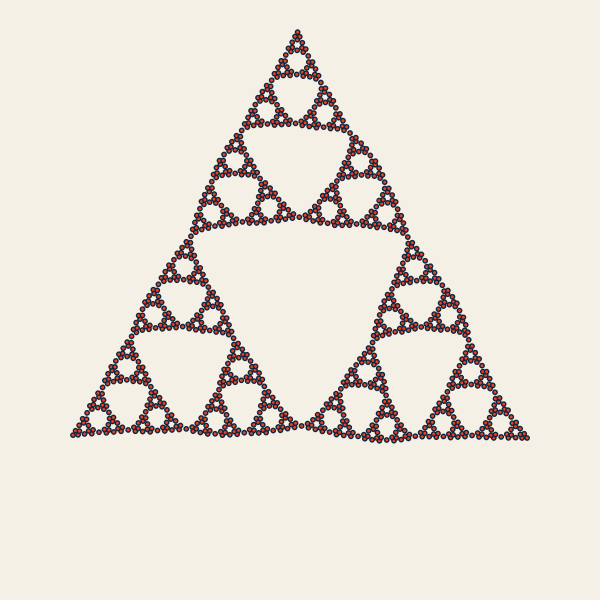
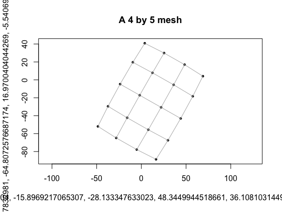

<!-- README.md is generated from README.Rmd. Please edit that file -->

# grip

**grip** draws graphs in two or three dimensions and helps you check how
well those drawings preserve connectivity and distances.

<p align="center">

<a href="https://pgajer.github.io/grip/articles/showcase-recipes.html#triangle-construction">

</a>
</p>

<p align="center">

<em>A completed Sierpinski triangle layout. Play the trace on the
website to see vertices introduced and refined.</em>
</p>

[Reproduce this
showcase](https://pgajer.github.io/grip/articles/showcase-recipes.html#triangle-construction)
· [Get
started](https://pgajer.github.io/grip/articles/grip-examples.html) ·
[Choose a
task](https://pgajer.github.io/grip/articles/function-guide.html) ·
[Explore the
gallery](https://pgajer.github.io/grip/articles/gallery.html)

Its primary unweighted and weighted workflows target 2D and 3D, while
opt-in weighted-GRIP, metric-MDS, and edge-KK workflows also support
higher-dimensional embeddings. The main workflow is:

- `grip(metric = "hop")` for topology-first layouts,
- `grip(metric = "edge_length")` when edge lengths define the graph
  metric,
- `compare.layouts()` and `score.layout()` for real-data layout
  selection,
- `trace.grip()` with the same metric choice for diagnostics.

The package also includes advanced public experimental geodesic-KK
utilities for weighted-layout scoring and polish. It builds on the GRIP
(Graph dRawing with Intelligent Placement) method described in [Gajer &
Kobourov (2002)](https://doi.org/10.7155/jgaa.00052) and [Gajer,
Goodrich & Kobourov
(2004)](https://doi.org/10.1016/j.comgeo.2004.03.014).

## Installation

### Released package

``` r
install.packages("grip")
```

The [CRAN package
page](https://cran.r-project.org/web/packages/grip/index.html) provides
the manual and vignettes for the released version. CRAN currently
provides **0.2.0**, with four guides. Its `metric.mds()` performs
classical scaling. This README and the package website describe
**development version 0.2.0.9001**, which adds the function and
synthetic-family guides and changes `metric.mds()` to raw-stress
minimization. Use `packageVersion("grip")` to check your installation
and read the [MDS migration
guide](https://pgajer.github.io/grip/reference/grip-mds-migration.html)
when moving to the development version.

### Development package

Installing from source requires R and a C++17 toolchain (Rtools on
Windows or command-line developer tools on macOS). For the package plus
offline guides, also install Pandoc and the vignette-building R
packages:

``` r
install.packages(c("remotes", "knitr", "rmarkdown"))
remotes::install_github("pgajer/grip", build_vignettes = TRUE)
```

For a smaller installation, omit vignette building and use the rendered
website guides:

``` r
remotes::install_github("pgajer/grip", build_vignettes = FALSE)
```

Vignette building is off by default in
[remotes](https://remotes.r-lib.org/reference/install_github.html). The
no-build route does not include the six offline guides. Optional viewers
and numerical backends are needed only for workflows that use them; for
example, install `smacof` to use `metric.mds(backend = "smacof")`. The
default native SGD backend does not require an additional runtime
package.

## Quick start

This small mesh gives an immediate first result. It is a smaller example
of graph drawing, not the level-6 construction shown above.

``` r
library(grip)
edges <- edges.mesh(4, 5)
coords <- grip(edges, n = 20, dim = 2, preset = "mesh", seed = 11)
plot.layout(coords, edges = edges, pch = 16, cex = 0.7,
            main = "A 4 by 5 mesh")
```



``` r
quality <- score.layout(coords, edges = edges, n = 20,
                        sample.size.stress = 200, stress.seed = 11,
                        edge.crossings = "never")
quality[, c("sampled.stress", "edge.length.cv")]
#>   sampled.stress edge.length.cv
#> 1      0.1376255     0.06182833
```

Sampled stress compares drawn separation with graph hop distances after
fitting a common scale; zero means exact agreement on the sampled pairs.
The edge-length coefficient of variation measures relative variation in
drawn edge lengths, useful here because the mesh is unweighted. Neither
number certifies recovery of a reference shape. Try `dim = 3` with
`plot.layout(coords, edges = edges, projection = "ortho")` for a static
3D view.

From R, start with `help("grip-package", package = "grip")` or
`vignette("grip-examples", package = "grip")` when installed guides are
available. The [function
guide](https://pgajer.github.io/grip/articles/function-guide.html)
explains graph conventions, score meanings, and the next workflow.

## Features

- Multiscale force-directed layout in 2D and 3D via C++ (Rcpp).
- A unified `grip()` interface for hop-metric and edge-length-metric
  layouts.
- Opt-in multiscale weighted layout in dimensions greater than 3 via
  `weighted.grip.nd()`, with higher-dimensional metric-MDS and edge-KK
  workflows available through `classical.mds()`, `metric.mds()`, and
  `edge.kk()`. `classical.mds()` uses classical scaling; `metric.mds()`
  minimizes raw distance stress through native SGD by default, with
  **smacof** available through `backend = "smacof"`. In versions through
  0.2.0, `metric.mds()` performed classical scaling: use
  `classical.mds()` to preserve that behavior. Edge-KK defaults to
  `init = "classical_mds"`; explicit `init = "metric_mds"` now requests
  stress minimization.
- Layout comparison and quality scoring across seeds and parameter
  settings (`compare.layouts()`, `score.layout()`).
- Multiscale trace diagnostics for both metrics via `trace.grip()`.
- Advanced public experimental geodesic-KK utilities for weighted-layout
  scoring and polish (`prepare.geodesic.kk()`, `score.geodesic.kk()`,
  `prepare.landmark.geodesic.kk()`, `score.landmark.geodesic.kk()`).
- Synthetic graph-family helpers for benchmark and geometry-rich
  examples.
- Handles disconnected graphs automatically (component packing).
- Tuned presets for common graph families (see table below).
- Static 3D projection for vignettes and reports
  (`plot.layout(projection = "ortho")`, `project.3d()`).

## Presets

| Family | Preset | Tuned on |
|:---|:---|:---|
| Rectangular grid or lattice | `preset = "mesh"` | `8x8` and `12x12` meshes |
| Sierpinski carpet | `preset = "carpet"` | Level 3 and 4 carpets |
| Tree-like graph | `preset = "tree"` | Binary trees, depths 5 and 6 |
| 3D torus or cylinder | `preset = "torus"` | Torus sizes `8x8` through `20x20` |

Presets set sensible defaults for the GRIP parameters. Any explicit
argument you pass overrides the preset value.

## Choosing a workflow

- Start with `grip(metric = "hop")`, the default, when topology should
  define the multiscale hierarchy and graph neighborhoods.
- Use `grip(metric = "edge_length")` when positive edge lengths should
  also define shortest-path distances, hierarchy construction,
  neighborhoods, and insertion anchors.
- Use `compare.layouts()` and `score.layout()` when the graph is
  important enough to justify a candidate shortlist rather than a single
  run.
- Use `trace.grip()` with the corresponding `metric` when you need to
  diagnose how a solve evolved.
- Add GKK/LGKK only after you already have weighted candidate layouts
  and need geodesic-aware scoring or polish; these are advanced public
  experimental tools rather than the default starting point.

The historical argument names `edge_weights` and `weight_list` represent
positive edge **lengths**, not connection strengths. With
`metric = "hop"`, supplied lengths set adjacent-edge force targets while
standard GRIP hierarchy and neighborhood searches still count hops. With
`metric = "edge_length"`, the lengths also define weighted shortest
paths throughout the multiscale engine and are median-normalized by
default. See `?grip` for the complete semantics and normalization
options.

## Gallery

The [showcase
recipes](https://pgajer.github.io/grip/articles/showcase-recipes.html)
provide construction traces for the triangle and carpet, plus
synchronized saddle rotations. The website uses still previews with
explicit playback controls; the README links to those controls. The
Sierpinski traces show algorithm steps. The saddle displays rotate saved
coordinates, not solver iterations; their frozen fitting provenance is
described alongside the recipe.

Graph-path fidelity, straight-line separation, and agreement with
reference coordinates measure different aspects of a drawing. See
[Choose a
score](https://pgajer.github.io/grip/articles/function-guide.html#choose-a-score)
before interpreting a visual comparison.

## More examples

**Edge-list input (2D, circle placement)**

``` r
edges <- edges.cycle(18)
coords <- grip(edges, n = 18, dim = 2, placement = "circle", seed = 2)
plot.layout(coords, edges, pch = 16, cex = 0.7)
```

**Edge-length-metric adjacency list (geometry-aware)**

``` r
adj_list <- list(c(2), c(1, 3), c(2, 4), c(3))
weight_list <- list(c(1.0), c(1.0, 2.0), c(2.0, 1.5), c(1.5))
coords <- grip(
  adj_list = adj_list, weight_list = weight_list,
  metric = "edge_length", n = 4, dim = 2, seed = 12
)
plot.layout(coords)
```

**3D layout with static projection**

``` r
edges <- edges.torus(8, 12)
coords <- grip(edges, n = max(edges), dim = 3, preset = "torus", seed = 3)
plot.layout(coords, edges, projection = "ortho", main = "Torus (8x12)")
```

## Layout comparison

For real-world graphs without a known target layout, `compare.layouts()`
compares candidates across seeds and reports quality metrics. Use
`params.from.summary()` to extract the winning parameters for reuse.

``` r
edges <- edges.mesh(10, 10)
cmp <- compare.layouts(edges, n = 100, dim = 2,
                            candidates = c("default", "mesh"),
                            seeds = 1:3)
cmp$summary[, c("candidate", "score.composite", "sampled.stress.mean")]
```

## Documentation

A development installation built with vignettes contains seven guides,
listed by `vignette(package = "grip")`:

- **Finding your way around grip** — a task-oriented function catalog,
  metric and score choices, and detailed help. Open with
  `vignette("function-guide", package = "grip")`.
- **Graph examples** — generated graphs and application datasets with
  interactive 3D MDS and edge-KK views. Open with
  `vignette("synthetic-graph-families", package = "grip")`.
- **Comparing SGD and SMACOF for metric MDS** — stress and timing
  comparisons on synthetic clouds and weighted graphs. Open with
  `vignette("metric-mds-backends", package = "grip")`.
- **Getting Started with grip** — the shortest path through the default
  unweighted workflow, with guidance on when to switch to weighted,
  trace, or comparison workflows.
- **Weighted Graph Layouts with grip** — geometry-aware layouts,
  geodesic scoring, and 2D-versus-3D decisions for weighted graphs.
- **Choosing Layouts for Real Data** — a step-by-step workflow using the
  Zachary karate club and Krackhardt kite examples, plus a larger
  weighted HMP/U01 case study.
- **Tracing and Diagnosing Layouts** — frame-by-frame tracing for
  understanding how a solve evolves.

The pkgdown site also includes companion articles such as the
interactive explorer guide, the HMP/U01 object-structure note, the
comparison article, and the synthetic-family gallery.

The geodesic-KK helpers are public and documented in the reference
index, but they are intentionally positioned as advanced experimental
tools layered on top of the main weighted workflow.

## Citation

If you use **grip** in published work, please cite the underlying
algorithm:

> Gajer, P. and Kobourov, S.G. (2002). GRIP: Graph dRawing with
> Intelligent Placement. *Journal of Graph Algorithms and Applications*,
> 6(3), 203–224. doi:
> [10.7155/jgaa.00052](https://doi.org/10.7155/jgaa.00052)

> Gajer, P., Goodrich, M.T. and Kobourov, S.G. (2004). A
> multi-dimensional approach to force-directed layouts of large graphs.
> *Computational Geometry*, 29(1), 3–18. doi:
> [10.1016/j.comgeo.2004.03.014](https://doi.org/10.1016/j.comgeo.2004.03.014)

## License

GPL (\>= 3)

## Development

The [developer
map](https://github.com/pgajer/grip/blob/main/dev/ARCHITECTURE.md)
traces graph validation, preparation, engines, results, and displays,
and lists source regeneration and full-dependency checks. The public
workflow remains `grip()` → `layout.coords()` → `plot.layout()` /
`score.layout()`.
