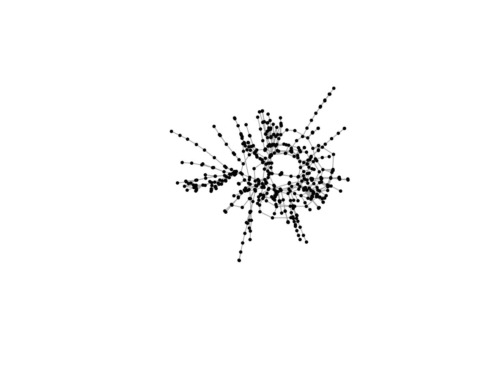
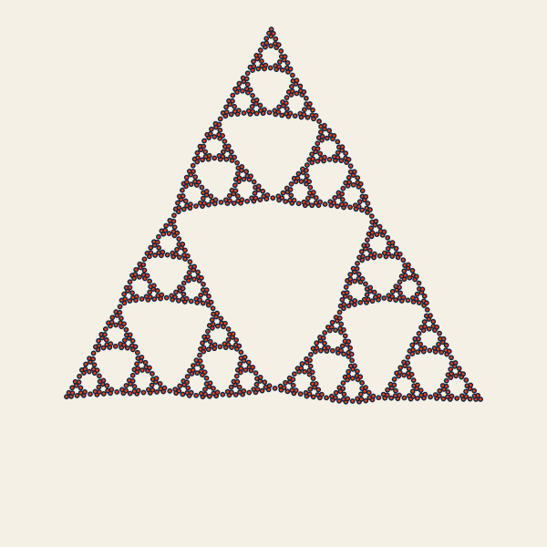

<!-- README.md is generated from README.Rmd. Please edit that file -->

# grip

**grip** embeds graphs in Euclidean space and helps assess how well the
resulting coordinates preserve graph distances and local structure.

Start with **metric multidimensional scaling (MDS) using stochastic
gradient descent (SGD)**. Use full metric MDS when pairwise graph
distances are affordable, and sparse metric MDS for larger problems.
Targets can be unweighted hop distances or shortest-path distances
defined by positive edge lengths.

The package also provides classical MDS, multiscale GRIP layouts,
alternative optimization methods, and tools for comparing and
visualizing embeddings. Use 2D or 3D for visualization; metric MDS also
supports higher dimensions.

[Get started](https://pgajer.github.io/grip/articles/grip-examples.html)
· [Choose a
task](https://pgajer.github.io/grip/articles/function-guide.html) ·
[Sparse
MDS](https://pgajer.github.io/grip/articles/sparse-metric-mds.html) ·
[Explore the
gallery](https://pgajer.github.io/grip/articles/gallery.html)

## Installation

Install from GitHub to use the workflows below. Building from source
requires R and a C++17 toolchain (Rtools on Windows or command-line
developer tools on macOS).

``` r
install.packages("remotes")
remotes::install_github("pgajer/grip", build_vignettes = FALSE)
```

Use the online guides, or install Pandoc, `knitr`, and `rmarkdown` and
set `build_vignettes = TRUE` for offline guides. List available
installed guides with `vignette(package = "grip")`.

The native SGD backend needs no additional runtime package. Optional
viewers and numerical backends are needed only for workflows that use
them; install `smacof` to use `metric.mds(backend = "smacof")`.

## First embedding

Draw a 494-vertex power network from the SuiteSparse Matrix Collection.
The graph is bundled with grip: no download or matrix conversion is
needed. Edges come from the matrix’s nonzero off-diagonal pattern and
have unit length; matrix coefficients are not used as distances. Targets
are shortest-path hop counts.

``` r
library(grip)
data(zheng.graphs)
g <- zheng.graphs[["494_bus"]]

fit <- metric.mds(
  edges = g$edges, n = g$n, dim = 3,
  backend = "sgd", seed = 11
)
#> Warning: Selected metric.mds() start terminated with iteration_limit; inspect
#> metadata$starts
coords <- fit$coords
edges <- g$edges
plot.layout(fit$coords, edges = g$edges, projection = "ortho")
```



[Rotate and explore the power
network](https://pgajer.github.io/grip/articles/graph-gallery-more.html#graph-494_bus)
in the interactive gallery (its saved fits have their own stated
settings). For an interactive view of this exact fit in R:

``` r
ivue::plot3D.plain(fit$coords,
  layers = list(ivue::layer3D.edges(g$edges)))
```

This is an embedding of network connectivity, not a geographic map of
the power system. Inspect `fit$metadata$starts`: an iteration-limit
warning means coordinates were returned without meeting the stopping
criterion. A returned embedding does not establish convergence or an
optimum.

## Choosing a workflow

| Task | Starting point |
|:---|:---|
| Fit unweighted or weighted graph distances | `metric.mds(..., backend = "sgd")` |
| Avoid a full pairwise distance matrix | `metric.mds(..., backend = "sgd", approximation = "sparse")` |
| Assess an embedding | `score.layout()` and the diagnostics relevant to the application |
| Compare optimization methods | SGD versus `backend = "smacof"`, on the same full-MDS targets and weights |
| Explore alternative layouts | Classical MDS or multiscale GRIP; see below |

### Weighted graph distances

Supply positive edge **lengths**, not connection strengths. Full MDS
uses shortest paths computed from these lengths.

``` r
weighted.edges <- cbind(1:3, 2:4)
weighted.fit <- metric.mds(
  edges = weighted.edges, n = 4, edge.weights = c(1, 2, 1.5),
  dim = 2, backend = "sgd", seed = 12, diagnostics = FALSE
)
#> Warning: Selected metric.mds() start terminated with iteration_limit; inspect
#> metadata$starts
```

### Sparse MDS for larger graphs

Sparse mode retains graph edges and represents longer-range influences
using selected vertices called **pivots**. Pass graph inputs directly
rather than preparing a dense distance matrix first.

``` r
large.edges <- edges.mesh(20, 20)
sparse.fit <- metric.mds(
  edges = large.edges, n = 400, dim = 3,
  backend = "sgd", approximation = "sparse", seed = 3,
  sparse.control = list(n.pivots = 32), max.iter = 100
)
```

This modest example demonstrates the API; it is not a threshold for
switching to sparse mode. Choose according to graph size, memory and
accuracy needs. More pivots cost more and do not guarantee improvement
in every run.

Sparse mode currently requires a connected graph, uses inverse-squared
stress weights, and supports SGD only. Its fitted proxy stress is not
directly comparable with full-MDS stress. For weighted graphs, a
supplied edge longer than an alternative route can also have a different
target in sparse and full MDS. See the [sparse
guide](https://pgajer.github.io/grip/articles/sparse-metric-mds.html)
for constraints, diagnostics and measured examples.

## Assess the result

Evaluate the aspect of geometry that matters to the application, rather
than choosing a drawing by appearance alone.

``` r
quality <- score.layout(coords, edges = edges, n = g$n,
                        sample.size.stress = 200, stress.seed = 11,
                        edge.crossings = "never")
quality[, c("sampled.stress", "edge.length.cv")]
#>   sampled.stress edge.length.cv
#> 1      0.1258268      0.3295209
```

Sampled stress compares drawn separations with graph hop distances after
fitting a common scale; zero means exact agreement on the sampled pairs.
The edge-length coefficient of variation measures relative variation in
drawn edge lengths, useful here because the graph is unweighted. Neither
measure certifies recovery of a reference shape, and this assessment
stress need not match the optimizer’s weighted objective.

For method comparisons, hold graph inputs, target distances and
evaluation pairs fixed where applicable. Report seeds and computational
budgets. For sparse MDS, evaluate against independently selected
shortest-path targets rather than comparing sparse proxy values across
pivot counts.

Do not append edge-KK automatically. It changes the fitting objective;
retain an additional refinement only when its diagnostics support the
intended use. See [Choose a
score](https://pgajer.github.io/grip/articles/function-guide.html#choose-a-score).

## Other layout methods

- `classical.mds()` performs classical scaling.
- `metric.mds(backend = "smacof")` provides an alternative full-MDS
  optimizer.
- `grip(metric = "hop")` and `grip(metric = "edge_length")` provide
  multiscale GRIP layouts. `weighted.grip.nd()` supports
  higher-dimensional weighted GRIP.
- `trace.grip()` records the GRIP construction process.
- `edge.kk()` provides optional edge-length refinement. Geodesic-KK
  helpers are advanced experimental tools; consult their individual
  references.

GRIP presets (`"mesh"`, `"carpet"`, `"tree"`, `"torus"`) configure that
algorithm, not metric MDS. For GRIP specifically, `metric = "hop"` uses
hops for hierarchy and neighborhoods; `metric = "edge_length"` uses
supplied positive lengths throughout its weighted shortest-path
hierarchy. See [the function
guide](https://pgajer.github.io/grip/articles/function-guide.html).

### Comparing GRIP presets

`compare.layouts()` can compare GRIP candidates across seeds. The
example below compares GRIP presets; it does not compare SGD, sparse MDS
and GRIP.

``` r
comparison.edges <- edges.mesh(4, 5)
cmp <- compare.layouts(comparison.edges, n = 20, dim = 2,
                       candidates = c("default", "mesh"), seeds = 1:3)
cmp$summary[, c("candidate", "score.composite", "sampled.stress.mean")]
```

## Gallery

<p align="center">

<a href="https://pgajer.github.io/grip/articles/showcase-recipes.html#triangle-construction">

</a>
</p>

<p align="center">

<em>A completed Sierpinski triangle layout. Play the trace on the
website to see vertices introduced and refined.</em>
</p>

This construction animation illustrates GRIP, an alternative method in
the package. The [showcase
recipes](https://pgajer.github.io/grip/articles/showcase-recipes.html)
also include carpet traces and saddle rotations. Construction traces
show algorithm steps; rotations show saved coordinates. Each example
retains its actual fitting provenance.

## Documentation

Start with `help("grip-package", package = "grip")`, the
[getting-started
guide](https://pgajer.github.io/grip/articles/grip-examples.html), or
the [function
guide](https://pgajer.github.io/grip/articles/function-guide.html).

- [Metric MDS backends and stress
  weighting](https://pgajer.github.io/grip/articles/metric-mds-backends.html).
- [Sparse SGD for larger
  graphs](https://pgajer.github.io/grip/articles/sparse-metric-mds.html).
- [Choosing layouts for real
  data](https://pgajer.github.io/grip/articles/grip-real-data.html).
- [Synthetic graph examples and
  comparisons](https://pgajer.github.io/grip/articles/synthetic-graph-families.html).
- [Weighted GRIP
  alternatives](https://pgajer.github.io/grip/articles/weighted-grip-intro.html).

Use `vignette(package = "grip")` to discover offline guides in an
installation built with vignettes. The website includes additional
articles and galleries.

## Citation

Use `citation("grip")` for the package citation, and cite the methods
used in your analysis. Relevant algorithm references include:

- **SGD stress minimization:** Zheng, Pawar and Goodman (2018), [Graph
  Drawing by Stochastic Gradient
  Descent](https://doi.org/10.1109/TVCG.2018.2859997).
- **Sparse stress model:** Ortmann, Klimenta and Brandes (2017), [A
  Sparse Stress Model](https://doi.org/10.7155/jgaa.00440).
- **GRIP layouts:** Gajer and Kobourov (2002), [GRIP: Graph dRawing with
  Intelligent Placement](https://doi.org/10.7155/jgaa.00052), and Gajer,
  Goodrich and Kobourov (2004), [A multi-dimensional approach to
  force-directed layouts of large
  graphs](https://doi.org/10.1016/j.comgeo.2004.03.014).

## License

GPL (\>= 3)

## Development

The [developer
map](https://github.com/pgajer/grip/blob/main/dev/ARCHITECTURE.md)
traces graph validation, preparation, engines, results, and displays,
and lists source regeneration and full-dependency checks. The
recommended embedding workflow is `metric.mds()` → `fit$coords` →
visualization and independent assessment.
