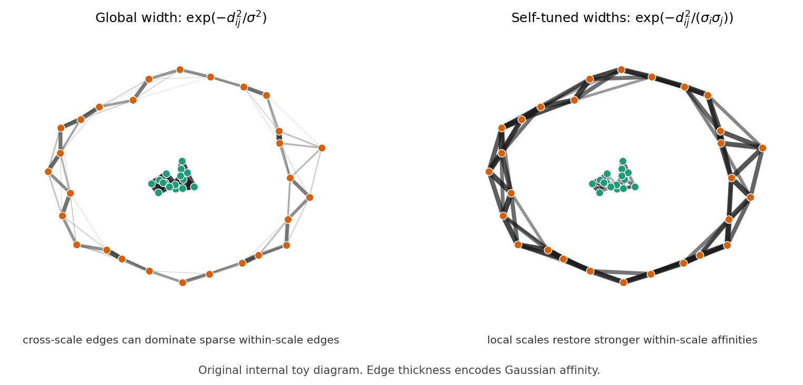

# Paper Review: Self-Tuning Spectral Clustering

Paper: Zelnik-Manor, Lihi and Pietro Perona. "Self-Tuning Spectral Clustering." NeurIPS, 2004.
Reviewer: Reviewer-P01
Auditor: Auditor-P01
Status: revised after audit
Date: 2026-05-15
Source manifest ID: P01
Canonical reading copy: `sources/pdf/P01_zelnik_manor_perona_self_tuning_spectral_clustering.pdf`

## Whole-Paper Review

### Reader Background Needed

- [contextual] Basic graph terminology: weighted affinity matrix, degree matrix, normalized graph adjacency/Laplacian conventions, and the meaning of an edge weight as an affinity or conductance-like coupling.
- [contextual] Gaussian/RBF kernels: a distance \(d(s_i,s_j)\) is converted to a similarity by \(\exp(-d^2/\sigma^2)\), and the bandwidth \(\sigma\) determines which distances count as "near."
- [contextual] Spectral clustering: build a graph on data points, compute leading eigenvectors of a normalized affinity operator, embed each data point as a row of the eigenvector matrix, and cluster those rows.
- [contextual] The Ng-Jordan-Weiss (NJW) algorithm: the paper explicitly builds on the normalized affinity matrix \(L=D^{-1/2}AD^{-1/2}\), row-normalized eigenvector coordinates, and a final \(k\)-means step (Section 1.1, pp. 1-2).
- [contextual] Eigenvalue multiplicity and block diagonal matrices: if a graph has disconnected cluster blocks, leading eigenvectors can be supported on individual blocks, but repeated eigenvalues allow arbitrary rotations of the eigenspace.
- [contextual] Nearest-neighbor distances: the local scale \(\sigma_i\) is chosen as a distance from point \(s_i\) to its \(K\)th neighbor (Eq. (2), p. 3).

### What A Non-Expert Should Understand Before Reading This Paper

[contextual] The paper asks how to make spectral clustering less hand-tuned. Standard spectral clustering needs a single Gaussian scale \(\sigma\): if \(\sigma\) is too small, many points look disconnected; if it is too large, separate structures blur together. A single global \(\sigma\) is especially fragile when one cluster is dense and another is sparse.

[explicit] Zelnik-Manor and Perona's main kernel idea is to give every point its own scale \(\sigma_i\), estimated from its local neighborhood, and to use the product \(\sigma_i\sigma_j\) in the Gaussian affinity between points \(i\) and \(j\) (Section 2, Eq. (1), p. 3). A point in a tight region gets a small scale; a point in a sparse region gets a large scale. The product makes the edge weight depend on both endpoints' local sampling density.

[explicit] The second idea is to estimate the number of clusters by rotating leading eigenvectors until their rows align as much as possible with coordinate axes (Section 3.2, Eq. (3), p. 5), then select the largest cluster number with minimal alignment cost (Section 4, step 7, p. 6). This is meant to replace both manual choice of the number of groups and the random final \(k\)-means stage.

### Problem And Context

[explicit] The paper identifies four open issues in spectral clustering: choosing an appropriate analysis scale, handling multi-scale data, clustering in irregular background clutter, and automatically finding the number of groups (Abstract, p. 1; Introduction, p. 1).

[explicit] The authors position their work as an extension of NJW spectral clustering, not as a new continuum graph-Laplacian convergence theory. Section 1.1 reviews NJW's affinity construction, normalized affinity operator, leading eigenvectors, row normalization, and \(k\)-means clustering (pp. 1-2).

[explicit] Figure 1 (p. 2) demonstrates the failure mode that motivates local scaling: different synthetic point sets need different optimal global \(\sigma\), and even the best global \(\sigma\) can fail on multi-scale data.

### Main Method

[explicit] The method modifies NJW by replacing the global Gaussian affinity matrix \(A\) with a locally scaled affinity matrix \(\hat A\) (Section 2, Eq. (1), p. 3; Section 4, steps 1-3, p. 6).

[explicit] The local scale for point \(s_i\) is \(\sigma_i=d(s_i,s_K)\), where \(s_K\) is the \(K\)th neighbor of \(s_i\) (Eq. (2), p. 3). The experiments use \(K=7\) (p. 3).

[explicit] After building \(L=D^{-1/2}\hat A D^{-1/2}\), the algorithm computes the top \(C\) eigenvectors for a chosen maximum possible group number \(C\), incrementally rotates them, grades candidate group numbers by alignment cost, selects \(C_{\text{best}}\), and assigns labels by non-maximum suppression on \(Z=XR\) (Section 4, steps 4-9, p. 6).

[derived] In graph-conductance language, \(\hat A_{ij}\) can be read as the edge conductance or edge weight used by the normalized graph operator, but the paper itself uses "affinity" rather than "conductance" and does not develop an electrical-network interpretation.

### Main Formulas And Operators

- [explicit] Standard NJW global Gaussian affinity, Section 1.1 step 1, pp. 1-2:
  \[
  A_{ij}=\exp\left(-\frac{d^2(s_i,s_j)}{\sigma^2}\right),\quad i\ne j,\qquad A_{ii}=0.
  \]
- [explicit] Degree and normalized affinity, Section 1.1 step 2, p. 2:
  \[
  D_{ii}=\sum_{j=1}^n A_{ij},\qquad L=D^{-1/2}AD^{-1/2}.
  \]
- [explicit] Eigenvector matrix and NJW row normalization, Section 1.1 steps 4-5, p. 2:
  \[
  X=[x_1,\ldots,x_C]\in\mathbb R^{n\times C},\qquad
  Y_{ij}=X_{ij}\bigg/\left(\sum_j X_{ij}^2\right)^{1/2}.
  \]
- [explicit] Local "seen by endpoint" distances, Section 2, p. 3:
  \[
  \frac{d(s_i,s_j)}{\sigma_i},\qquad \frac{d(s_j,s_i)}{\sigma_j}.
  \]
  The authors generalize the earlier squared distance to
  \[
  \frac{d(s_i,s_j)d(s_j,s_i)}{\sigma_i\sigma_j}
  =\frac{d^2(s_i,s_j)}{\sigma_i\sigma_j}.
  \]
- [explicit] Self-tuned local-scale Gaussian affinity, Section 2, Eq. (1), p. 3:
  \[
  \hat A_{ij}=\exp\left(-\frac{d^2(s_i,s_j)}{\sigma_i\sigma_j}\right).
  \]
- [explicit] Local scale, Section 2, Eq. (2), p. 3:
  \[
  \sigma_i=d(s_i,s_K),
  \]
  where \(s_K\) is the \(K\)th neighbor of \(s_i\).
- [explicit] Locally scaled normalized affinity, Section 4 step 3, p. 6:
  \[
  D_{ii}=\sum_{j=1}^n \hat A_{ij},\qquad L=D^{-1/2}\hat A D^{-1/2}.
  \]
- [explicit] Eigenvector rotation setup, Section 3.2, p. 5:
  \[
  Z=XR,\qquad M_i=\max_j Z_{ij}.
  \]
- [explicit] Alignment cost, Section 3.2, Eq. (3), p. 5:
  \[
  J=\sum_{i=1}^n\sum_{j=1}^C\frac{Z_{ij}^2}{M_i^2}.
  \]
- [explicit] Final non-maximum assignment, Section 4 step 8, p. 6:
  \[
  s_i\mapsto c\quad\text{iff}\quad \max_j(Z_{ij}^2)=Z_{ic}^2.
  \]
- [explicit] Appendix A parameterizes \(R\) using Givens rotations and updates angles by
  \[
  \Theta_{k+1}=\Theta_k-\alpha\nabla J|_{\Theta=\Theta_k}
  \]
  (Appendix A, p. 8). The appendix also defines \(A^{(k)}_{ij}=\partial Z_{ij}/\partial\theta_k\) and sketches a local convergence condition for the step size \(\alpha\) (p. 8).

### Figures And Experiments

- [explicit] Figure 1 (p. 2) shows standard NJW clustering without local scaling. The top row demonstrates that different point sets require different global \(\sigma\) values; the bottom row applies different \(\sigma\) values to the same nested-ring point set, showing strong sensitivity to bandwidth.
- [explicit] Figure 2 (p. 3) is the most important conductance/kernel figure. Panel (a) shows a tight cluster inside a sparse background cluster. Panel (b) visualizes global-scale affinities; cross-cluster affinities can be larger than affinities within the sparse background. Panel (c) visualizes local scaling; cross-cluster affinities become weaker than within-cluster affinities.
- [explicit] Figure 3 (p. 4) shows synthetic clustering results using the Section 4 algorithm; the caption says the number of groups was found automatically.
- [explicit] Figure 4 (p. 4) plots the first ten eigenvalues of \(L\) for the top-row datasets in Figure 3. It supports the authors' argument that eigenvalue-gap heuristics are unreliable because the eigenvalue patterns differ across datasets.
- [explicit] Figure 5 (p. 6) plots alignment cost from Eq. (3) for varying group numbers for the top-row datasets in Figure 3. The red circle marks the selected number of groups, with near-ties up to 0.01% treated as the same value.
- [explicit] Figure 6 (p. 7) shows automatic intensity-based image segmentation results using the proposed algorithm. The text states that similar quality could be obtained without local scaling only by manually setting both \(\sigma\) and the number of groups differently for different images (Section 4, pp. 6-7).
- [uncertain] Figure 5's plotted costs are near zero, while Eq. (3) as printed has a per-row ideal contribution of 1 when a row has exactly one nonzero entry. The paper does not clearly state whether the plotted alignment score is shifted, normalized, or otherwise rescaled.

### Theoretical Claims

[explicit] In the ideal case where \(L\) is strictly block diagonal with blocks \(L^{(c)}\), the eigenvalues and eigenvectors of \(L\) are unions of the eigenvalues and padded eigenvectors of the blocks (Section 3.2, pp. 4-5, citing [6,5]).

[explicit] The authors state that the eigenvalue 1 is a repeated eigenvalue with multiplicity equal to the number of groups \(C\) in the ideal clustered case (Section 3.1, p. 4; Section 3.2, p. 5).

[explicit] Because the top eigenspace can be arbitrarily rotated when eigenvalues are repeated, the authors seek a rotation \(R\) such that rows of \(XR\) have a single nonzero entry (Section 3.2, p. 5).

[explicit] Appendix A claims convergence of the Givens-rotation gradient descent under a small-enough step size \(\alpha\), but the authors state they cannot give the full proof because of space and refer to Goyal and Vetterli [2] (Appendix A, p. 8).

[derived] The local-scale kernel is a heuristic adaptive-bandwidth graph construction, not a proven asymptotically unbiased Laplace-Beltrami estimator in this paper.

### Limitations And Scope

[explicit] The local scale estimate \(\sigma_i=d(s_i,s_K)\) is presented as a simple choice; the authors explicitly say it might be improved by using more informative local statistics (Discussion, p. 7).

[explicit] The alignment cost in Eq. (3) is described as "reasonable, but by no means the only possibility"; the authors mention row entropy as an alternative (Discussion, p. 7).

[explicit] The paper reports that automatic group-number estimation fails on one synthetic example in Figure 3, predicting 2 clusters instead of 3 for the right-most dataset in the bottom row (Section 3.2, p. 5).

[explicit] The high-dimensional experiments are not included because of space, even though the authors say \(K=7\) worked for them (Section 2, p. 3).

[derived] The method still requires selecting a maximum possible group number \(C\) before computing eigenvectors and evaluating candidate group numbers (Section 4 step 4, p. 6).

[uncertain] The paper's statement that \(K\) is independent of scale and a function of data dimension is plausible as a heuristic, but the paper gives no recipe for choosing \(K\) from dimension beyond the experimental choice \(K=7\) (Section 2, p. 3).

### Historical / Methodological Importance

[contextual] This paper is an early and widely cited source for the self-tuning or local-scaling Gaussian kernel
\(\exp[-d^2(s_i,s_j)/(\sigma_i\sigma_j)]\). In later graph-learning language, it is a prototype for adaptive-bandwidth affinity graphs.

[explicit] Methodologically, the paper's stated contribution is automation: local scale rather than global scale, data-estimated scale, and eigenvector rotation for sparse cluster indicators (Discussion, p. 7).

[derived] For a conductance/kernel review, P01 matters because it gives a simple symmetric edge-weight rule that increases effective affinity in sparse regions and decreases cross-scale leakage near dense structures, without changing the later normalized graph operator.

## Conductance / Kernel Extraction

### Conductance, Affinity, Or Kernel Formula(s)

1. [explicit] Global Gaussian affinity used in NJW baseline, Section 1.1 step 1, pp. 1-2:
   \[
   A_{ij}=\exp\left(-\frac{d^2(s_i,s_j)}{\sigma^2}\right),\quad i\ne j,\qquad A_{ii}=0.
   \]
   This is the baseline edge weight that depends on one global bandwidth.

2. [explicit] Endpoint-scaled distance product, Section 2, p. 3:
   \[
   \frac{d(s_i,s_j)d(s_j,s_i)}{\sigma_i\sigma_j}
   =\frac{d^2(s_i,s_j)}{\sigma_i\sigma_j}.
   \]
   This is the derivation step that makes the local-bandwidth kernel symmetric in \(i,j\).

3. [explicit] Self-tuned local-scale Gaussian affinity, Section 2, Eq. (1), p. 3:
   \[
   \hat A_{ij}=\exp\left(-\frac{d^2(s_i,s_j)}{\sigma_i\sigma_j}\right).
   \]
   This is the paper's central conductance/kernel formula.

4. [explicit] Local scale estimate, Section 2, Eq. (2), p. 3:
   \[
   \sigma_i=d(s_i,s_K),
   \]
   where \(s_K\) is the \(K\)th neighbor of \(s_i\). The experiments use \(K=7\).

5. [explicit] Diagonal convention for local affinity, Section 4 step 2, p. 6:
   \[
   \hat A_{ii}=0.
   \]

6. [derived] If interpreting graph weights as conductances for a graph smoother, the edge conductance would be \(c_{ij}=\hat A_{ij}\) for \(i\ne j\), with \(c_{ii}=0\). The paper itself does not use this conductance notation.

### Graph, Laplacian, Or Diffusion Operator

[explicit] The paper uses the symmetric normalized affinity
\[
L=D^{-1/2}AD^{-1/2}
\]
for the baseline NJW algorithm (Section 1.1 step 2, p. 2), and
\[
L=D^{-1/2}\hat A D^{-1/2}
\]
for the proposed local-scale algorithm (Section 4 step 3, p. 6).

[derived] This \(L\) is equivalent to a normalized adjacency/similarity operator. The paper calls it a normalized affinity matrix rather than a graph Laplacian. A Laplacian-style operator could be formed as \(I-L\), but that is not the operator the authors explicitly analyze or compute.

### Task

[explicit] The task is spectral clustering of point sets and intensity-based image segmentation (Abstract, p. 1; Figures 1-6, pp. 2-7).

[explicit] The algorithm also estimates the number of groups automatically and eliminates the random \(k\)-means stage in clean cases by using eigenvector rotation and non-maximum suppression (Section 4, p. 6).

### Explicit Author Motivations

- [explicit] Automate spectral clustering parameters: scale selection and number of groups (Abstract, p. 1; Discussion, p. 7).
- [explicit] Handle multi-scale data where no single global \(\sigma\) works well (Section 2, pp. 2-3; Figures 1-3, pp. 2-4).
- [explicit] Reduce sensitivity to irregular background clutter (Abstract, p. 1; Figure 2, p. 3).
- [explicit] Avoid repeated runs over many global \(\sigma\) values, which increases computation and still requires a manually chosen search range (Section 2, p. 2).
- [explicit] Avoid random \(k\)-means initialization after spectral embedding when the rotated eigenvectors are already axis-aligned (Section 4, p. 6).

### Derived Or Implied Motivations

[derived] The local-scale Gaussian is motivated by density equalization: distances in dense regions are judged against small local neighborhoods, and distances in sparse regions are judged against larger local neighborhoods. This makes sparse within-cluster edges less unfairly weak.

[derived] The product \(\sigma_i\sigma_j\) avoids an asymmetric affinity that would arise if only the source point's local scale were used.

[derived] The method can be read as a finite-sample graph construction heuristic: improve the edge-weight matrix before applying the same normalized spectral machinery.

### Effect On Eigenfunctions / Diffusion / Smoothing

[explicit] In ideal separated clusters, leading eigenvectors correspond to blocks/clusters, up to rotations in repeated eigenspaces (Section 3.2, pp. 4-5).

[explicit] The authors argue that eigenvalue magnitudes and gaps are unreliable for finding \(C\), because block eigenvalues depend on individual cluster structures (Section 3.1, p. 4; Figure 4, p. 4).

[derived] Local scaling changes the graph spectrum by changing affinities: cross-scale edges that might connect dense and sparse structures are weakened relative to sparse within-cluster edges, making the leading eigenspace more block-like.

[derived] For smoothing or diffusion, replacing \(A\) by \(\hat A\) would make diffusion locally adaptive: sparse regions can remain internally connected without forcing a global bandwidth so large that dense structures merge.

[uncertain] The paper does not analyze continuum limits, diffusion time, stationary distributions, or smoothing bias/variance under the local-scale kernel.

### Relationship To Adaptive-Scale Graph Construction

[explicit] P01 defines an adaptive scale per data point and inserts that scale into the Gaussian denominator as \(\sigma_i\sigma_j\) (Section 2, Eq. (1), p. 3).

[explicit] The authors estimate \(\sigma_i\) from the \(K\)th neighbor distance (Section 2, Eq. (2), p. 3).

[derived] This is a nearest-neighbor adaptive-bandwidth kernel. It adapts to sampling density while preserving a symmetric affinity matrix.

[derived] Compared with a fixed heat kernel, P01's kernel behaves as if the bandwidth is larger in sparse regions and smaller in dense regions.

### What The Paper Does Not Claim

- [explicit] It does not claim that \(\sigma_i=d(s_i,s_K)\) is the only or optimal local scale; the discussion explicitly says better estimates may be possible (p. 7).
- [explicit] It does not claim the Eq. (3) alignment cost is unique; the authors mention entropy of rows as another possibility (p. 7).
- [explicit] It does not provide the omitted high-dimensional experimental details (Section 2, p. 3).
- [derived] It does not derive a graph-Laplacian continuum limit, a variable-bandwidth diffusion limit, or a consistency theorem for regression/smoothing.
- [derived] It does not frame \(\hat A_{ij}\) as physical conductance; that translation is ours for comparing graph-weight choices.

### Relevance To gflow / SIMODS

[contextual] Current `fit.rdgraph.regression()` semantics should remain distinct from P01. The current method is an overlap-density/Riemannian-complex smoother, not a self-tuned Gaussian kernel over point distances.

[derived] P01 is relevant as a planned length/kernel-conductance comparator: one could define graph edge conductance by
\[
c_{ij}=\exp\left(-\frac{\ell_{ij}^2}{\sigma_i\sigma_j}\right)
\]
when a meaningful length \(\ell_{ij}\) or distance \(d(s_i,s_j)\) exists, with \(\sigma_i\) estimated from local neighbor lengths. This would be a new comparator, not a reinterpretation of the existing overlap-density smoother.

[derived] P01 suggests a practical design question for SIMODS/gflow: if graph edges have heterogeneous local sampling density, fixed global length scales may under-connect sparse regions or over-connect dense regions. A self-tuned comparator could test whether local bandwidths improve robustness.

[uncertain] The paper gives no direct guidance on simplicial/Riemannian-complex overlap density, regression targets, or graph signal smoothing objectives, so any transfer to gflow should be treated as an implementation-level comparator inspired by the kernel, not as a supported claim from P01.

## Figure Handling

### Copied Paper Figures Used

Reproduced cropped figure panels for Figures 1--6 are managed by `paper_figure_screenshots.yml` and embedded in the generated HTML memo next to the primary figure descriptions. These are internal-review cropped figure panels from the canonical reading copy, not manuscript-ready reused figures.

[explicit] Figure 2 (p. 3) remains the strongest candidate because it visually explains the local-scaling conductance mechanism. Figure 1 (p. 2) is the next most useful candidate because it documents global-\(\sigma\) sensitivity.

### Original Explanatory Figures Proposed Or Created

- `../figures/P01_self_tuned_kernel_toy.png`
  - [derived] Original internal toy diagram illustrating Eq. (1) against the global Gaussian baseline from Section 1.1.
  - It shows the same point cloud under a global-width Gaussian and the self-tuned \(\sigma_i\sigma_j\) Gaussian; edge thickness represents affinity/conductance-like weight.
  - Internal review only; not reproduced from the paper.

## Evidence Table

| Claim | Label | Source reference | Notes |
| --- | --- | --- | --- |
| Standard spectral clustering uses \(A_{ij}=\exp[-d^2(s_i,s_j)/\sigma^2]\), \(A_{ii}=0\). | explicit | Section 1.1 step 1, pp. 1-2 | Baseline NJW formula reviewed by the paper. |
| The normalized affinity operator is \(L=D^{-1/2}AD^{-1/2}\). | explicit | Section 1.1 step 2, p. 2 | Reused with \(\hat A\) in Section 4. |
| Global \(\sigma\) is highly sensitive and can fail on multi-scale data. | explicit | Section 2, p. 2; Figure 1, p. 2 | Authors show different optimal \(\sigma\) values and failures. |
| The self-tuned affinity is \(\hat A_{ij}=\exp[-d^2(s_i,s_j)/(\sigma_i\sigma_j)]\). | explicit | Section 2, Eq. (1), p. 3 | Central kernel/conductance formula. |
| The local scale is \(\sigma_i=d(s_i,s_K)\). | explicit | Section 2, Eq. (2), p. 3 | \(K=7\) used in experiments. |
| Local scaling lowers cross-cluster affinities relative to within-cluster affinities in the nested tight/sparse example. | explicit | Figure 2 caption and text, p. 3 | The figure is the clearest visual evidence. |
| The algorithm computes \(L=D^{-1/2}\hat A D^{-1/2}\). | explicit | Section 4 step 3, p. 6 | Proposed algorithm. |
| The top eigenspace can be arbitrarily rotated under repeated eigenvalues. | explicit | Section 3.2, p. 5 | Motivates rotation alignment. |
| The alignment cost is \(J=\sum_i\sum_j Z_{ij}^2/M_i^2\). | explicit | Section 3.2, Eq. (3), p. 5 | Possible plotting-scale ambiguity in Figure 5. |
| A point is assigned by \(\max_j(Z_{ij}^2)=Z_{ic}^2\). | explicit | Section 4 step 8, p. 6 | Non-maximum suppression replaces \(k\)-means in clean cases. |
| \(c_{ij}=\hat A_{ij}\) is a conductance interpretation suitable for graph-smoother comparisons. | derived | Derived from Eq. (1), p. 3 | The authors call it affinity, not conductance. |
| P01 does not analyze continuum graph-Laplacian convergence. | derived | Whole paper; especially Sections 2-5, pp. 2-7 | No convergence theorem for the local-scale kernel is provided. |
| Current `fit.rdgraph.regression()` overlap-density smoothing is separate from P01-style local-kernel conductance. | contextual | H005 execution plan; P01 Eq. (1) | Keep current implementation semantics distinct from planned comparators. |

## Open Questions For Auditor

1. Eq. (3) as printed has ideal rows contributing at least 1 to \(J\), but Figure 5 plots costs near 0. Should the review note that the plotted cost appears shifted or normalized, or should this be treated as an implementation detail outside the memo?
2. For SIMODS/gflow comparison, should P01 be grouped with "adaptive/self-tuned Gaussian kernels" only, or also cross-indexed under "nearest-neighbor local bandwidth selection"?
3. Should a final report include a reproduced copy of Figure 2 from the paper, or is the original toy figure sufficient for internal explanation?
4. If implementing a comparator, should \(\sigma_i\) be estimated from all point-cloud neighbors as in P01, or from graph-neighbor edge lengths only?

## Revision Notes

### Post-Audit Revision, 2026-05-15

- Auditor-P01 requested that the Eq. (3)/Figure 5 ambiguity be moved out of
  open questions. The main figure discussion now treats it as an `uncertain`
  source issue: Eq. (3), as printed, has an ideal per-row contribution of 1,
  while Figure 5 plots near-zero costs. The final synthesis should not infer a
  precise shifted or normalized score unless it is independently confirmed.
- Auditor-P01 requested a sharper cKNN distinction. P01 uses nearest-neighbor
  distances to set local bandwidths \(\sigma_i=d(s_i,s_K)\), but it does not
  define cKNN/adaptive graph support. Any connection to adaptive-radius or
  cKNN graph construction is contextual synthesis, not an explicit claim of
  Zelnik-Manor and Perona.

- 2026-05-15: Initial Reviewer-P01 memo drafted from the canonical eight-page PDF, including figure review and original internal toy figure.
