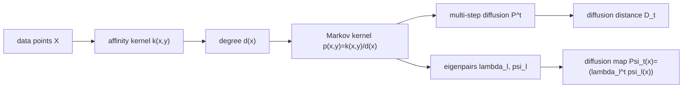

# Paper Review: Diffusion Maps

Paper: Coifman, Ronald R. and Lafon, Stephane. "Diffusion Maps." Applied and Computational Harmonic Analysis 21(1):5--30, 2006. DOI: 10.1016/j.acha.2006.04.006.
Reviewer: Reviewer-P03
Auditor: Auditor-P03
Status: revised after audit
Date: 2026-05-15
Source manifest ID: P03
Canonical reading copy: `literature/conductance_kernel_laplacian_review/sources/pdf/P03_coifman_lafon_diffusion_maps.pdf`

## Whole-Paper Review

### Reader Background Needed

A mathematically capable reader can follow the paper with the following prerequisites.

- Weighted graphs and kernels: a symmetric nonnegative kernel `k(x,y)` is a weighted adjacency/affinity function.
- Markov chains: row-normalization turns affinities into transition probabilities; powers of a transition matrix describe multi-step random walks.
- Spectral decomposition: eigenvalues/eigenvectors of a self-adjoint or reversible Markov operator describe slow and fast modes.
- Normalized graph Laplacians: a degree normalization converts edge weights into a diffusion operator; low eigenmodes are smooth with respect to the graph.
- Basic manifold learning: the data may be samples from a lower-dimensional manifold embedded in `R^n`.
- Heat kernels and Laplace-Beltrami operators: on a manifold, heat diffusion has eigenfunctions of the Laplacian and a time parameter that smooths/localizes functions.
- Density effects: when sampling is nonuniform, a graph Laplacian can mix the geometry of the support with the sampling density.
- Graph signal processing language: eigenvectors near eigenvalue 1 of a Markov operator, or near eigenvalue 0 of a Laplacian, are low-frequency graph signals.

### What A Non-Expert Should Understand Before Reading This Paper

The paper starts from a simple idea: if nearby or similar data points are joined by large weights, then a random walk on those weights can reveal the shape of the data. A one-step random walk is local. A many-step random walk accumulates many local transitions, so it measures whether two points are connected by many short paths, not merely whether their raw coordinates are close.

The authors call the resulting multi-step geometry "diffusion" geometry. Two points are close at diffusion time `t` if a random walk started from either point has nearly the same `t`-step distribution over the data. The main computational trick is spectral: instead of storing all powers of the Markov matrix, use eigenvalues and eigenvectors. Eigenvectors with large eigenvalues change slowly under diffusion and become coordinates of a low-dimensional embedding, the diffusion map.

The paper also warns that a graph built from Euclidean distances does not automatically recover manifold geometry. If samples are denser in one region than another, the graph degrees encode density as well as geometry. Section 3 introduces an `alpha` normalization that controls this density effect: `alpha = 0` keeps the classical normalized graph Laplacian behavior, `alpha = 1/2` matches a Fokker-Planck/Langevin interpretation, and `alpha = 1` removes sampling density to approximate the Laplace-Beltrami heat operator.

### Problem And Context

The paper addresses dimensionality reduction, parametrization, and structure discovery for data represented as a weighted graph or kernel space. It is positioned as a unifying framework for spectral clustering, ranking, and kernel eigenmap methods (Introduction, pp. 5--6; Section 2.7, pp. 12--13).

The central problem is how to turn local affinities into global coordinates and distances that respect connectivity. The authors argue that distances between far-apart points in the original feature space may be meaningless, but local similarities can be integrated by a Markov process into meaningful multiscale geometry (Introduction, p. 6; Section 2.2, pp. 7--9).

### Main Method

The method is:

1. Start with a symmetric, nonnegative kernel `k(x,y)` on a data space `(X,A,mu)`.
2. Compute the degree/volume function `d(x) = integral_X k(x,y) dmu(y)`.
3. Normalize rows to get a Markov transition kernel `p(x,y) = k(x,y) / d(x)`.
4. Study powers `P^t`, where `p_t(x,y)` is the probability of transition from `x` to `y` in `t` steps.
5. Use the eigenpairs `P psi_l = lambda_l psi_l` to define diffusion distance and diffusion map coordinates.
6. For Euclidean point clouds or manifold samples, optionally renormalize the kernel by an estimated density term before Markov normalization, using the `alpha` family in Section 3.1.

Simple pipeline diagram, original explanatory diagram:

### Main Formulas And Operators

- [explicit] Base kernel assumptions: `k : X x X -> R` is symmetric and positivity preserving, `k(x,y)=k(y,x)` and `k(x,y) >= 0` (Section 2.1, p. 7).
- [explicit] Degree/volume: `d(x) = integral_X k(x,y) dmu(y)` (Section 2.1, p. 7).
- [explicit] Markov kernel: `p(x,y) = k(x,y) / d(x)` and `integral_X p(x,y) dmu(y) = 1` (Section 2.1, p. 7).
- [explicit] Diffusion operator: `P f(x) = integral_X p(x,y) f(y) dmu(y)`; the paper says this preserves constants and is an averaging/diffusion operator (Section 2.1, p. 7). The PDF text extraction shows `a(x,y)` in this displayed formula, but the surrounding definition indicates `p(x,y)`.
- [explicit] Multi-step transition: `p_t(x,y)` is the kernel of `P^t`, the probability of transition from `x` to `y` in `t` steps (Section 2.2, p. 7).
- [explicit] Stationary distribution in the finite graph case: `pi(y) = d(y) / sum_z d(z)` (Section 2.3, p. 9).
- [explicit] Reversibility/detailed balance: `pi(x)p(x,y) = pi(y)p(y,x)` (Eq. 1, Section 2.3, p. 9).
- [explicit] Eigenpairs: under mild assumptions, `P psi_l = lambda_l psi_l`, with `1 = lambda_0 > |lambda_1| >= |lambda_2| >= ...` (Section 2.3, p. 9).
- [explicit] Diffusion distance:
  `D_t(x,y)^2 = integral_X (p_t(x,u) - p_t(y,u))^2 dmu(u)/pi(u)` (Section 2.4, pp. 9--10).
- [explicit] Spectral diffusion distance:
  `D_t(x,y) = [sum_{l>=1} lambda_l^{2t} (psi_l(x)-psi_l(y))^2]^{1/2}` (Section 2.4, p. 10; Appendix A, Eq. A.1 and following derivation, p. 21).
- [explicit] Truncated diffusion map:
  `Psi_t(x) = (lambda_1^t psi_1(x), ..., lambda_s^t psi_s(x))`, where `s=s(delta,t)` keeps modes satisfying `|lambda_l|^t > delta |lambda_1|^t` (Section 2.4, p. 10).
- [explicit] Proposition 1: Euclidean distance in diffusion map space equals diffusion distance up to the truncation accuracy (Section 2.4, p. 10).
- [explicit] Appendix A symmetrization: conjugating by `sqrt(pi)` gives a symmetric kernel `a(x,y) = sqrt(pi(x)/pi(y)) p(x,y) = k(x,y)/(sqrt(pi(x)) sqrt(pi(y)))`, enabling self-adjoint spectral theory (Appendix A, p. 21).

### Figures And Experiments

- [explicit] Figure 1, p. 8, Section 2.2: three Gaussian clusters are diffused at `t=8`, `t=64`, and `t=1024`. The left panels color points by diffusion intensity from one source point; the right panels show `P^8`, `P^64`, and `P^1024`. The figure demonstrates that powers of `P` merge structures across increasing scale: three clusters at small time, two at intermediate time, and one stationary/rank-one structure at large time. This is the clearest visual explanation of diffusion time as scale.
- [explicit] Figure 2, p. 11, Section 2.5: images of the text "3D" under varying viewing angles are reorganized by the first two nontrivial eigenvectors `psi_1` and `psi_2`. It shows eigenvectors functioning as coordinates that recover latent parameters.
- [explicit] Figure 3, p. 12, Section 2.6: spectra of `P`, `P^2`, `P^4`, `P^8`, and `P^16` show that numerical rank decreases as diffusion time increases. This is the main figure for graph low-pass smoothing: raising eigenvalues to power `t` damps smaller modes and preserves large-eigenvalue, slowly varying modes.
- [explicit] Figure 4, p. 16, Section 3.4: for nonuniformly sampled curves, columns show original curves, point densities, embeddings using graph Laplacian normalization (`alpha=0`), and embeddings using the Laplace-Beltrami approximation (`alpha=1`). The `alpha=1` embedding recovers a circle and arclength parametrization; `alpha=0` introduces density-induced corners.
- [explicit] Figure 5, p. 18, Section 4: a directed/function-driven diffusion on the sphere converts an oscillatory function `f(phi,theta)=sin(12 theta)` into a first nontrivial eigenfunction `phi_1(phi,theta)=cos(theta)` that is constant along level-set directions and smoother across the sphere.
- [explicit] Figure 6, p. 19, Section 5: a noisy helix is embedded as a circle using diffusion coordinates, illustrating robustness of diffusion distances, maps, and eigenfunctions to perturbations when scale is larger than noise.
- [contextual] Figures B.1 and B.2, pp. 22 and 26, Appendix B: local coordinate diagrams used in the asymptotic proof for manifold kernels and boundary behavior. They support the convergence analysis rather than the data-analysis algorithm.

### Theoretical Claims

- [explicit] A reversible Markov chain can be constructed from a symmetric nonnegative kernel using normalized graph Laplacian row normalization (Section 2.1, p. 7).
- [explicit] The diffusion distance is a metric when the full eigenvector expansion is used (Section 2.4, p. 10).
- [explicit] Diffusion maps preserve diffusion distances in Euclidean coordinates up to the truncation tolerance (Proposition 1, Section 2.4, p. 10).
- [explicit] Low-dimensionality comes from eigenvalue decay: for larger `t`, `lambda_l^t` suppresses modes with smaller magnitude eigenvalues (Section 2.5, p. 11; Figure 3, p. 12).
- [explicit] For manifold data, the `alpha`-normalized family has infinitesimal generator
  `L_{epsilon,alpha} = (I - P_{epsilon,alpha})/epsilon` and, on low Laplace-Beltrami eigenspaces, converges to
  `Delta(f q^{1-alpha})/q^{1-alpha} - [Delta(q^{1-alpha})/q^{1-alpha}] f`
  (Theorem 2, Section 3.1, p. 15).
- [explicit] For `alpha=0`, the classical normalized graph Laplacian on isotropic weights has a density-dependent potential term `Delta q / q` unless density is uniform (Section 3.2, p. 15).
- [explicit] For `alpha=1/2`, the limiting operator is connected to the forward Fokker-Planck equation and Langevin equation `dot{x} = -grad U(x) + sqrt(2) dot{w}` with `q=e^{-U}` (Section 3.3, Eq. 2, pp. 15--16).
- [explicit] For `alpha=1`, `L_{epsilon,1}` converges to the Laplace-Beltrami operator and `P_{epsilon,1}^{t/epsilon}` approximates the Neumann heat kernel `e^{-t Delta}` (Proposition 3, Section 3.4, p. 16; Proposition 11, Appendix B, p. 29).
- [explicit] Finite-sample approximation error depends on sample size, scale, and intrinsic dimension; the paper reports high-probability rates for approximating `P_{epsilon,alpha}` and `L_{epsilon,alpha}` (Section 5, p. 18) and states Criterion 4 (p. 19).
- [explicit] Perturbation robustness requires `sqrt(epsilon)` to remain larger than the perturbation size (Eq. 3 and Criterion 5, Section 5, p. 19).

### Limitations And Scope

- [explicit] The base construction requires a choice of kernel; the paper emphasizes that the kernel encodes the prior local geometry and should be application-guided (Section 2.1, p. 7).
- [explicit] Spectral theory is justified under reversibility and additional compactness/finite-graph assumptions (Section 2.3, p. 9; Appendix A, p. 21).
- [explicit] The manifold convergence analysis assumes smooth compact manifolds and small-scale asymptotics (Appendix B, pp. 21--29).
- [explicit] Finite-sample accuracy has unfavorable dependence on intrinsic dimension and scale; Criterion 4 states that sample size must grow quickly as `epsilon` shrinks (Section 5, p. 19).
- [explicit] Noise robustness is scale-limited; Criterion 5 requires the diffusion scale `sqrt(epsilon)` to exceed the perturbation size (Section 5, p. 19).
- [uncertain] Section 3.4 begins "Finally, when alpha = 0" but the heading, Proposition 3, and subsequent text all concern `alpha = 1`; this appears to be a typographical error in the paper (p. 16).

### Historical / Methodological Importance

This is a foundational paper because it reinterprets several spectral graph and kernel eigenmap methods as Markov diffusion geometry. It gives three durable ideas:

1. Eigenvectors of a Markov matrix are coordinates, not just clustering/ranking tools.
2. Diffusion time is a scale parameter, with `P^t` acting as a multiscale low-pass operator.
3. Density normalization is not a detail: different normalizations recover different limiting operators.

For the conductance/kernel Laplacian review, the paper is especially important because it clarifies how affinity weights become transition probabilities, how those probabilities determine smooth eigenvectors, and how density normalization changes the object being smoothed.

## Conductance / Kernel Extraction

### Conductance, Affinity, Or Kernel Formula(s)

- [explicit] General affinity kernel: `k(x,y)` symmetric and nonnegative (Section 2.1, p. 7). This is the paper's generic "conductance-like" edge weight. The paper does not use the word conductance for it.
- [explicit] Gaussian example in Figure 1: weights `exp(-||x_i-x_j||^2 / epsilon)` with `epsilon = 0.7` (Section 2.2, p. 8).
- [explicit] Isotropic Euclidean kernel: `k_epsilon(x,y) = h(||x-y||^2 / epsilon)` (Section 3.1, p. 14; Appendix B, p. 23).
- [explicit] Density estimate: `q_epsilon(x) = integral_X k_epsilon(x,y) q(y) dy`, approximating the true density up to a multiplicative factor (Section 3.1, p. 14).
- [explicit] Anisotropic/density-normalized kernel:
  `k_epsilon^{(alpha)}(x,y) = k_epsilon(x,y) / [q_epsilon(x)^alpha q_epsilon(y)^alpha]` (Section 3.1, p. 14).
- [explicit] Directed/function-driven kernel:
  `k_epsilon(x,y) = exp(-||x-y||^2/epsilon - <grad f, x-y>^2/epsilon^2)` (Section 4, p. 17). This favors diffusion along level sets of `f`.
- [derived] If using the language of electrical networks or graph smoothing, larger `k(x,y)` behaves like larger edge conductance because it increases transition probability after degree normalization and penalizes variation in the quadratic form `sum_{x,y} k(x,y)(f(x)-f(y))^2` (Section 2.7, p. 13). The paper itself phrases this as affinity/similarity and local geometry.

### Graph, Laplacian, Or Diffusion Operator

- [explicit] Row-stochastic Markov operator: `P f(x) = integral p(x,y) f(y) dmu(y)` (Section 2.1, p. 7).
- [explicit] Reversible Markov structure: detailed balance Eq. 1 gives a symmetrizable operator (Section 2.3, p. 9; Appendix A, p. 21).
- [explicit] Kernel eigenmap quadratic form:
  `Q_1(f)=sum_x sum_y k(x,y)(f(x)-f(y))^2`, normalized by `Q_2(f)=sum_x v(x) f(x)^2`; solving `Q_1 f = lambda Q_2 f` gives embedding eigenfunctions (Section 2.7, pp. 12--13).
- [explicit] Density-normalized diffusion operator:
  `P_{epsilon,alpha} f(x) = integral_X p_{epsilon,alpha}(x,y) f(y) q(y) dy` (Section 3.1, p. 14).
- [explicit] Infinitesimal generator: `L_{epsilon,alpha} = (I - P_{epsilon,alpha})/epsilon` (Theorem 2, p. 15).
- [derived] For graph signal smoothing, `P^t f` is a diffusion smoother: in the eigenbasis, each coefficient is multiplied by `lambda_l^t`, so high-frequency modes with smaller `|lambda_l|` are damped as `t` grows (Sections 2.4--2.6, pp. 10--12; Figure 3, p. 12).

### Task

The paper supports:

- diffusion geometry and multiscale distances;
- dimensionality reduction and parametrization;
- spectral clustering and ranking as related contexts;
- kernel eigenmap unification;
- manifold learning and Laplace-Beltrami approximation;
- Fokker-Planck/Langevin dynamical-system analysis;
- semi-supervised classification via random walks, commute times, and harmonic measure;
- graph signal smoothing in the derived sense of low-pass diffusion by `P^t`.

### Explicit Author Motivations

- [explicit] The abstract states that diffusion processes are used to find meaningful geometric descriptions of data and that eigenfunctions of Markov matrices construct diffusion map coordinates (p. 5).
- [explicit] The introduction motivates graph methods because they balance simplicity, interpretability, and ability to represent complex relationships (p. 5).
- [explicit] The authors motivate diffusion distance as a connectivity-based distance robust to noise because it sums over all paths of length `t` (Section 2.4, p. 10).
- [explicit] Section 3 motivates `alpha` normalization by asking how density and underlying geometry influence eigenfunctions and spectra (p. 13).
- [explicit] Section 4 motivates directed kernels as task-specific ways to define fast and slow Markov directions (p. 17).

### Derived Or Implied Motivations

- [derived] The paper motivates low-pass graph smoothing even though it does not use that exact phrase: Section 2.6 identifies leading eigenfunctions as low-frequency content and Figure 3 shows increasing powers of `P` reducing numerical rank.
- [derived] The density normalization is a warning for any kernel-conductance method: if conductances are built from sample proximity, degree and density can dominate the spectrum unless explicitly normalized.
- [derived] The method offers a comparator class for length/kernel-conductance smoothing: replace an overlap-density edge rule with a geometry-derived kernel, normalize it into `P`, and use `P^t`, heat-kernel powers, or low eigenvectors as smoothers.

### Effect On Eigenfunctions / Diffusion / Smoothing

- [explicit] Eigenvectors at the beginning of the spectrum, near `lambda_0=1`, have low-frequency content; deeper eigenvectors become increasingly oscillatory (Section 2.6, p. 12).
- [explicit] Increasing `t` shrinks the contribution of smaller eigenvalues via `lambda_l^t`, reducing the number of significant eigenvectors (Section 2.4, p. 10; Figure 3, p. 12).
- [explicit] Diffusion distance uses all paths of length `t`; this makes it robust to noise and cluster-sensitive (Section 2.4, p. 10).
- [explicit] For `alpha=1`, density is removed and geometry is recovered; Figure 4 shows this for nonuniformly sampled curves (Section 3.4, pp. 16--17).
- [derived] In graph smoothing terms, `P^t` is a low-pass filter with transfer function `lambda^t`; a Laplacian-style smoother would instead use an equivalent function of `I-P` or the normalized Laplacian.

### Relationship To Adaptive-Scale Graph Construction

- [contextual] The paper uses fixed-bandwidth kernels such as `exp(-||x_i-x_j||^2/epsilon)` and `h(||x-y||^2/epsilon)`, not self-tuned or variable-bandwidth local scales (Figure 1, p. 8; Section 3.1, p. 14).
- [explicit] It does adapt for sampling density through `q_epsilon(x)^alpha q_epsilon(y)^alpha`, which is a density normalization rather than a pointwise bandwidth selection (Section 3.1, p. 14).
- [derived] Later adaptive-scale methods can be understood as modifying the kernel-conductance stage before Markov normalization. Coifman-Lafon supplies the normalization/eigenbasis logic against which those variants should be compared.

### What The Paper Does Not Claim

- [explicit/contextual] It does not claim that every kernel choice is appropriate; Section 2.1 says kernel choice should be guided by the application.
- [contextual] It does not present current graph signal processing terminology or a formal low-pass filter design framework, though Section 2.6 gives the spectral basis for that interpretation.
- [contextual] It does not define conductance in the electrical-network sense; it defines affinities/kernels and Markov probabilities.
- [contextual] It does not propose overlap-density smoothing or any gflow-specific smoother.
- [contextual] It does not solve bandwidth selection as a primary contribution; `epsilon` appears as a scale parameter, with finite-sample and noise constraints discussed in Section 5.

### Relevance To gflow / SIMODS

For SIMODS, this paper is most useful as a principled template for planned length/kernel-conductance comparators, not as a description of current gflow overlap-density smoothing.

- [derived] Current `fit.rdgraph.regression()` overlap-density smoothing should remain described as its own graph construction and smoothing semantics. Coifman-Lafon should not be cited as evidence that the current overlap-density edge weights are diffusion-map kernels unless the code actually constructs the same Markov normalization and spectral/diffusion operator.
- [derived] Planned length/kernel-conductance comparators can borrow the paper's pipeline: choose a symmetric nonnegative edge conductance/kernel, degree-normalize into `P`, then smooth by `P^t` or by retaining leading diffusion coordinates/eigenvectors.
- [derived] The paper highlights an audit point for SIMODS: if edge weights depend on sample density or overlap counts, the resulting smoother may mix biological/geometric structure with sampling density. An `alpha`-style comparator would make that distinction explicit.
- [derived] The low-pass interpretation is directly relevant: leading diffusion eigenvectors are graph-smooth basis functions; applying powers of `P` damps oscillatory components.

## Figure Handling

### Copied Paper Figures Used

Reproduced cropped figure panels for Figures 1--6 and Appendix Figures B.1--B.2 are managed by `paper_figure_screenshots.yml` and embedded in the generated HTML memo next to the primary figure descriptions. These are internal-review cropped figure panels from the canonical reading copy, not manuscript-ready reused figures.

### Original Explanatory Figures Proposed Or Created

No external figure file was created. An original Mermaid pipeline diagram is included inline above under "Main Method"; it illustrates the concept `data -> kernel -> degree -> Markov operator -> diffusion powers/eigenvectors -> distance/map`.

## Evidence Table

| Claim | Label | Source reference | Notes |
| --- | --- | --- | --- |
| A symmetric nonnegative kernel defines the starting affinity graph. | explicit | Section 2.1, p. 7 | `k(x,y)=k(y,x)`, `k(x,y)>=0`. |
| Degree normalization creates a Markov transition kernel. | explicit | Section 2.1, p. 7 | `d(x)=integral k`, `p=k/d`, rows integrate to 1. |
| The Markov chain is reversible under the degree stationary distribution. | explicit | Eq. 1, Section 2.3, p. 9 | Detailed balance. |
| Diffusion distance compares `t`-step transition distributions. | explicit | Section 2.4, pp. 9--10 | Weighted `L^2(X,dmu/pi)` norm. |
| Diffusion distance has an eigen-expansion using `lambda_l^{2t}` and `psi_l`. | explicit | Section 2.4, p. 10; Appendix A, p. 21 | Derived in Appendix A from Eq. A.1. |
| Diffusion map coordinates are `lambda_l^t psi_l(x)`. | explicit | Section 2.4, p. 10 | Truncated by `s(delta,t)`. |
| Diffusion map Euclidean distances equal diffusion distances up to accuracy. | explicit | Proposition 1, p. 10 | Core embedding claim. |
| Raising `P` to larger powers is low-pass smoothing. | derived | Section 2.6 and Figure 3, p. 12 | Paper says leading eigenfunctions have low-frequency content; low-pass wording is our graph-signal interpretation. |
| `alpha=0` retains density effects. | explicit | Section 3.2, p. 15 | Limiting operator includes `Delta q/q`. |
| `alpha=1/2` connects to Fokker-Planck/Langevin dynamics. | explicit | Section 3.3, pp. 15--16; Eq. 2 | Uses `q=e^{-U}`. |
| `alpha=1` approximates Laplace-Beltrami/heat diffusion independent of density. | explicit | Proposition 3, p. 16; Figure 4, pp. 16--17 | Also Proposition 11, p. 29. |
| The Section 3.4 phrase "when alpha=0" appears to be a typo. | uncertain | Section 3.4, p. 16 | Heading/proposition/text all say `alpha=1`. |
| The paper gives a template for future kernel-conductance smoothers, not current gflow overlap-density smoothing. | derived | Whole paper; especially Sections 2.1, 2.6, 3.1 | Requires implementation-specific mapping before citation as direct evidence. |

## Open Questions For Auditor

1. Should the audit memo treat the Section 3.4 "when alpha=0" sentence as a formal erratum/typo, or just avoid mentioning it outside review notes?
2. Does H005 want a separate original figure file under `figures/P03_*`, or is the inline Mermaid pipeline sufficient?
3. For SIMODS, which planned comparator should map most directly to Coifman-Lafon: row-stochastic `P^t` smoothing, symmetric normalized Laplacian smoothing, or diffusion-coordinate truncation?
4. Should the gflow comparison explicitly test density sensitivity, e.g., an `alpha=0` versus `alpha=1` comparator on the same graph family?
5. Are overlap-density edge weights intended to behave like affinities/conductances, transition probabilities, or pre-normalized smoothing weights in current `fit.rdgraph.regression()`?

## Revision Notes

### Post-Audit Revision, 2026-05-15

- Auditor-P03 requested that Figure 3 be described as supporting a derived
  low-pass interpretation, not as an explicit graph-signal-processing claim.
  The paper explicitly shows powers of \(P\) shrinking smaller eigenvalue
  contributions; calling this "low-pass smoothing" is our derived synthesis.
- SIMODS/gflow clarification for synthesis: current
  `fit.rdgraph.regression()` treats `weight.list` as edge lengths for
  neighborhood ordering/truncation and uses overlap-density/Riemannian-complex
  conductance, not direct length, Gaussian, or Markov diffusion conductance.
- The Section 3.4 `alpha=0` sentence should be described as an apparent PDF
  typo because the heading, Proposition 3, and surrounding text concern
  \(\alpha=1\). Do not call it a formal erratum unless another source confirms
  it.

- 2026-05-15: Initial Reviewer-P03 memo drafted from full 26-page canonical PDF, including visual inspection of Figures 1--6 and Appendix Figures B.1--B.2.
