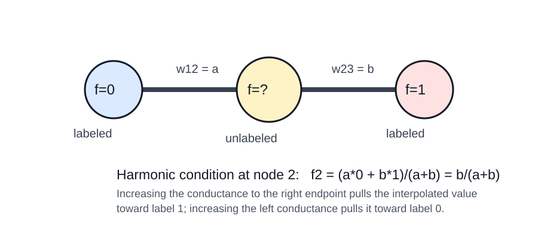

# Paper Review: Zhu, Ghahramani, and Lafferty, Gaussian Fields and Harmonic Functions

Paper: Zhu, Xiaojin; Ghahramani, Zoubin; Lafferty, John. "Semi-Supervised Learning Using Gaussian Fields and Harmonic Functions." ICML 2003.
Reviewer: Reviewer-P05
Auditor: Auditor-P05
Status: revised after audit
Date: 2026-05-15
Source manifest ID: P05
Canonical reading copy: `/Users/pgajer/current_projects/grip/papers/data_to_geodesic_embedding_paper/literature/conductance_kernel_laplacian_review/sources/pdf/P05_zhu_ghahramani_lafferty_gaussian_fields_harmonic_functions.pdf`

## Whole-Paper Review

### Reader Background Needed

* Weighted graphs: vertices are data points; edge weights encode similarity or conductance.
* Combinatorial graph Laplacian: `Delta = D - W`, where `D_ii = sum_j w_ij`.
* Dirichlet boundary-value problems: some nodes are clamped to known values while the unknown interior values are solved from a harmonic equation.
* Markov chains on graphs: row-normalizing `W` gives `P = D^{-1} W`; labeled nodes can be absorbing boundaries.
* Quadratic forms: `f^T Delta f` penalizes rough graph signals.
* Gaussian random fields: a quadratic energy induces a Gaussian density over real-valued functions.
* Semi-supervised learning: few labeled examples, many unlabeled examples, with the hope that unlabeled geometry helps prediction.
* Basic spectral graph ideas: heat kernels, Green's functions, normalized cuts, and eigenvectors of graph Laplacians.
* For Section 6: entropy minimization, length-scale hyperparameters, and elementary matrix calculus for differentiating an inverse.

### What A Non-Expert Should Understand Before Reading This Paper

This paper turns semi-supervised classification into a graph interpolation problem. Every labeled or unlabeled example is a node in a weighted graph. A high edge weight means "these two examples should probably have similar labels." The known labels are fixed boundary values. The unknown labels are not learned by fitting a parametric classifier first; they are solved as the smoothest real-valued function on the graph that agrees with the labeled nodes.

The central object is a function `f` on graph vertices. For binary labels, labeled nodes have `f=0` or `f=1`; unlabeled nodes get values between 0 and 1. A node with value near 1 is classified as class 1, but the paper also shows why a plain `1/2` threshold can fail when graph weights create badly unbalanced masses. The method is called "harmonic" because each unlabeled value is a weighted average of its neighbors. It is also a Gaussian random field because the quadratic smoothness energy defines a Gaussian distribution over all possible functions that match the labels; the harmonic function is the mean/mode of that field.

For the H005 conductance review, the paper is important because it treats graph weights as conductances. The weight formula determines how labels, heat, voltage, or random-walk hitting probabilities propagate through the graph. Changing the kernel bandwidth or the feature-wise length scales changes the interpolating function even when the labeled data are unchanged.

### Problem And Context

The paper addresses semi-supervised learning with many unlabeled examples and few labeled examples. The authors motivate the setting by the cost of labels and by the idea that unlabeled data reveal a "manifold structure" on which nearby examples should have similar classifications (Introduction, pp. 1-2). [explicit]

The proposed method differs from discrete-label Markov random fields and graph mincut approaches by using a continuous Gaussian field over real-valued functions, not a discrete field over labels. The authors claim this relaxation gives a unique most probable configuration with a closed-form harmonic solution computable by matrix methods or loopy belief propagation (Introduction, p. 1; Section 3.3, p. 4). [explicit]

The paper's own application framing is classification, not general graph signal smoothing. However, the mathematical core is graph interpolation/regression from boundary values: solve a Laplacian Dirichlet problem on unlabeled nodes. That is why it is relevant to length/kernel-conductance smoothing in H005. [derived]

### Main Method

The basic algorithm is harmonic energy minimization:

1. Build a weighted graph `G=(V,E)` on labeled and unlabeled data (Section 2, p. 2). [explicit]
2. Clamp labeled nodes `L={1,...,l}` to their observed binary labels `f_l(i)=y_i` (Section 2, p. 2). [explicit]
3. Minimize the quadratic graph energy
   `E(f) = (1/2) sum_{i,j} w_ij (f(i)-f(j))^2`
   subject to those boundary values (Eq. 2, p. 2). [explicit]
4. Solve the harmonic equation `Delta f = 0` on the unlabeled nodes `U={l+1,...,l+u}` with Dirichlet boundary `f_L=f_l` (Section 2, p. 2). [explicit]
5. Classify from `f_u`, either by thresholding at `1/2` or by class mass normalization when class priors are available (Section 4, Eq. 9, p. 4). [explicit]

The paper also gives two extensions:

* External classifier combination: attach a labeled "dongle" node to each unlabeled node and let a transition probability `eta` control how strongly the external prediction pulls the harmonic solution (Section 5, Eq. 10, p. 4). [explicit]
* Weight/length-scale learning: choose feature-wise Gaussian bandwidths `sigma_d` by minimizing average label entropy on the unlabeled nodes, using a smoothed transition matrix to avoid a degenerate zero-bandwidth minimum (Section 6, Eqs. 11-15, pp. 5-7). [explicit]

### Main Formulas And Operators

Data are `l` labeled points `(x_1,y_1),...,(x_l,y_l)` and `u` unlabeled points `x_{l+1},...,x_{l+u}`, with `n=l+u`; initially labels are binary `y in {0,1}` (Section 2, p. 2). [explicit]

Feature-weighted Gaussian affinity:

```text
w_ij = exp( - sum_{d=1}^m ((x_id - x_jd)^2 / sigma_d^2) )
```

This is Eq. 1 (p. 2). The `sigma_d` are feature-wise length-scale hyperparameters. Larger `sigma_d` makes dimension `d` less influential; smaller `sigma_d` makes the weight more sensitive to that dimension. [explicit]

Graph energy:

```text
E(f) = (1/2) sum_{i,j} w_ij (f(i)-f(j))^2
```

This is Eq. 2 (p. 2). It penalizes label variation across high-weight edges. If `w_ij` is large, a difference between `f(i)` and `f(j)` is expensive. [explicit]

Gaussian field:

```text
p_beta(f) = exp(-beta E(f)) / Z_beta
Z_beta = integral_{f_L=f_l} exp(-beta E(f)) df
```

This appears immediately after Eq. 2 (p. 2). The field is constrained to match the labeled boundary values. [explicit]

Laplacian and harmonic property:

```text
Delta = D - W
D = diag(d_i), d_i = sum_j w_ij
Delta f = 0 on U, f_L = f_l on L
f(j) = (1/d_j) sum_{i~j} w_ij f(i), for j=l+1,...,l+u
P = D^{-1} W, so f = P f on U
```

The average-value relation is Eq. 3 (p. 2). It is the local interpolation rule: an unlabeled node equals the weighted mean of neighbors. [explicit]

Block solution:

```text
W = [ W_ll  W_lu
      W_ul  W_uu ]

f_u = (D_uu - W_uu)^{-1} W_ul f_l
    = (I - P_uu)^{-1} P_ul f_l
```

This is Eqs. 4-5 (p. 2). It is the main linear solve. [explicit]

Heat kernel and Green's function on the unlabeled subgraph:

```text
K_t = exp(t Delta)                         on the full graph
K'_t = exp(-t Delta_uu)                    with Dirichlet boundary
G = integral_0^infty K'_t dt
  = integral_0^infty exp(-t Delta_uu) dt
  = (D_uu - W_uu)^{-1}
```

The paper defines the graph heat kernel and then the restricted Green's function in Section 3.2; the expression for `G` is Eq. 6 (p. 3). [explicit]

Kernel-classifier view:

```text
f_u = G W_ul f_l
f(j) = sum_{i=1}^l sum_k y_i w_ik G(k,j)
```

This is Eq. 7 (p. 3). It shows the harmonic solution as a specific graph-kernel classifier based on the Green's function. [explicit]

Normalized cut comparator:

```text
R(f) = (f^T Delta f)/(f^T D f)
     = [sum_ij w_ij (f(i)-f(j))^2] / [sum_i d_i f(i)^2]
Delta f = lambda D f
```

This is Eq. 8 and the following eigenproblem (Section 3.3, p. 4). It is not the paper's algorithm but connects the harmonic method to spectral clustering. [explicit]

Class mass normalization:

```text
class 1 mass = sum_i f_u(i)
class 0 mass = sum_i (1 - f_u(i))

classify i as class 1 iff
q * f_u(i) / sum_i f_u(i)
  > (1-q) * (1-f_u(i)) / sum_i (1-f_u(i))
```

This is Eq. 9 (p. 4). It rescales the soft masses to match prior class proportions `q` and `1-q`. [explicit]

External classifier/dongle solution:

```text
f_u = (I - (1-eta) P_uu)^{-1} ( (1-eta) P_ul f_l + eta h_u )
```

This is Eq. 10 (p. 4). `h_u` is the external classifier's unlabeled prediction and `eta` is the transition probability to the attached dongle node. [explicit]

Entropy-based length-scale objective:

```text
H(f) = (1/u) sum_{i=l+1}^{l+u} H_i(f(i))
H_i(f(i)) = - f(i) log f(i) - (1-f(i)) log(1-f(i))
```

This is Eq. 11 (p. 5). Smaller entropy means more confident values near 0 or 1. [explicit]

Smoothed transition matrix for weight learning:

```text
P_tilde = epsilon U + (1-epsilon) P
U_ij = 1/(l+u)
```

This appears in Section 6 (p. 5), before Eq. 12. It prevents the entropy objective from being minimized by the degenerate limit `sigma_d -> 0`. [explicit]

Entropy gradient pieces:

```text
dH/dsigma_d = (1/u) sum_{i=l+1}^{l+u} log((1-f(i))/f(i)) * df(i)/dsigma_d

df_u/dsigma_d =
  (I - P_tilde_uu)^{-1}
  ( dP_tilde_uu/dsigma_d * f_u + dP_tilde_ul/dsigma_d * f_l )

dp_ij/dsigma_d =
  [ dw_ij/dsigma_d - p_ij sum_{n=1}^{l+u} dw_in/dsigma_d ] /
  [ sum_{n=1}^{l+u} w_in ]

dw_ij/dsigma_d = 2 w_ij (x_id - x_jd)^2 / sigma_d^3
```

These are Eqs. 12-14 and the following derivative formula (p. 5). [explicit]

For CMN-aware entropy learning, the paper replaces `f(i)` in Eq. 11 with a normalized probability `bar f(i)` (Eq. 15, p. 5). In the denominator, the class-0 term uses `(1-f_u(i))` multiplied by the total class-1 mass `sum_j f_u(j)`. [explicit]

Text-document affinity:

```text
w_uv = exp( -(1/0.03) * (1 - (u^T v)/(|u||v|)) )
```

This is Eq. 16 (p. 6). Edges are only between 10-nearest-neighbor documents under cosine similarity, symmetrized by connecting if either document is in the other's 10 nearest neighbors (Experimental Results, p. 6). [explicit]

### Figures And Experiments

Figure 1 (p. 2) shows the graph construction on scanned digits: labeled data are boundary nodes and unlabeled data are interior nodes. It is mainly conceptual, making clear that labels are clamped rather than merely used as training examples. [explicit]

Figure 2 (p. 3) demonstrates harmonic energy minimization on two synthetic datasets: three bands and two spirals. Large symbols are labeled points; other points are unlabeled. The authors state that the method follows the data structure where kNN would fail; the figure visually supports graph-geometric label propagation. [explicit]

Figure 3 (p. 6) has three digit experiments. Left: digits "1" vs. "2"; CMN improves over plain thresholding, and plain thresholding performs poorly because many `f_u(j)` values are close to 1. Middle: all 10 digits on an intentionally unbalanced dataset; CMN again improves performance. Right: odd vs. even digits; adding a voted-perceptron external classifier via Eq. 10 improves accuracy over either harmonic or perceptron information alone. [explicit]

Figure 4 (p. 6) reports document categorization on 20 newsgroups tasks: PC vs. MAC, baseball vs. hockey, and MS-Windows vs. MAC. Harmonic energy minimization performs much better than 1NN and voted perceptron baselines on these graph/text tasks, while the improvement from class prior is less significant than on digits. [explicit]

Figure 5 (p. 7) isolates weight-matrix learning. The toy dataset has two slightly different grids connected by a few points and two labeled examples. Panel (a) shows the unsmoothed small-sigma failure, where `H -> 0` as `sigma -> 0` and the tighter grid invades the sparser one. Panel (b) shows the useful result at `sigma=0.67` with smoothing `epsilon=0.01`. Panel (c) shows that smoothing removes the nuisance entropy minimum near zero. [explicit]

Table 1 (p. 8) shows entropy and accuracy before and after learning `sigma` values for digits "1" vs. "2": entropy decreases from 0.6931 to 0.6542 bits; CMN accuracy rises from `97.25 +/- 0.73%` to `98.56 +/- 0.43%`; threshold accuracy rises from `94.70 +/- 1.19%` to `98.02 +/- 0.39%`. [explicit]

Figure 6 (p. 8) visualizes learned feature-wise `sigma_i` values for "1" vs. "2": average "1", average "2", initial sigmas, learned sigmas. The authors say learned parameters exaggerate variations within class "1" while suppressing variations within class "2", compensating for class tightness differences in feature space. [explicit]

### Theoretical Claims

The minimum-energy function is harmonic: it satisfies `Delta f = 0` on unlabeled nodes and equals the labels on labeled nodes (Section 2, p. 2). [explicit]

The harmonic solution is unique by the maximum principle and is either constant or has `0 < f(j) < 1` for unlabeled nodes (Section 2, p. 2). [explicit]

The random-walk interpretation says `f(i)` is the probability that a walk starting at unlabeled node `i` hits a labeled node with label 1 before hitting a labeled node with label 0 (Section 3.1, p. 3). [explicit]

The electrical-network interpretation treats graph edges as resistors with conductance `W`; label-1 nodes attach to positive voltage and label-0 nodes to ground, so `f_u` gives node voltages and minimizes energy dissipation (Section 3.1, p. 3). [explicit]

The Green's function interpretation connects the harmonic solution to an integral over heat diffusion on the unlabeled subgraph with Dirichlet boundary conditions (Section 3.2, Eq. 6, p. 3). [explicit]

For multi-label discrete random fields, the authors state that lowest-energy configurations are typically NP-hard, while the harmonic Gaussian-field solution can be computed efficiently using matrix methods even in the multi-label case (Introduction p. 1; Section 3.3 p. 4). [explicit]

The paper does not prove continuum convergence of graph Laplacians to manifold operators. It uses manifold-structure language and spectral connections, but the technical development is finite-graph harmonic interpolation. [contextual]

### Limitations And Scope

The method relies heavily on the graph weight matrix `W`; the authors explicitly say the right graph is often unclear and may need to be learned from data (Introduction p. 2; Section 6 p. 5). [explicit]

Plain harmonic thresholding can produce severely unbalanced classifications when `W` is poorly estimated or does not reflect the classification goal (Section 4, p. 4). [explicit]

The base paper assumes labeled data are noise-free and clamps them exactly. The authors note that if this assumption is doubtful, one could attach dongles to labeled nodes too and move the labels onto those new nodes (Section 5, p. 5). [explicit]

The entropy criterion for learning weights is heuristic. The authors justify it intuitively and experimentally, but also note a degeneracy as `sigma_d -> 0` and introduce PageRank-style smoothing to avoid the nuisance minimum (Section 6, p. 5; Figure 5, p. 7). [explicit]

The experiments are early-2000s benchmarks: synthetic data, handwritten digits, and 20 newsgroups. They show the method's promise but do not settle modern scalability, calibration, or robustness questions. [contextual]

### Historical / Methodological Importance

This paper is a canonical finite-graph formulation of semi-supervised learning as harmonic extension from labeled boundary nodes. Its importance for H005 is that the same Laplacian machinery underlies graph-based interpolation, regression, diffusion, and smoothing; the only thing that changes across many later methods is how `W`, `D`, normalization, and boundary/regularization terms are chosen. [contextual]

The paper is also methodologically valuable because it gives several equivalent readings of the same linear system: Gaussian field mean/mode, energy minimizer, random-walk hitting probability, electrical potential, Green's-function kernel classifier, and spectral graph object (Sections 2-3, pp. 2-4). [explicit]

## Conductance / Kernel Extraction

### Conductance, Affinity, Or Kernel Formula(s)

Gaussian feature-space affinity (Eq. 1, p. 2):

```text
w_ij = exp( - sum_d (x_id - x_jd)^2 / sigma_d^2 )
```

Evidence: [explicit]. The authors present this as an example when `x in R^m`. They call `sigma_1,...,sigma_m` length-scale hyperparameters. They also say other weightings may be more appropriate for discrete or symbolic data. [explicit]

Text graph affinity (Eq. 16, p. 6):

```text
w_uv = exp( -(1/0.03) * (1 - cosine(u,v)) )
cosine(u,v) = u^T v / (|u||v|)
```

Evidence: [explicit]. The edge set is 10-nearest-neighbor under cosine similarity with mutual-or condition: connect if `u` is among `v`'s 10 nearest neighbors or vice versa. [explicit]

Conductance interpretation:

```text
edge conductance c_ij = w_ij
edge resistance r_ij = 1/w_ij
```

Evidence: [explicit for conductance; derived for resistance]. Section 3.1 says to imagine edges as resistors with conductance `W`. Resistance is the reciprocal of conductance by the standard electrical-network interpretation. [explicit/derived]

Transition probabilities:

```text
P = D^{-1} W
P_ij = w_ij / d_i
d_i = sum_j w_ij
```

Evidence: [explicit]. The paper writes `f = P f`, `P = D^{-1} W` after Eq. 3 (p. 2). The random-walk interpretation in Section 3.1 uses `P_ij` as the one-step transition probability. [explicit]

Green's-function kernel:

```text
G = (D_uu - W_uu)^{-1}
```

Evidence: [explicit]. Eq. 6 defines `G` as the inverse of the restricted Laplacian and as the time integral of the heat kernel on the unlabeled subgraph. Eq. 7 uses `G` in a kernel-classifier representation. [explicit]

Smoothed transition matrix for learned weights:

```text
P_tilde = epsilon U + (1-epsilon) P
```

Evidence: [explicit]. Section 6 uses this smoothing to avoid a degeneracy in entropy minimization. [explicit]

### Graph, Laplacian, Or Diffusion Operator

The primary operator is the combinatorial Laplacian `Delta = D - W` (Section 2, p. 2). [explicit]

The Dirichlet operator solved on unlabeled nodes is `Delta_uu = D_uu - W_uu`; its inverse gives the Green's function `G` (Eq. 6, p. 3). [explicit]

The Markov operator is `P = D^{-1} W`; the harmonic condition can be written `f = P f` on unlabeled nodes (Section 2, p. 2). [explicit]

The paper contrasts the full heat kernel `K_t = exp(t Delta)` with the restricted heat kernel `K'_t = exp(-t Delta_uu)`. The sign convention in the rendered PDF uses `K_t = e^{t Delta}` for the full graph and `K'_t = e^{-t Delta_uu}` for the positive restricted Laplacian; the key use is the integral inverse in Eq. 6. [explicit/contextual]

### Task

Primary task: semi-supervised classification by graph harmonic interpolation from labeled nodes to unlabeled nodes. [explicit]

Mathematical task: Dirichlet graph regression/interpolation with hard boundary labels. [derived]

Related tasks discussed: spectral clustering, graph mincuts, graph kernels, random-walk hitting probabilities, electrical networks, and feature/length-scale selection by entropy minimization. [explicit]

### Explicit Author Motivations

The authors want to exploit unlabeled data because labels can be costly, and unlabeled examples can reveal data-manifold structure (Introduction, p. 1). [explicit]

They adopt continuous Gaussian fields because the most probable configuration is unique, harmonic, and available in closed form, unlike many discrete multi-label random fields (Introduction, p. 1; Section 3.3, p. 4). [explicit]

They include class priors because the graph structure `W` can be poorly estimated and may not reflect the classification goal (Section 4, p. 4). [explicit]

They include external classifiers because a graph-only manifold may be insufficient; the dongle construction combines supervised predictions with harmonic energy minimization (Introduction p. 2; Section 5 p. 4). [explicit]

They propose entropy minimization for learning weights because ordinary likelihood is not appropriate when labeled values are fixed and unlabeled data do not have a generative model (Section 6, p. 5). [explicit]

### Derived Or Implied Motivations

The paper implies that bandwidth or conductance selection is part of the model, not a preprocessing detail. Eq. 1 sets all label propagation, and Section 6 learns `sigma_d` to alter graph geometry. [derived]

The paper implies that graph smoothness can act as nonparametric regression: labels are boundary values and predictions are interpolated interior values. This is not presented as "regression" terminology, but the linear system is exactly harmonic extension. [derived]

The paper implies that class-prior correction is a calibration layer on top of graph interpolation. CMN does not change the harmonic solve; it rescales the resulting masses for decision making. [derived]

### Effect On Eigenfunctions / Diffusion / Smoothing

High weights force `f(i)` and `f(j)` to be close in the energy `E(f)`. Thus the chosen kernel controls where sharp label transitions are cheap or expensive. [derived from Eq. 2]

In the random-walk view, increasing `w_ij` increases transition probability from `i` to `j` after row normalization, unless all outgoing weights from `i` increase together. This changes hitting probabilities and therefore class probabilities. [derived from `P=D^{-1}W`]

In the electrical view, increasing `w_ij` increases conductance and decreases resistance between nodes. Voltage interpolation then pulls more strongly along that edge. [explicit/derived from Section 3.1]

In the Green's-function view, `G=(D_uu-W_uu)^{-1}` integrates heat flow over all times with labeled nodes as Dirichlet boundaries. Weight changes alter the restricted Laplacian spectrum, so they change both diffusion paths and smoothing length scales. [explicit/derived from Eq. 6]

In Section 6 and Figure 6, learned feature-wise `sigma_i` values reshape the graph by making weights more or less sensitive to particular pixel dimensions. A small `sigma_i` means dimension `i` has high influence; large `sigma_i` suppresses that feature. [explicit]

Toy three-node interpolation, matching the paper's Eq. 3:

```text
label node 1: f1 = 0
unlabeled node 2: f2 unknown
label node 3: f3 = 1
w12 = a, w23 = b

f2 = (a f1 + b f3)/(a+b) = b/(a+b)
```

Evidence: [derived]. This is a direct specialization of Eq. 3. It shows how conductance controls interpolation: if `b >> a`, the middle node is close to label 1; if `a >> b`, it is close to label 0.

### Relationship To Adaptive-Scale Graph Construction

The paper uses feature-wise global length scales `sigma_d`, not local self-tuning bandwidths or adaptive-radius/kNN density corrections. [explicit/contextual]

It does, however, anticipate later adaptive-scale concerns by learning `sigma_d` from labeled and unlabeled data. Section 6 shows that different feature dimensions can receive different effective scales, and Figure 6 visualizes pixel-level feature selection. [explicit]

The text experiments use sparse 10-nearest-neighbor graph construction before assigning Eq. 16 weights. This is adaptive in graph topology through nearest-neighbor selection, but the exponential cosine scale `0.03` itself is fixed. [explicit]

The entropy degeneracy as `sigma -> 0` is directly relevant to H005's conductance choices: a kernel can become too local, producing hard nearest-neighbor-like propagation rather than stable smoothing (Section 6, p. 5; Figure 5, p. 7). [derived]

### What The Paper Does Not Claim

The paper does not claim that Eq. 1 is the universally correct weight formula. It says other weightings are possible and may be more appropriate for discrete or symbolic `x` (Section 2, p. 2). [explicit]

The paper does not provide manifold convergence theorems for `Delta`, `P`, or `G`. [contextual]

The paper does not study graph low-pass filtering as a signal-processing task, although its harmonic solution is a smoothing/interpolation operator. [contextual]

The paper does not use current gflow overlap-density/Riemannian-complex conductance, inverse-length conductance, or kernel-conductance comparators. Any connection to those H005 variants is our synthesis, not an author claim. [contextual]

The paper does not soften the labeled boundary values in the main method; labels are clamped. It only suggests a dongle variant if labels may be noisy (Section 5, p. 5). [explicit]

### Relevance To gflow / SIMODS

For SIMODS/gflow, this paper is best treated as a reference model for graph Dirichlet interpolation. Given a weighted graph and boundary values, the prediction is obtained by a Laplacian linear system. [derived]

The current `fit.rdgraph.regression()` overlap-density/Riemannian-complex smoother must remain distinct from this paper's Gaussian feature-space weights. Current gflow semantics use overlap-density conductance such as:

```text
c_e^rho = 1 / max(rho_1(e), 1e-10)
```

That is not in Zhu et al. 2003. [contextual]

Planned length/kernel-conductance comparators, such as:

```text
c_e^len = 1 / (ell_e + epsilon)
c_ij = phi(ell_ij; theta)
```

are closer in spirit to this paper because they make the conductance/kernel choice the object that shapes the Laplacian solve. But the exact formulas in Zhu et al. are Eq. 1 for Euclidean features and Eq. 16 for cosine text features. [contextual]

The three-node example in `figures/P05_three_node_harmonic_interpolation.svg` is a useful sanity check for any gflow comparator: changing conductance alone changes the interpolated/regressed value even when node labels and graph topology stay fixed. [derived]

## Figure Handling

### Copied Paper Figures Used

Reproduced cropped figure panels for Figures 1--6 are managed by `paper_figure_screenshots.yml` and embedded in the generated HTML memo next to the primary figure descriptions. These are internal-review cropped figure panels from the canonical reading copy, not manuscript-ready reused figures. [explicit]

### Original Explanatory Figures Proposed Or Created

* `/Users/pgajer/current_projects/grip/papers/data_to_geodesic_embedding_paper/literature/conductance_kernel_laplacian_review/figures/P05_three_node_harmonic_interpolation.svg`
  * Original figure created for this review.
  * Concept illustrated: Eq. 3 harmonic averaging on a three-node path with endpoint labels `0` and `1`.
  * Purpose: show how conductance weights affect interpolation/regression: `f2 = b/(a+b)`.
  * This figure is not copied from Zhu et al. 2003.



## Evidence Table

| Claim | Label | Source reference | Notes |
| --- | --- | --- | --- |
| The method represents labeled and unlabeled examples as vertices in a weighted graph. | explicit | Abstract; Section 2, p. 2 | Figure 1 visualizes this construction. |
| Edge weights encode similarity and can be Gaussian feature-space weights. | explicit | Eq. 1, p. 2 | Other weights are allowed. |
| The energy minimized is quadratic in edge differences. | explicit | Eq. 2, p. 2 | `1/2 sum w_ij (f(i)-f(j))^2`. |
| The Gaussian field has density proportional to `exp(-beta E(f))` under label constraints. | explicit | Section 2, p. 2 | Partition function integrates over functions clamped on labeled data. |
| The minimizing function is harmonic on unlabeled nodes. | explicit | Section 2; Eq. 3, p. 2 | Weighted neighbor average. |
| The main solve is `f_u=(D_uu-W_uu)^{-1}W_ul f_l`. | explicit | Eq. 5, p. 2 | Equivalent Markov form uses `(I-P_uu)^{-1}P_ul f_l`. |
| `f(i)` is a random-walk hitting probability. | explicit | Section 3.1, p. 3 | Label-1 absorbing boundary. |
| Edge weights can be interpreted as electrical conductances. | explicit | Section 3.1, p. 3 | The solution is node voltage. |
| The Green's function is the inverse restricted Laplacian. | explicit | Eq. 6, p. 3 | Also integral over heat kernel. |
| The harmonic solution can be read as a kernel classifier. | explicit | Eq. 7, p. 3 | Kernel is `G`. |
| Class mass normalization rescales decisions using class prior `q`. | explicit | Section 4; Eq. 9, p. 4 | Addresses unbalanced threshold outputs. |
| External classifiers enter through dongle nodes and Eq. 10. | explicit | Section 5, p. 4 | `eta` controls the pull of external predictions. |
| Weight learning minimizes average unlabeled label entropy. | explicit | Section 6; Eq. 11, p. 5 | Heuristic criterion. |
| Smoothing `P` avoids a zero-bandwidth entropy degeneracy. | explicit | Section 6, p. 5; Figure 5, p. 7 | PageRank-inspired smoothing. |
| Weight/kernel selection controls graph interpolation/regression. | derived | Eqs. 2-5; Section 3.1 | Direct from energy, averaging, and conductance views. |
| The paper proves manifold convergence of the graph Laplacian. | uncertain | Not found | It discusses spectral/manifold context but gives no such theorem. |
| The paper uses gflow's overlap-density conductance. | contextual | Not in paper | Distinct H005 context only. |
| The text-document affinity uses an exponential cosine-distance weight on a sparse 10NN graph. | explicit | Eq. 16 and surrounding text, p. 6 | Used in 20 newsgroups experiments. |
| Learned pixel-level `sigma_i` values act as feature selection. | explicit | Section 7.2; Figure 6, p. 8 | Authors state this directly in Section 6 and discuss Figure 6. |

## Open Questions For Auditor

* Check whether the sign convention for the full heat kernel in Section 3.2 should be described exactly as printed (`K_t=e^{t Delta}`) or normalized to the more common `e^{-t Delta}` convention in the synthesis. The memo records the printed/restricted forms separately.
* Confirm whether the final H005 report should call `w_ij` "conductance" throughout or reserve "conductance" for the electrical-network interpretation in Section 3.1.
* Decide whether the final synthesis should include the three-node interpolation SVG or recreate it in the report's house style.
* Verify whether multi-label classification needs a separate note in the final report; this paper says CMN extends naturally and matrix methods remain efficient, but the detailed formulas are mostly binary.
* Audit that the gflow overlap-density paragraph is treated as contextual synthesis, not as a claim about Zhu et al. 2003.

## Revision Notes

### Post-Audit Revision, 2026-05-15

- Auditor-P05 corrected the heat-kernel sign convention: the PDF prints
  \(K_t=e^{-t\Delta}\), not \(e^{t\Delta}\). Use the negative exponent in the
  final synthesis unless explicitly changing Laplacian sign conventions.
- Eq. (8)'s Rayleigh quotient numerator uses an unhalved double sum; under the
  standard symmetric-Laplacian convention,
  \[
    f^\top L f = \frac12\sum_{i,j} w_{ij}(f_i-f_j)^2.
  \]
  The factor does not change the optimization but should be documented.
- Outside the electrical-network interpretation, use "weight/affinity,
  interpretable as conductance" rather than calling every \(w_{ij}\) a
  conductance.
- SIMODS/gflow clarification for synthesis: P05 supports graph Laplacian and
  Markov/harmonic-function interpretations of weighted graph regression. It
  should not be cited as describing the current `fit.rdgraph.regression()`
  overlap-density smoother.

* 2026-05-15: Initial Reviewer-P05 memo drafted from the canonical 8-page PDF. All pages and figures were rendered and visually inspected. One original explanatory SVG was created.
