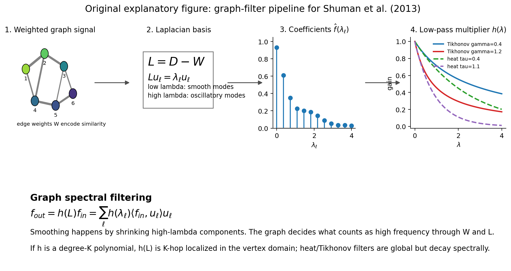

# Paper Review: The Emerging Field of Signal Processing on Graphs

Paper: Shuman, David I.; Narang, Sunil K.; Frossard, Pascal; Ortega, Antonio; Vandergheynst, Pierre. "The Emerging Field of Signal Processing on Graphs: Extending High-Dimensional Data Analysis to Networks and Other Irregular Domains." arXiv:1211.0053v2, 10 Mar 2013.
Reviewer: Reviewer-P07
Auditor: Auditor-P07
Status: revised after audit
Date: 2026-05-15
Source manifest ID: P07
Canonical reading copy: `literature/conductance_kernel_laplacian_review/sources/pdf/P07_shuman_et_al_emerging_field_gsp.pdf`

## Whole-Paper Review

### Reader Background Needed

A mathematically capable non-specialist should be comfortable with:

- Weighted undirected graphs, adjacency matrices, degree matrices, and graph Laplacians.
- Symmetric matrix eigendecompositions, orthonormal eigenbases, Rayleigh quotients, and positive semidefinite quadratic forms.
- Classical Fourier analysis at the level of "basis functions, frequencies, filters, and convolution."
- Basic regularization: least squares plus a smoothness penalty, especially Tikhonov/ridge-like objectives.
- Kernel or affinity graph construction: Gaussian weights, thresholding, and nearest-neighbor graphs.
- Markov chains and random-walk matrices, at least enough to understand `P = D^{-1} W`.
- The distinction between vertex-domain locality and spectral-domain smoothness.
- For later sections, wavelet language: localization, scale, translation, dilation, and multiresolution.

### What A Non-Expert Should Understand Before Reading This Paper

This is a tutorial paper, not a new convergence theorem or a new graph-construction method. Its job is to explain how ordinary signal-processing ideas can be moved from regular grids, such as time series or images, to irregular graph domains. A graph signal is just one number per vertex. The graph says which samples should be treated as nearby or similar.

The central translation is:

```text
classical Fourier modes      -> graph Laplacian eigenvectors
classical frequencies        -> graph Laplacian eigenvalues
smooth signal                -> small changes across high-weight edges
low-pass filter              -> shrink high-eigenvalue graph-Fourier components
```

The paper's main practical point for SIMODS/gflow is that smoothing is not defined by the data vector alone. It is defined by the chosen graph, the edge weights, the Laplacian normalization, and the spectral response `h(lambda)`. Changing edge weights changes which signals look smooth. Changing `h(lambda)` changes how much high-frequency graph variation is attenuated.

### Problem And Context

`[explicit]` The Abstract on PDF p. 1 says the paper studies high-dimensional data that "reside on the vertices of weighted graphs" in settings such as social, energy, transportation, sensor, and neuronal networks. It frames graph signal processing as a merger of algebraic/spectral graph theory with computational harmonic analysis.

`[explicit]` Section I, PDF pp. 1-2, identifies the difficulty: a graph signal with `N` vertices and a classical discrete-time signal with `N` samples are both vectors in `R^N`, but classical signal-processing operations ignore dependencies induced by the irregular graph domain. The paper names translation, modulation, downsampling, and coarsening as basic operations that are not automatic on arbitrary weighted graphs.

`[explicit]` Section I-A, PDF p. 2, lists four overarching challenges: constructing a weighted graph when the application does not dictate one; incorporating graph structure into localized transforms; preserving useful Euclidean-domain intuition; and developing computationally efficient implementations for high-dimensional graph data.

`[contextual]` For the conductance/kernel review, this paper is background infrastructure. It does not solve adaptive-scale graph construction, but it explains why any edge-weight choice becomes part of the smoothing operator.

### Main Method

The paper builds a graph spectral calculus around a weighted, undirected, connected graph `G = {V, E, W}`. It then uses this calculus to define graph Fourier transforms, graph filters, graph translations, graph heat diffusion, and graph wavelets.

The main sequence is:

1. Define `W`, `D`, and the non-normalized graph Laplacian `L = D - W` (Section II-A and II-B, PDF p. 3).
2. Use the eigenvectors of `L` as graph Fourier modes and the eigenvalues as graph frequencies (Section II-C, equations (3)-(4), PDF p. 3).
3. Define smoothness by edge differences and the Laplacian quadratic form `f^T L f` (Section II-E, equations (5)-(8), PDF pp. 4-5).
4. Define graph spectral filters by multiplying graph Fourier coefficients by a transfer function `h(lambda)` (Section III-A, equations (12)-(14), PDF p. 6).
5. Show that low-pass filtering solves familiar graph-regularized denoising/smoothing problems, including Tikhonov regularization (Example 2, equations (16)-(17), PDF p. 7).
6. Relate spectral filters to vertex-domain locality when `h(lambda)` is a polynomial (equation (19), PDF p. 7).
7. Extend the same basis to convolution, translation, dilation, heat diffusion, and graph wavelets (Section III-B through IV, PDF pp. 8-12).

### Main Formulas And Operators

`[explicit]` Section II-A, equation (1), PDF p. 3, gives a common graph-construction affinity:

```text
W_ij =
  exp(-dist(i,j)^2 / (2 theta^2))   if dist(i,j) <= kappa
  0                                 otherwise.
```

The distance can be a physical distance or a Euclidean distance between feature vectors. The paper also names `k`-nearest-neighbor construction as another common method (Section II-A, PDF p. 3).

`[explicit]` Section II-B, PDF p. 3, defines the non-normalized/combinatorial graph Laplacian:

```text
L = D - W,
d_i = sum_j W_ij,
(L f)(i) = sum_{j in N_i} W_ij [f(i) - f(j)].
```

Because `L` is real symmetric, it has orthonormal eigenvectors `{u_l}` and nonnegative eigenvalues `{lambda_l}` with `L u_l = lambda_l u_l`. For a connected graph, the paper orders them as `0 = lambda_0 < lambda_1 <= ... <= lambda_{N-1} = lambda_max` (Section II-B, PDF p. 3).

`[explicit]` Section II-C, equation (3), PDF p. 3, defines the graph Fourier transform:

```text
f_hat(lambda_l) = <f, u_l> = sum_{i=1}^N f(i) u_l^*(i).
```

`[explicit]` Section II-C, equation (4), PDF p. 3, gives the inverse graph Fourier transform:

```text
f(i) = sum_{l=0}^{N-1} f_hat(lambda_l) u_l(i).
```

`[explicit]` Section II-C, PDF p. 3, interprets graph frequency: low-eigenvalue eigenvectors vary slowly across high-weight edges; high-eigenvalue eigenvectors oscillate more rapidly and have more sign changes across edges. Figure 2 and Figure 3 on PDF p. 4 visualize this with random sensor-network eigenvectors and zero-crossing counts.

`[explicit]` Section II-E, PDF p. 4, defines an edge derivative with edge weight inside a square root:

```text
partial f / partial e at i = sqrt(W_ij) [f(j) - f(i)].
```

The local variation is therefore small when neighboring vertices connected by large weights have similar signal values.

`[explicit]` Section II-E, equation (5), PDF p. 5, defines the graph `p`-Dirichlet form:

```text
S_p(f) = (1/p) sum_i ||grad_i f||_2^p
       = (1/p) sum_i [sum_{j in N_i} W_ij (f(j)-f(i))^2]^{p/2}.
```

`[explicit]` Section II-E, equation (6), PDF p. 5, specializes to the graph Laplacian quadratic form:

```text
S_2(f) = sum_{(i,j) in E} W_ij [f(j)-f(i)]^2 = f^T L f.
```

This is the core smoothness penalty: high-weight edges penalize jumps more strongly.

`[explicit]` Section II-E, equations (7)-(8), PDF p. 5, gives the Rayleigh quotient characterization of Laplacian eigenvalues. The `l`th eigenvector minimizes `f^T L f` subject to unit norm and orthogonality to previous eigenvectors, explaining why low eigenvalues correspond to smoother modes.

`[explicit]` Section II-F, PDF pp. 5-6, describes alternatives: the normalized Laplacian `L_tilde = D^{-1/2} L D^{-1/2}`, the random-walk matrix `P = D^{-1} W`, and the asymmetric Laplacian `L_a = I_N - P`. The paper states there is not a clear answer for when to use the normalized Laplacian, non-normalized Laplacian, or another basis.

`[explicit]` Section III-A, equation (12), PDF p. 6, defines graph spectral filtering:

```text
f_hat_out(lambda_l) = f_hat_in(lambda_l) h_hat(lambda_l).
```

`[explicit]` Section III-A, equations (13)-(14), PDF p. 6, writes the same operation as:

```text
f_out(i) = sum_{l=0}^{N-1} f_hat_in(lambda_l) h_hat(lambda_l) u_l(i),
f_out = h_hat(L) f_in
```

with `h_hat(L) = U diag(h_hat(lambda_0), ..., h_hat(lambda_{N-1})) U^T`.

`[explicit]` Section III-A, equation (15), PDF p. 6, gives a graph-regularized inverse-problem template:

```text
min_f ||f - y||_2^2 + gamma S_p(f).
```

`[explicit]` Example 2, equations (16)-(17), PDF p. 7, gives Tikhonov graph denoising:

```text
argmin_f ||f - y||_2^2 + gamma f^T L f,

f_*(i) = sum_{l=0}^{N-1} [1 / (1 + gamma lambda_l)] y_hat(lambda_l) u_l(i).
```

The corresponding filter `h_hat(lambda) = 1 / (1 + gamma lambda)` is explicitly called a low-pass filter.

`[explicit]` Section III-A, equation (18), PDF p. 6, defines localized vertex-domain filtering:

```text
f_out(i) = b_ii f_in(i) + sum_{j in N(i,K)} b_ij f_in(j).
```

`[explicit]` Section III-A, equation (19), PDF p. 7, shows that if the spectral filter `h_hat(lambda)` is a degree-`K` polynomial, then `h_hat(L)` can be written exactly as a `K`-hop localized vertex-domain filter because `(L^k)_{ij} = 0` when graph shortest-path distance `d_G(i,j) > k`.

`[explicit]` Section III-B, equation (20), PDF p. 8, defines graph convolution as spectral multiplication:

```text
(f * h)(i) = sum_l f_hat(lambda_l) h_hat(lambda_l) u_l(i).
```

`[explicit]` Section III-C, equation (21), PDF p. 8, defines generalized translation of a spectral kernel to a vertex `n`:

```text
(T_n g)(i) = sqrt(N) sum_l g_hat(lambda_l) u_l^*(n) u_l(i).
```

`[explicit]` Example 3, PDF p. 9, defines heat diffusion with `R = exp(-L)` and powers `R^tau f = exp(-tau L) f`. It says the heat flow rates are proportional to edge weights encoded in `L`, and that increasing `tau` makes the filtered value at `i` depend on vertices farther away in the graph.

### Figures And Experiments

The paper is a tutorial, so its figures are mostly conceptual examples rather than benchmark experiments.

`[explicit]` Figure 1, PDF p. 1, shows a positive graph signal on the Petersen graph, using bars at vertices. It establishes the basic visual idea: a graph signal is one sample per vertex.

`[explicit]` Figure 2, PDF p. 4, shows graph Laplacian eigenvectors `u_0`, `u_1`, and `u_50` on a random sensor-network graph. The constant `u_0`, smooth Fiedler vector `u_1`, and oscillatory `u_50` support the frequency interpretation of Laplacian eigenvalues.

`[explicit]` Figure 3, PDF p. 4, plots zero-crossing counts for non-normalized and normalized Laplacian eigenvectors. Larger eigenvalues generally have more zero crossings, reinforcing the "higher lambda = higher graph frequency" rule.

`[explicit]` Figure 4, PDF p. 4, shows a signal on the Minnesota road graph and its graph spectral representation. The caption states that the signal is a heat kernel defined directly in the spectral domain by `g_hat(lambda_l) = exp(-5 lambda_l)`, then transformed back with equation (4).

`[explicit]` Example 1, PDF p. 5, plots the same signal on three unweighted graphs with the same vertices but different edges. The graph spectral content and quadratic form values change: `f^T L_1 f = 0.14`, `f^T L_2 f = 1.31`, and `f^T L_3 f = 1.81`. This is the paper's clearest visual proof that smoothness is graph-dependent.

`[explicit]` Example 2, PDF p. 7, denoises the cameraman image using (a) ordinary Gaussian low-pass filters and (b) a graph spectral filter based on a semi-local pixel graph. The graph connects horizontal, vertical, and diagonal neighbors but sets Gaussian weights from noisy pixel-value differences using equation (1), with `theta = 0.1`, `kappa = 0`, and Tikhonov filter parameter `gamma = 10`. The graph filter smooths less across image edges because the graph Laplacian encodes those image-edge similarities.

`[explicit]` Figure 5, PDF p. 8, translates the heat kernel from Figure 4 to three different vertices on the Minnesota graph. It illustrates that smooth spectral kernels produce localized translated vertex-domain kernels, even though graph translation is not a classical shift.

`[explicit]` Example 3, PDF p. 9, shows heat diffusion on a cerebral cortex graph. Starting from a delta at vertex 100, the displays show `exp(-L) delta_100`, `exp(-3L) delta_100`, `exp(-7L) delta_100`, and `exp(-15L) delta_100`, plus the corresponding dilated heat kernels. This figure is directly relevant to smoothing semantics because it visualizes increasing filter scale.

`[explicit]` Figure 6, PDF p. 12, compares spatial and spectral spreads for two graph wavelet transforms on random 5-regular graphs. It is evidence that graph transforms have a spatial/spectral localization tradeoff, though the authors caution in footnote 7 on PDF p. 10 that these spread definitions are heuristic.

`[explicit]` Figure 7, PDF p. 12, shows a piecewise smooth signal with a sharp discontinuity on the unweighted Minnesota graph, plus CKWT and SGWT coefficients. High-magnitude coefficients cluster near the discontinuity, demonstrating spatial localization of high-pass information.

### Theoretical Claims

`[explicit]` The paper claims the graph Laplacian eigenbasis supplies a usable graph spectral domain (Section II-C, equations (3)-(4), PDF p. 3), with eigenvalues functioning as graph frequencies.

`[explicit]` It claims smoothness is defined relative to graph structure, not only signal values (Section II-E, equations (5)-(6), PDF pp. 4-5; Example 1, PDF p. 5).

`[explicit]` It claims graph spectral filters generalize classical frequency filters after a graph Fourier basis is fixed (Section III-A, equations (12)-(14), PDF p. 6).

`[explicit]` It claims graph low-pass filtering can be equivalent to solving graph-regularized inverse problems such as denoising and inpainting (Section III-A, equation (15), PDF p. 6; Example 2, equations (16)-(17), PDF p. 7).

`[explicit]` It claims polynomial graph spectral filters are exactly localized in the vertex domain up to the polynomial degree in graph-hop distance (Section III-A, equation (19), PDF p. 7).

`[contextual]` The paper does not claim that a particular graph construction is optimal. In Section V-A, PDF p. 12, the first open issue is that graph construction is extremely important and relatively little is known about how it affects localized multiscale transforms.

### Limitations And Scope

`[explicit]` Section II-F, PDF p. 6, says there is not a clear answer for when to use the normalized Laplacian eigenvectors, the non-normalized Laplacian eigenvectors, or another basis.

`[explicit]` Section V-A, PDF pp. 12-13, lists graph construction, Laplacian-basis choice, vertex-domain distance choice, scalable computation, approximation theory, and localization theory as open issues.

`[explicit]` Section V-B, PDF p. 13, says the described framework focuses on static signals on static, weighted, undirected graphs. Extensions include directed graphs, time series at each vertex, and time-varying graphs.

`[explicit]` Section V-A, PDF p. 13, notes that most transforms require graph Laplacian eigenvectors, but explicit eigendecomposition is not practical for extremely large graphs. Polynomial approximations and Krylov methods are mentioned as partial remedies.

`[contextual]` The paper is not a conductance-selection paper, not an adaptive bandwidth theory paper, and not a graph Laplacian convergence paper. It should be cited for graph signal smoothing semantics, not for guarantees that a given kernel recovers a manifold operator.

### Historical / Methodological Importance

`[contextual]` P07 is a good bridge citation for introducing graph signal processing to readers who know spectral graph theory, semi-supervised learning, or manifold learning but do not know signal-processing language. It collects the basic GFT/filter/wavelet vocabulary in one place and explains why edge weights, Laplacian normalization, and spectral response functions matter.

`[contextual]` For SIMODS, the most important methodological contribution is not a new kernel formula. It is the operator viewpoint: after a graph is chosen, a smoother is a spectral function `h(L)`, and the graph determines what "low frequency" means.

## Conductance / Kernel Extraction

### Conductance, Affinity, Or Kernel Formula(s)

`[explicit]` The only graph-affinity formula presented as a common construction is the thresholded Gaussian edge weight in Section II-A, equation (1), PDF p. 3:

```text
W_ij = exp(-dist(i,j)^2 / (2 theta^2)) if dist(i,j) <= kappa,
W_ij = 0 otherwise.
```

The paper says `dist(i,j)` may be physical distance or Euclidean feature-vector distance, and that feature-space distances are especially common in graph-based semi-supervised learning.

`[explicit]` Section II-A, PDF p. 3, also names `k`-nearest-neighbor graph construction as a common alternative, but does not give a new `kNN` weighting formula.

`[derived]` In a standard electrical-network or graph-Laplacian smoother interpretation, `W_ij` is conductance-like: larger `W_ij` creates stronger coupling and a larger penalty for `f(i) - f(j)` in `f^T L f`. The paper itself calls these entries edge weights or similarities, not gflow conductances.

`[explicit]` Example 2, PDF p. 7, instantiates equation (1) for image denoising by taking graph edges between nearby pixels and setting distances to noisy pixel-value differences. This makes strong conductance/similarity inside image regions and weak conductance across image edges.

### Graph, Laplacian, Or Diffusion Operator

`[explicit]` The primary operator is the non-normalized graph Laplacian `L = D - W`, Section II-B, PDF p. 3.

`[explicit]` The normalized graph Laplacian `L_tilde = D^{-1/2} L D^{-1/2}` is presented in Section II-F, PDF p. 5.

`[explicit]` The random walk matrix `P = D^{-1} W` and asymmetric Laplacian `L_a = I_N - P` are described in Section II-F, PDF p. 6.

`[explicit]` The heat diffusion operator is `R = exp(-L)`, and powers `R^tau f = exp(-tau L) f` diffuse a graph signal over time/scale (Example 3, PDF p. 9).

### Task

`[explicit]` The paper lists filtering, denoising, inpainting, compression, storage, communication, analysis, visualization, and multiscale transform design as graph-signal tasks (Abstract and Section I, PDF pp. 1-2).

`[explicit]` Example 2, PDF p. 7, demonstrates image denoising by graph low-pass filtering.

`[explicit]` Section IV, PDF pp. 10-12, surveys localized multiscale transforms and graph wavelets for analyzing graph signals.

`[contextual]` For gflow/SIMODS, the closest task analogue is graph signal smoothing or graph regression: choose a graph and use a low-pass operator to reconstruct smooth feature signals.

### Explicit Author Motivations

`[explicit]` Abstract, PDF p. 1: define graph spectral domains analogous to the classical frequency domain and incorporate irregular graph structure when processing signals on graphs.

`[explicit]` Section I, PDF p. 1: common tasks include filtering, denoising, inpainting, and compressing graph signals.

`[explicit]` Section I-A, PDF p. 2: graph construction is one of the overarching challenges when the graph is not directly dictated by the application.

`[explicit]` Section III-A, PDF p. 6: graph spectral filtering can implement discrete versions of Gaussian smoothing, bilateral filtering, total variation filtering, anisotropic diffusion, and non-local means.

`[explicit]` Section V-A, PDF p. 12: graph construction is extremely important and insufficiently understood for localized multiscale graph transforms.

### Derived Or Implied Motivations

`[derived]` For SIMODS non-oracle selection, the paper motivates evaluating candidate graphs by how well biologically or geometrically meaningful signals become low-frequency/smooth on the graph. This is derived from Example 1 and the `f^T L f` smoothness framework, not stated as a graph-selection criterion.

`[derived]` For planned length/kernel-conductance comparators, the paper motivates comparing how different edge-weight rules alter the Laplacian spectrum and low-pass filter output. This is derived from equations (1), (6), and (12)-(17).

`[derived]` For auditor review, the paper motivates reporting the exact smoothing response `h(lambda)`, not just the graph construction. Two smoothers using the same graph but different `h(lambda)` can behave differently.

### Effect On Eigenfunctions / Diffusion / Smoothing

`[explicit]` Larger edge weights force low-frequency eigenvectors to take similar values at adjacent vertices (Section II-C, PDF p. 3). Larger eigenvalues correspond to more rapid oscillation and more zero crossings (Figures 2-3, PDF p. 4).

`[explicit]` The Laplacian quadratic form `f^T L f` is small when high-weight adjacent vertices have similar signal values (equation (6), PDF p. 5).

`[explicit]` A low-pass filter such as `h(lambda)=1/(1+gamma lambda)` shrinks high-`lambda` graph Fourier components and preserves low-`lambda` components (Example 2, equation (17), PDF p. 7).

`[explicit]` Heat filtering `exp(-tau L)` diffuses a signal farther across the graph as `tau` increases (Example 3, PDF p. 9).

`[derived]` Increasing an edge weight can make signal jumps across that edge more expensive and can alter the eigenvectors/eigenvalues that define frequency. Thus, kernel/conductance design is upstream of smoothing behavior.

### Relationship To Adaptive-Scale Graph Construction

`[explicit]` The paper presents fixed global Gaussian parameters `theta` and `kappa` in equation (1), plus `k`-nearest-neighbor construction as a common alternative (Section II-A, PDF p. 3). It does not develop local bandwidth, self-tuned kernels, or adaptive-radius theory.

`[contextual]` The paper supports adaptive-scale construction only at the level of motivation: since graph construction is an open and important issue (Section V-A, PDF p. 12), local-scale choices should be documented because they change the graph spectral domain.

`[derived]` If an adaptive-scale kernel changes `W_ij`, then all quantities in P07 downstream of `W` change: `D`, `L`, eigenvectors, eigenvalues, `f^T L f`, graph Fourier coefficients, and the output of `h(L)f`.

### What The Paper Does Not Claim

`[explicit]` It does not claim a best Laplacian normalization. Section II-F, PDF p. 6, explicitly says the choice is unclear.

`[explicit]` It does not solve graph construction. Section V-A, PDF p. 12, lists graph construction effects as an open issue.

`[contextual]` It does not prove convergence of graph Laplacians to continuum Laplace-Beltrami operators; it cites that literature in footnote 5 on PDF p. 4.

`[contextual]` It does not define current `gflow` overlap-density smoothing, Riemannian-complex edge masses, or SIMODS graph-selection criteria.

`[contextual]` It does not say that a graph low-pass smoother is automatically a metric-length smoother. The smoother follows the chosen `W`, `L`, and `h(lambda)`.

### Relevance To gflow / SIMODS

P07 is a semantics paper for graph smoothers. It should be used to explain that a graph-spectral smoother is a low-pass filter `h(L)` whose meaning depends on the graph Laplacian and edge weights.

Keep this separate from current `gflow` overlap-density smoothing. In current project notes, precomputed `weight.list` values are positive edge lengths used for neighborhood ordering/truncation, while the current mass-symmetrized spectral path uses overlap-density/Riemannian-complex edge masses with conductance `c_e^rho = 1/max(rho_1(e), 1e-10)`. P07's `W_ij` is a generic graph-signal-processing affinity/conductance matrix, not evidence that current `fit.rdgraph.regression()` uses length conductance `1/(ell_e + epsilon)`.

For planned length/kernel-conductance comparators, P07 gives the right operator vocabulary:

- A length-conductance comparator can define a new `W` from edge lengths, for example `c_e = 1/(ell_e + epsilon)`, then use `L = D - W` and a low-pass response such as heat or Tikhonov.
- A kernel-conductance comparator can define `W_ij` with a Gaussian or adaptive Gaussian affinity, then examine the induced `L`, spectrum, and smoother.
- A graph-selection criterion based on smooth feature reconstruction should report the graph family, edge-weight rule, Laplacian normalization, filter response `h(lambda)`, and GCV/selection objective separately.

The strongest P07 bridge to SIMODS is Example 1: the same signal can be smooth or rough depending on graph structure. That is exactly why non-oracle graph selection via signal smoothness can be meaningful, but also why it is not the same thing as oracle geodesic recovery.

## Figure Handling

### Copied Paper Figures Used

Reproduced cropped figure panels for Figures 1--7 and Example 3 are managed by `paper_figure_screenshots.yml` and embedded in the generated HTML memo next to the primary figure descriptions. These are internal-review cropped figure panels from the canonical reading copy, not manuscript-ready reused figures.

### Original Explanatory Figures Proposed Or Created

Created:

`literature/conductance_kernel_laplacian_review/figures/P07_graph_filter_pipeline.png`

This original figure illustrates the P07 graph-filter pipeline: edge weights define `L`, `L` defines eigenmodes/eigenvalues, the graph Fourier transform represents the input in that basis, and a low-pass response such as `1/(1+gamma lambda)` or `exp(-tau lambda)` produces smoothed output. It is based on Section II-B through III-A, especially equations (3)-(4), (12)-(14), and Example 2 equation (17).



## Evidence Table

| Claim | Label | Source reference | Notes |
| --- | --- | --- | --- |
| Graph signals are samples on vertices of a weighted graph. | explicit | Abstract and Section I, PDF p. 1; Figure 1 | Basic object of the paper. |
| Edge weights often represent similarity and may be physical or inferred from data. | explicit | Section I, PDF p. 1; Section II-A, PDF p. 3 | Key conductance/affinity bridge. |
| Thresholded Gaussian edge weights are a common construction. | explicit | Eq. (1), Section II-A, PDF p. 3 | `theta` bandwidth and `kappa` cutoff. |
| The non-normalized graph Laplacian is `L=D-W`. | explicit | Section II-B, PDF p. 3 | Primary operator. |
| The graph Fourier transform expands `f` in Laplacian eigenvectors. | explicit | Eq. (3), Section II-C, PDF p. 3 | Core GFT definition. |
| The inverse graph Fourier transform reconstructs from graph Fourier coefficients. | explicit | Eq. (4), Section II-C, PDF p. 3 | Basis expansion. |
| Low eigenvalues correspond to smooth eigenvectors over high-weight edges. | explicit | Section II-C, PDF p. 3; Figures 2-3, PDF p. 4 | Frequency interpretation. |
| Graph smoothness is measured by weighted edge differences. | explicit | Edge derivative, PDF p. 4; Eq. (5), PDF p. 5 | Weight enters as `W_ij`. |
| `f^T L f = sum_edges W_ij (f(j)-f(i))^2`. | explicit | Eq. (6), PDF p. 5 | Smoothness penalty. |
| The same signal can have different spectral content on different graphs. | explicit | Example 1, PDF p. 5 | Central for graph selection. |
| Normalized and non-normalized Laplacian bases are both possible, with no universally clear choice. | explicit | Section II-F, PDF pp. 5-6 | Important limitation. |
| Graph spectral filtering multiplies `f_hat(lambda_l)` by `h_hat(lambda_l)`. | explicit | Eq. (12), Section III-A, PDF p. 6 | Filter definition. |
| `h_hat(L)=U diag(h_hat(lambda_l)) U^T` is the matrix-function form. | explicit | Eq. (14), PDF p. 6 | Practical smoother semantics. |
| Tikhonov graph smoothing has response `1/(1+gamma lambda)`. | explicit | Example 2, Eqs. (16)-(17), PDF p. 7 | Low-pass filter. |
| Polynomial spectral filters are `K`-hop localized in vertex space. | explicit | Eq. (19), PDF p. 7 | Locality result. |
| Heat diffusion is `exp(-tau L)f` and spreads farther as `tau` increases. | explicit | Example 3, PDF p. 9 | Heat-kernel smoother semantics. |
| P07 motivates but does not solve graph construction. | explicit | Section V-A, PDF p. 12 | Open issue. |
| P07 supports planned length/kernel-conductance comparators but is not current gflow overlap-density smoothing. | derived | Whole paper plus project notes | P07 defines generic `W`, not gflow `rho_1` edge masses. |

## Open Questions For Auditor

1. Should the memo cite P07 mainly for graph-spectral smoother semantics, or should it also be used as a general background citation for graph construction?
2. Does the auditor want the SIMODS writeup to privilege the non-normalized Laplacian because P07's DC eigenvector is constant, or should normalized/random-walk alternatives be kept equally visible?
3. For planned comparators, should heat filtering `exp(-tau L)` or Tikhonov filtering `1/(1+gamma lambda)` be the default low-pass response?
4. Should graph-selection reports always include the explicit `h(lambda)` curve alongside graph construction parameters?
5. How should the manuscript phrase the distinction between `W_ij` as a generic GSP affinity/conductance and current `gflow` overlap-density conductance so readers do not infer that existing `weight.list` lengths are used as `W_ij`?

## Revision Notes

### Post-Audit Revision, 2026-05-15

- Auditor-P07 requested a caveat around Example 2's \(\kappa=0\). Do not treat
  it as an unambiguous reusable thresholded-Gaussian recipe for SIMODS; cite it
  only as an example of graph-weight construction in the paper.
- P07 should be cited primarily for graph-spectral smoother semantics: graph
  Fourier basis, spectral response, graph filters, and low-pass interpretation.
  Use it only secondarily for graph-construction background.
- Any comparator discussion derived from P07 should name the actual filter
  response \(h(\lambda)\), such as heat, Tikhonov, polynomial, or idealized
  low-pass response.
- When discussing individual eigenvectors, note that bases inside repeated or
  nearly repeated eigenspaces are not unique; the invariant object is the
  subspace/filter action.

- 2026-05-15: Drafted by Reviewer-P07 from the canonical P07 PDF. Rendered and visually inspected the full 14-page PDF, including Figures 1-7 and Examples 1-3. Created one original graph-filter pipeline figure.
