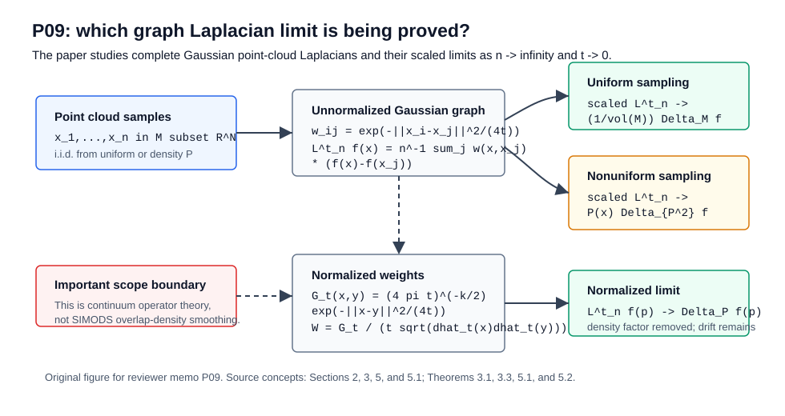

# Paper Review: Towards a Theoretical Foundation for Laplacian-Based Manifold Methods

Paper: Belkin, Mikhail, and Partha Niyogi, "Towards a Theoretical Foundation for Laplacian-Based Manifold Methods," Journal of Computer and System Sciences 74(8):1289-1308, 2008; DOI `10.1016/j.jcss.2007.08.006`. The cached PDF is an author-hosted preprint dated 23 April 2007.
Reviewer: Reviewer-P09
Auditor: Auditor-P09
Status: revised after audit
Date: 2026-05-15
Source manifest ID: P09
Canonical reading copy: `sources/pdf/P09_belkin_niyogi_theoretical_foundation_laplacian_manifold_methods.pdf`; SHA-256 `b9e24cc13c6ae9ae7077c415c8ae0e6bbb3b0c6761cc2ae3ed5fd983d571a650`; 29 pages; author-hosted PDF from `https://misha.belkin-wang.org/papers/TT_JCSS_08.pdf`.

## Whole-Paper Review

### Reader Background Needed

- `explicit` Graph Laplacians, weighted adjacency matrices, degree sums, and the idea that a graph Laplacian applied to a function compares `f(x_i)` with a weighted average of nearby values. Section 2, PDF p. 5, defines a complete weighted graph and the point-cloud Laplacian operator.
- `explicit` Riemannian manifolds embedded in Euclidean space, tangent spaces, geodesic distance, exponential coordinates, volume form, and the Laplace-Beltrami operator. Section 2, PDF pp. 3-5, introduces these objects; Section 4.1, PDF pp. 9-11, reviews geodesics, the exponential map, and chordal versus geodesic distance.
- `explicit` Heat kernels and the heat equation. Section 3.1, PDF pp. 7-9, explains that the heat operator on Euclidean space is Gaussian convolution and motivates the graph construction as an empirical heat-kernel approximation.
- `explicit` Probability convergence tools: law of large numbers, concentration inequalities, Hoeffding's inequality, convergence in probability, and uniform convergence over function classes. These are used in Section 4.2, PDF pp. 11-13; Section 6, PDF pp. 23-26; and Theorem 7.2, PDF p. 27.
- `explicit` Smoothness assumptions on functions and densities: \(C^\infty\) test functions for the main pointwise theorem, uniform derivative bounds up to order 3 for the uniform theorem, and a twice differentiable positive density for the normalized nonuniform theorem. See Theorems 3.1, 3.2, and 5.2.
- `contextual` Familiarity with Laplacian Eigenmaps, diffusion maps, spectral clustering, and manifold regularization helps place the paper historically, but the paper itself is about operator convergence rather than a new embedding or classifier.
- `contextual` A reader should know that different graph normalizations target different continuum operators. This is the main reason P09 matters for conductance/kernel comparisons: unnormalized and normalized weights can converge to different density-biased or density-corrected operators.

### What A Non-Expert Should Understand Before Reading This Paper

This paper addresses a basic justification problem behind Laplacian-based manifold learning. Many algorithms build a graph on sampled data and then use the graph Laplacian for embedding, clustering, semi-supervised learning, or smoothing. The graph is easy to compute, but the object one hopes to approximate is geometric: the Laplace-Beltrami operator on the unknown manifold from which the data were sampled. P09 proves that, under smooth manifold and bandwidth assumptions, a Gaussian-weighted point-cloud graph Laplacian converges to the relevant continuum differential operator.

The key construction is a complete weighted graph. Every sample point is connected to every other sample point, with weight

```text
w_ij = exp(-||x_i - x_j||^2 / (4t)).
```

Small `t` makes the graph local. Large `n` makes the empirical weighted average approximate an integral over the manifold. The scaled difference between `f(x)` and nearby weighted values behaves like the infinitesimal generator of heat diffusion, which is the Laplace-Beltrami operator. The mathematical work is needed because the data provide ambient Euclidean chord distances, while the manifold operator is intrinsic and depends on geodesic geometry.

For a nonuniform sampling density, the same unnormalized graph no longer isolates pure geometry. It converges to a density-weighted Laplacian. Section 5 then explains how normalizing by empirical local degrees can remove one density scaling and produce a different weighted Laplacian. This is the central warning for downstream use: "graph Laplacian" is not one object. The continuum limit depends on the weight kernel, the bandwidth, the sampling density, and the normalization.

### Problem And Context

`explicit` The introduction states the problem directly: manifold methods assume data lie on or near a low-dimensional submanifold, but in practice one has only a point cloud and constructs an adjacency graph as a proxy for the manifold; PDF pp. 1-2, Section 1. The paper seeks theoretical support for the intuition that graph-based inference corresponds to geometric inference on the underlying manifold.

`explicit` The paper focuses on graph-Laplacian methods used for "semi-supervised learning, clustering, data representation" and asks when the empirical graph Laplacian is related to the data-generating process; Abstract and Section 1, PDF pp. 1-2.

`explicit` The main contribution is an operator convergence result: under suitable assumptions, the graph Laplacian of a point cloud converges to the Laplace-Beltrami operator on the underlying manifold. The abstract identifies Theorem 3.1 as the first random graph Laplacian convergence result of this type in the machine-learning context; PDF p. 1.

`explicit` The paper grew out of analysis of Laplacian Eigenmaps and extends the COLT 2005 version with fuller uniform-convergence proofs and discussion of arbitrary sampling densities; Section 1.1, PDF pp. 2-3.

### Main Method

`explicit` The starting object is a compact smooth `k`-dimensional manifold `M` isometrically embedded in `R^N`; Section 2, PDF p. 3. The embedding induces a Riemannian metric and a canonical volume measure.

`explicit` The paper defines the positive-sign convention Laplace-Beltrami operator by `Delta_M f = -div(nabla_M f)`, and equivalently through the integration-by-parts identity in Equation (1), PDF p. 4:

```text
int_M h(x) Delta_M f(x) dmu(x)
  = int_M <nabla_M h(x), nabla_M f(x)> dmu(x).
```

`explicit` Given points `x_1,...,x_n`, the graph is complete and weighted by a Gaussian of ambient squared chord distance, Section 2, PDF p. 5:

```text
w_ij = exp(-||x_i - x_j||^2 / (4t)).
```

The associated matrix has off-diagonal entries `-w_ij` and diagonal entries `sum_k w_ik`.

`explicit` The matrix is extended to a point-cloud Laplace operator on any function, Section 2, PDF p. 5:

```text
L_n^t f(x)
  = (1/n) sum_j exp(-||x - x_j||^2/(4t)) (f(x) - f(x_j)).
```

The paper calls this the Laplacian associated with the point cloud.

`explicit` The continuous analog replaces the empirical measure by a measure `nu` on `M`, Section 2, PDF p. 5:

```text
L^t f(x)
  = f(x) int_M exp(-||x-y||^2/(4t)) dnu(y)
    - int_M f(y) exp(-||x-y||^2/(4t)) dnu(y).
```

Section 4.2 uses the scaled form

```text
L_t f(p)
  = 1 / (t (4 pi t)^(k/2))
    int_M exp(-||p-x||^2/(4t)) (f(x) - f(p)) dmu(x),
```

Equation (6), PDF p. 11, up to the paper's sign convention.

`explicit` The proof has two layers, described in Section 3 and Section 4.2. First, the empirical operator converges to the integral operator by law of large numbers and Hoeffding concentration. Second, the scaled integral operator converges to the Laplace-Beltrami operator as `t -> 0`; see PDF pp. 6 and 11-13.

`explicit` The geometric proof reduces the manifold integral to a small ball (Lemma 4.1, PDF p. 13), changes coordinates with the exponential map (Section 4.4, PDF pp. 14-15), uses chordal/geodesic distance agreement to fourth order (Lemma 4.3, PDF pp. 14-15), and analyzes the resulting Gaussian integral in `R^k` (Proposition 4.4, PDF pp. 16-17).

### Main Formulas And Operators

`explicit` Laplace-Beltrami variational identity, Equation (1), PDF p. 4:

```text
int_M h Delta_M f dmu = int_M <nabla_M h, nabla_M f> dmu.
```

This is the continuum smoothness operator that graph Laplacians are meant to approximate.

`explicit` Weighted Laplacian for a nonuniform measure `dnu = P dmu`, Section 2, PDF p. 4:

```text
Delta_{M,nu} f(x) = Delta_P f(x)
  = (1/P(x)) div(P(x) nabla_M f).
```

The paper later uses related density-weighted forms `Delta_{P^2}` and `Delta_P`; see Section 5, PDF pp. 18-23.

`explicit` Complete Gaussian graph kernel, Section 2, PDF p. 5:

```text
K_t(x_i, x_j) = exp(-||x_i - x_j||^2 / (4t)).
```

This is not a compact-support, epsilon-neighborhood, kNN, self-tuned, or conductance-from-length kernel. It is a full graph with rapidly decaying weights.

`explicit` Point-cloud Laplacian, Section 2, PDF p. 5:

```text
L_n^t f(x) = (1/n) sum_j K_t(x, x_j) (f(x) - f(x_j)).
```

On sample vertices this is the matrix graph Laplacian divided by `n`.

`explicit` Main uniform-density limit, Theorem 3.1, PDF p. 6:

```text
t_n = n^(-1/(k+2+alpha)), alpha > 0

1 / (t_n (4 pi t_n)^(k/2)) L_n^{t_n} f(x)
  -> (1/vol(M)) Delta_M f(x)
```

The convergence is in probability for a fixed smooth `f` and point `x`.

`explicit` Uniform-over-functions theorem, Theorem 3.2, PDF pp. 6-7, and Theorem 6.3, PDF p. 26: for an equicontinuous function class with uniform derivative bounds up to order 3, there exists `t_n -> 0` such that the scaled empirical operator converges uniformly over the class to `(1/vol(M)) Delta_M`.

`explicit` Nonuniform-density unnormalized limit, Theorem 3.3, PDF p. 7, and Theorem 5.1, PDF p. 19:

```text
scaled L_n^{t_n} f(x) -> P(x) Delta_{P^2} f(x)
```

Theorem 3.3 includes a `vol(M)` factor under its measure convention; Theorem 5.1 states the same density-biased phenomenon under the Section 5 convention.

`explicit` Normalized weights, Section 5.1, PDF p. 20:

```text
G_t(x, y) = (4 pi t)^(-k/2) exp(-||x-y||^2/(4t))

W(x, x_i) = (1/t) G_t(x, x_i)
            / sqrt(dhat_t(x) dhat_t(x_i)).
```

Here `d_t(x) = int_M G_t(x,y) P(y) vol(y)`, and `dhat_t` is its empirical estimate from the point cloud.

`explicit` Normalized limiting continuous operator, Section 5.1.1, PDF p. 20:

```text
L_t^P f(x)
  = (1/t) int_M G_t(x,y) / sqrt(d_t(x)d_t(y))
          (f(x)-f(y)) P(y) vol(y).
```

`explicit` Normalized nonuniform limit, Theorem 5.2, PDF p. 23: if `M` is compact without boundary, `P` is bounded above and below away from zero, and `P` is twice differentiable, then for some sequence `t_n`, the normalized empirical Laplacian converges in probability to `Delta_P f(p)`.

`explicit` Chordal/geodesic approximation, Lemma 4.3, PDF pp. 14-15:

```text
||x||^2_Rk - ||y-p||^2_RN = g(x), with |g(x)| = O(||x||^4).
```

This is the reason an ambient Gaussian kernel can approximate an intrinsic heat-kernel operator to the order needed for the Laplacian limit.

### Figures And Experiments

`explicit` Figure 1, PDF p. 10, is the only figure in the paper. It contrasts geodesic distance along the manifold with ambient chord distance. Its role is not empirical; it supports the proof intuition behind Lemma 4.3 by showing why `dist_M(x,y)` and `||x-y||` are close locally but conceptually different.

`explicit` The paper contains no experimental section, algorithms, result tables, or numerical comparisons. It is a theory paper about operator convergence. The examples and cited applications are contextual rather than empirically evaluated in this PDF.

`explicit` The paper has no tables in the canonical PDF.

`contextual` For the H005 review, Figure 1 is useful mainly as a reminder that the Gaussian weights use ambient chord distance while the limit operator is intrinsic. It is not a conductance, kernel-response, eigenvector, clustering, or smoothing result figure.

### Theoretical Claims

`explicit` Theorem 3.1, PDF p. 6, gives pointwise convergence in probability of the scaled Gaussian point-cloud Laplacian to \((1/\operatorname{vol}(M))\Delta_M f(x)\) under uniform sampling from a compact embedded manifold, \(f \in C^\infty(M)\), and \(t_n=n^{-1/(k+2+\alpha)}\).

`explicit` Theorem 3.2, PDF pp. 6-7, extends the uniform-density result to a function class with uniform derivative bounds up to order 3; the proof is completed as Theorem 6.3 in Section 6, PDF p. 26.

`explicit` Theorem 3.3, PDF p. 7, states that under arbitrary positive sampling density `P`, the same unnormalized graph Laplacian converges to a density-scaled weighted Laplacian rather than to the pure Laplace-Beltrami operator.

`explicit` Theorem 5.1, PDF p. 19, develops the nonuniform-density result in Section 5 and identifies the limiting operator as `P(x) Delta_{P^2} f(x)` under the Section 5 scaling convention.

`explicit` Section 5.1, PDF pp. 19-23, shows how normalizing weights by empirical local degree estimates changes the target operator. Theorem 5.2, PDF p. 23, proves convergence in probability to `Delta_P f(p)` under bounded positive twice differentiable `P`.

`explicit` Proposition 4.4, PDF pp. 16-17, is the core analytic step: after reducing the manifold integral to a local Euclidean Gaussian integral, the leading Taylor/Hessian term becomes `(1/vol(M)) Delta_M f(p)` while curvature and chordal-distance error terms vanish.

`explicit` Lemma 4.1, PDF p. 13, proves the Gaussian integral outside any open ball around `p` is exponentially negligible. This justifies localizing the manifold analysis.

`explicit` Lemma 4.2, PDF p. 14, states that in exponential coordinates at `p`, `Delta_M f(p)` equals the Euclidean Laplacian of the coordinate representation at the origin.

`explicit` Lemma 4.3, PDF pp. 14-15, proves the fourth-order relationship between squared geodesic and chordal distances. This is a critical assumption bridge from observable ambient distances to intrinsic manifold geometry.

`explicit` Proposition 6.1, PDF pp. 23-24, gives uniform empirical convergence over an equicontinuous precompact function class by Arzela-Ascoli plus a finite-net/union-bound argument.

`explicit` Proposition 6.2, PDF pp. 24-25, gives uniform convergence of the continuous Gaussian operator to the Laplace-Beltrami operator over function classes with uniform derivative bounds up to order 3.

`contextual` The paper proves convergence of operators applied to smooth functions, not convergence of graph eigenvectors, eigenvalues, embeddings, classifiers, or graph-regularized estimators. Those spectral/algorithmic consequences require additional perturbation and statistical arguments.

### Limitations And Scope

`explicit` The primary theorem assumes a compact smooth embedded manifold and uniform sampling; Theorem 3.1, PDF p. 6. Boundary effects are not central in the main result, and Theorem 5.2 explicitly assumes a compact manifold without boundary, PDF p. 23.

`explicit` The test function in Theorem 3.1 is smooth (\(C^\infty\)), and uniform convergence requires bounded derivatives up to order 3; Theorems 3.1, 3.2, and 6.3, PDF pp. 6-7 and 26. This is not a result for arbitrary noisy graph signals.

`explicit` The graph is complete with Gaussian weights; Section 2, PDF p. 5. The paper does not prove the same theorem for sparse kNN graphs, mutual kNN graphs, epsilon graphs, conductance graphs, or self-tuned local bandwidths.

`explicit` The bandwidth sequence is theoretical. Theorem 3.1 fixes `t_n = n^(-1/(k+2+alpha))`; normalized Theorem 5.2 states existence of a sequence `t_n` rather than a practical rule; PDF pp. 6 and 23.

`explicit` For nonuniform sampling, the unnormalized Laplacian is density biased. Theorems 3.3 and 5.1 show convergence to `P(x) Delta_{P^2}`, not directly to `Delta_M`; PDF pp. 7 and 19.

`explicit` Normalization removes a scaling factor but still yields a weighted Laplacian `Delta_P`, not automatically the pure geometry operator. Section 5.1 says a different normalization can recover the Laplace-Beltrami operator, but this PDF outlines only the normalized-weight convergence to `Delta_P`; PDF pp. 19-23.

`explicit` The paper does not present finite-sample constants usable for tuning in an applied pipeline. Hoeffding bounds are used to prove convergence in probability, but the results are asymptotic and proof-oriented; Section 4.2 and Section 5.1.1, PDF pp. 12-13 and 20-21.

`contextual` The paper assumes noiseless samples on the manifold. It does not address off-manifold noise, finite-thickness data clouds, sample-dependent metric learning, graph disconnection, numerical conditioning of eigenvectors, or out-of-sample extension.

`derived` Because the proof relies on local Taylor expansions, compactness, smooth positive density, and a shrinking Gaussian scale, it should not be used as direct evidence that an arbitrary empirical graph smoother has a Laplace-Beltrami interpretation. It supports carefully matched kernel, bandwidth, density, and normalization choices.

### Historical / Methodological Importance

`explicit` The abstract and Section 1 claim the paper helps close the gap between "manifold-motivated" algorithms and explicit theoretical guarantees; PDF pp. 1-2.

`explicit` The paper is tied historically to Laplacian Eigenmaps and the COLT 2005 result, with later related developments by Lafon/Coifman, Hein/Audibert/von Luxburg, Singer, and others listed in Section 1.1; PDF pp. 2-3.

`contextual` For the H005 conductance/kernel-laplacian review, P09 supplies the clean conceptual bridge: a Gaussian edge kernel plus graph Laplacian can be understood as a finite-sample approximation to a continuum diffusion/Laplace operator, but only after specifying sampling, scaling, and normalization.

`contextual` P09 complements P08. P08 is more directly about graph Laplacian convergence varieties and consistency issues; P09 is the compact proof narrative that explains why the Gaussian/chordal-distance construction approximates the intrinsic operator in the first place.

## Conductance / Kernel Extraction

### Conductance, Affinity, Or Kernel Formula(s)

`explicit` Complete Gaussian affinity, Section 2, PDF p. 5:

```text
w_ij = exp(-||x_i - x_j||^2 / (4t)).
```

This is the paper's core graph weight. It is a radial kernel on ambient Euclidean chord distance with bandwidth parameter `t` and exponent denominator `4t`.

`explicit` Gaussian heat kernel normalization used for normalized weights, Section 5.1, PDF p. 20:

```text
G_t(x, y) = (4 pi t)^(-k/2) exp(-||x-y||^2/(4t)).
```

`explicit` Degree/density estimate, Section 5.1, PDF p. 20:

```text
d_t(x) = int_M G_t(x,y) P(y) vol(y)
dhat_t(x_i) = (1/(n-1)) sum_{j != i} G_t(x_i,x_j)
```

`explicit` Normalized affinity/operator weight, Section 5.1, PDF p. 20:

```text
W(x, x_i) = (1/t) G_t(x, x_i)
            / sqrt(dhat_t(x) dhat_t(x_i)).
```

`derived` The effective conductance for a graph-smoothing energy would be proportional to `w_ij` or to the normalized `W(x_i,x_j)`, depending on whether the graph uses the unnormalized or degree-normalized construction. P09 does not frame these weights as electrical conductances, but graph Laplacian off-diagonal weights play that mathematical role.

`contextual` The paper's kernel is global-support Gaussian. Any H005 "length/kernel-conductance" comparator using finite graph lengths, local neighborhoods, or self-tuned scales should be presented as a planned comparator inspired by this class of theory, not as the exact P09 construction.

### Graph, Laplacian, Or Diffusion Operator

`explicit` Matrix graph Laplacian, Section 2, PDF p. 5:

```text
(L_n^t)_{ij} = -w_ij for i != j
(L_n^t)_{ii} = sum_k w_ik
```

`explicit` Function-valued point-cloud Laplacian, Section 2, PDF p. 5:

```text
L_n^t f(x) = (1/n) sum_j w_t(x,x_j) (f(x) - f(x_j)).
```

`explicit` Functional approximation, Section 2 and Equation (6), PDF pp. 5 and 11:

```text
L^t f(x) = int_M w_t(x,y) (f(x) - f(y)) dnu(y)
```

with a scale factor `1/(t(4 pi t)^(k/2))` when taking the Laplace limit.

`explicit` Heat diffusion connection, Section 3.1, PDF pp. 7-9: the Euclidean heat operator is Gaussian convolution, and Equation (5), PDF p. 8, expresses the Laplacian as the small-time derivative of the heat flow:

```text
Delta f(x) = lim_{t -> 0} (1/t) (f(x) - H_t f(x)).
```

`derived` In graph-signal terms, the graph operator is a local averaging residual. Low values mean `f` is close to its kernel-weighted local average; large values mark high local curvature or high graph-frequency variation.

### Task

`explicit` The paper's task is theoretical operator approximation: prove convergence from a point-cloud graph Laplacian to a manifold differential operator. It is motivated by semi-supervised learning, clustering, and data representation, but it does not implement one of those tasks; Abstract and Section 1, PDF pp. 1-2.

`contextual` The closest task categories for H005 are graph signal smoothing and graph/manifold regularization, because the same weights enter penalties like `sum_ij w_ij (f_i-f_j)^2` and low-frequency Laplacian bases.

### Explicit Author Motivations

`explicit` The authors say most manifold algorithms are "manifold-motivated" and lack explicit theoretical guarantees; Abstract, PDF p. 1.

`explicit` They argue graph-theoretic techniques are justifiable only when related to the underlying data-generating process; Section 1, PDF p. 2.

`explicit` They state their main step toward a theoretical foundation: under conditions, the graph Laplacian is directly related to and converges to the Laplace-Beltrami operator; Section 1, PDF p. 2.

`explicit` They emphasize that the graph is an empirical object constructed from sampled data; Section 1, PDF p. 2. This is exactly the reason the proof combines probability and differential geometry.

`explicit` They motivate arbitrary-density analysis because practical samples need not be uniform on the manifold; Section 3, PDF p. 7, and Section 5, PDF p. 18.

`explicit` They motivate normalized weights because the unnormalized operator under nonuniform sampling is multiplied by the density; Section 5.1, PDF p. 19.

### Derived Or Implied Motivations

`derived` The paper implicitly motivates kernel-conductance design by showing that the choice of edge weight is not merely numerical: it selects the continuum differential operator being approximated.

`derived` The paper motivates density correction when the sampling density is a nuisance rather than the target geometry. Theorem 3.3 and Section 5.1 show that unnormalized graphs mix geometry and sampling density.

`derived` The proof motivates using ambient distances only at sufficiently local scales. Lemma 4.3 makes chordal distance safe asymptotically because local chordal and geodesic squared distances differ only at fourth order.

`derived` The paper motivates treating bandwidth as part of the statistical model. The limit needs both `n -> infinity` and `t -> 0`; fixed or poorly scaled bandwidths are different regimes.

### Effect On Eigenfunctions / Diffusion / Smoothing

`explicit` Section 2, PDF p. 4, notes that eigenfunctions of the Laplace-Beltrami operator form a basis for `L^2(M)` and gives the circle/Fourier harmonics example. This is the continuum spectral foundation behind Laplacian Eigenmaps and graph spectral smoothing.

`explicit` Section 3.1, PDF pp. 7-9, ties the Laplacian to heat diffusion: the heat operator smooths a function by Gaussian averaging, and the Laplacian is the infinitesimal generator of that smoothing.

`contextual` If graph Laplacian operators converge to continuum Laplacians, then low graph frequencies can be interpreted as discrete approximations to smooth manifold modes. P09 does not itself prove eigenvector convergence, so this interpretation should be treated as contextual.

`derived` In smoothing language, `L_n^t f` measures how much a value differs from its local Gaussian average. Penalizing `f^T L f` suppresses local variation across high-weight edges, which approximates intrinsic smoothness only under compatible sampling, bandwidth, and normalization.

### Relationship To Adaptive-Scale Graph Construction

`explicit` P09 does not propose adaptive or self-tuned bandwidths. The main kernel has a single global bandwidth `t`; Section 2, PDF p. 5.

`explicit` The normalization in Section 5.1 is degree/density normalization, not local bandwidth adaptation. It uses `dhat_t(x)` estimates with the same global `t`; PDF p. 20.

`contextual` P09 is foundational for later adaptive-scale work because it shows what a clean global Gaussian limit looks like. Adaptive-scale comparators should cite P09 as baseline theory and use P04/P10-style sources for variable-bandwidth or kNN self-tuned guarantees.

`derived` For SIMODS planned length/kernel-conductance comparators, P09 supports the idea that a kernel of local distance can define a meaningful Laplacian smoother. It does not by itself determine the right local scale, neighbor truncation, or density correction for SIMODS data.

### What The Paper Does Not Claim

`explicit` It does not claim convergence for Laplacian eigenvectors or eigenvalues. The related non-geometric spectral convergence work is mentioned in Section 1.1, PDF p. 3, but P09's theorems are operator-on-function convergence statements.

`explicit` It does not present a new semi-supervised learning algorithm, classifier, clustering algorithm, or embedding method. It provides theory for a class of Laplacian-based methods; Abstract and Section 1, PDF pp. 1-2.

`explicit` It does not analyze sparse kNN/self-tuned graphs. The graph in Section 2 is complete with Gaussian weights; PDF p. 5.

`explicit` It does not solve practical bandwidth selection. The theorem gives asymptotic scaling or existence of a sequence; Theorems 3.1 and 5.2, PDF pp. 6 and 23.

`explicit` It does not prove that unnormalized graphs recover pure geometry under nonuniform sampling. In fact, Theorems 3.3 and 5.1 show density-weighted limits; PDF pp. 7 and 19.

`derived` It does not validate current `fit.rdgraph.regression()` overlap-density smoothing semantics as a Laplace-Beltrami-consistent method. Any such claim would require matching the actual SIMODS weights, graph construction, normalization, and data-generating assumptions to the P09 hypotheses.

### Relevance To gflow / SIMODS

`contextual` P09 is useful for SIMODS as baseline theory for graph Laplacian smoothing based on kernel weights. If planned length/kernel-conductance comparators use edge conductances of the form `exp(-length^2/(4t))` or a normalized heat-kernel analog, P09 supplies the continuum-operator interpretation to test against.

`derived` P09 suggests that a SIMODS kernel-conductance smoother should document four choices explicitly: the distance used in the kernel, the bandwidth schedule or selection rule, the sampling-density/degree normalization, and the target continuum operator or practical surrogate.

`derived` P09 warns that density is not an implementation detail. If SIMODS neighborhoods have variable sample density, unnormalized weights may smooth according to both geometry and density. Normalization may be needed if the desired comparator is geometric rather than density-aware.

`contextual` Current gflow overlap-density smoothing should remain distinct from planned length/kernel-conductance comparators. P09 studies Gaussian distance kernels and graph Laplacian limits, not overlap-density weights. It can help frame future comparators but should not be cited as evidence that the current overlap-density smoother has the same continuum limit.

`derived` For H005, the paper supports adding a "density sensitivity" diagnostic to comparator interpretation: if a method changes materially under degree normalization, the difference may reflect the operator distinction highlighted in Theorems 3.3, 5.1, and 5.2.

`contextual` Because the paper is asymptotic and assumes smooth manifolds, its role in SIMODS should be theoretical framing and comparator design, not a guarantee of finite-sample performance.

## Figure Handling

### Copied Paper Figures Used

Reproduced cropped figure panel for Figure 1 is managed by `paper_figure_screenshots.yml` and embedded in the generated HTML memo next to the primary figure description. This is an internal-review cropped figure panel from the canonical reading copy, not a manuscript-ready reused figure.

### Original Explanatory Figures Proposed Or Created

- `literature/conductance_kernel_laplacian_review/figures/P09_operator_limit_map.svg`
- Concept illustrated: the relationship among the complete Gaussian point-cloud Laplacian, the uniform-sampling Laplace-Beltrami limit, the nonuniform density-weighted limit, and the normalized-weight limit.
- Source references: Sections 2, 3, 5, and 5.1; Theorems 3.1, 3.3, 5.1, and 5.2.
- Purpose: original internal explanatory figure for keeping unnormalized and normalized operator targets distinct during H005 synthesis.



## Evidence Table

| Claim | Label | Source reference | Notes |
| --- | --- | --- | --- |
| The paper aims to justify Laplacian-based manifold methods by proving graph Laplacian convergence to manifold differential operators. | explicit | Abstract and Section 1, PDF pp. 1-2 | Central paper claim. |
| The graph is complete and uses Gaussian weights `exp(-||x_i-x_j||^2/(4t))`. | explicit | Section 2, PDF p. 5 | Not kNN, not self-tuned. |
| The point-cloud operator divides the graph Laplacian action by `n` and extends it to arbitrary `x`. | explicit | Section 2, PDF p. 5 | Important for scaling. |
| Under uniform sampling, the scaled point-cloud Laplacian converges in probability to `(1/vol(M)) Delta_M f`. | explicit | Theorem 3.1, PDF p. 6 | Fixed smooth function and fixed point. |
| Uniform convergence over a smooth bounded function class is proved. | explicit | Theorem 3.2, PDF pp. 6-7; Theorem 6.3, PDF p. 26 | Uses derivative bounds and equicontinuity. |
| Ambient chord distance is asymptotically good enough for intrinsic geometry because squared-distance error is fourth order. | explicit | Lemma 4.3, PDF pp. 14-15 | Core geometric bridge. |
| For nonuniform sampling, the unnormalized graph Laplacian converges to a density-weighted Laplacian, not pure `Delta_M`. | explicit | Theorem 3.3, PDF p. 7; Theorem 5.1, PDF p. 19 | Key density-bias warning. |
| Degree-normalized weights change the limit to `Delta_P` under smooth positive density assumptions. | explicit | Section 5.1 and Theorem 5.2, PDF pp. 19-23 | Normalization removes a density multiplier but does not necessarily produce pure geometry. |
| The paper proves operator convergence, not eigenvector/eigenvalue convergence. | explicit | Theorems 3.1, 3.2, 3.3, 5.1, 5.2; Section 1.1, PDF p. 3 | Spectral convergence is discussed as related work, not the result. |
| Figure 1 is the only figure and explains geodesic versus chordal distance. | explicit | Figure 1, PDF p. 10 | Internal-review cropped figure panel embedded in generated HTML. |
| P09 is relevant to SIMODS planned length/kernel-conductance comparators. | derived | Section 2 weights plus Theorems 3.1, 3.3, 5.2 | Applicability depends on matching graph construction and normalization. |
| P09 validates current gflow overlap-density smoothing. | uncertain | Not claimed in PDF | Keep separate from planned kernel-conductance comparators. |

## Open Questions For Auditor

- Confirm whether the memo should state both Theorem 3.3's `vol(M) P(x) Delta_{P^2}` scaling and Theorem 5.1's `P(x) Delta_{P^2}` scaling as convention-dependent, or whether the synthesis should standardize one measure convention.
- Check whether the normalized-weight discussion should mention the broader Coifman-Lafon alpha-normalization family from P03/P04, even though P09 itself only outlines the normalized construction needed for Theorem 5.2.
- Decide how strongly H005 should use P09 for planned SIMODS length/kernel-conductance comparators versus reserving finite-sample and adaptive-bandwidth claims for P08 and P10.
- Verify whether the original explanatory figure should remain SVG-only or be rendered to PNG for downstream manuscript assembly.

## Revision Notes

### Post-Audit Revision, 2026-05-15

- Auditor-P09 requested an explicit sign-convention note around Eq. (6). The
  final synthesis should state the paper's Laplacian sign convention before
  comparing Eq. (6) to graph-smoothing or heat-semigroup conventions.
- Resolve the density-scaling convention carefully: Theorem 3.3 and Theorem
  5.1 use different normalization contexts involving \(\mathrm{vol}(M)\).
  Do not collapse them into one density formula without preserving the theorem
  setting.
- Coifman-Lafon \(\alpha\) normalization should be treated as a contextual
  cross-reference here; detailed \(\alpha\)-normalization claims should be
  sourced to P03/P04.
- The SVG explanatory figure is fine for internal review. If used in the
  `pdflatex` final report, render it to PDF or PNG first.

- 2026-05-15: Reviewer-P09 created the memo from the canonical 29-page PDF, inspected Figure 1 visually, and added one original explanatory SVG figure.
