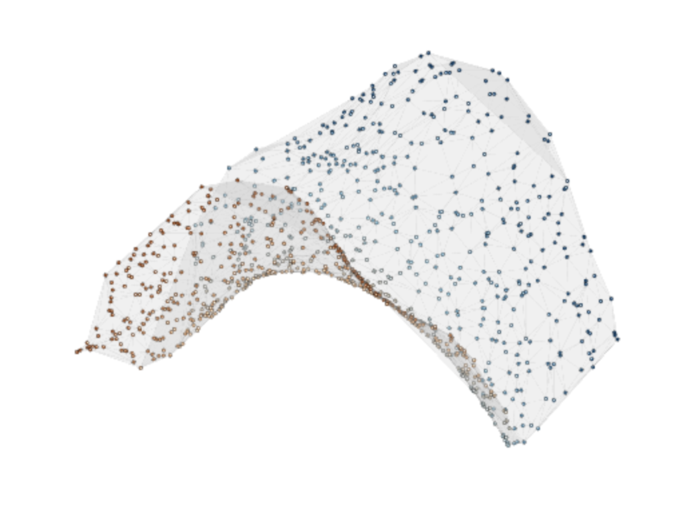

```{r setup, include=FALSE}
knitr::read_chunk("reproducibility/scripts/panel-e-workflow.R")
knitr::opts_chunk$set(
  collapse = TRUE,
  comment = "#>",
  echo = FALSE,
  fig.width = 7,
  fig.height = 4.5,
  fig.align = "center",
  out.width = "100%",
  message = FALSE,
  warning = FALSE
)

if (!requireNamespace("grip", quietly = TRUE) ||
    utils::packageVersion("grip") < "0.2.0") {
  stop("This article requires grip 0.2.0 or later.")
}
if (!requireNamespace("dgraphs", quietly = TRUE) ||
    utils::packageVersion("dgraphs") < "0.2.0") {
  stop("This article requires dgraphs 0.2.0 or later.")
}
if (!requireNamespace("igraph", quietly = TRUE)) {
  stop("This article requires igraph to render graph-path examples.")
}
if (!requireNamespace("png", quietly = TRUE)) {
  stop("This article requires png to include the supplied triangulated saddle views.")
}
suppressPackageStartupMessages(library(grip))

paper.table.colnames <- c(
  graph = "Graph",
  candidate = "Cand",
  method = "Meth",
  dim = "Dim",
  `n.vertices` = "nV",
  `n.edges` = "nE",
  `n.runs` = "Runs",
  `elapsed.sec.mean` = "Sec",
  `elapsed.sec.median` = "MedSec",
  `elapsed.sec.iqr` = "IQR",
  `score.composite` = "Comp",
  `sampled.stress` = "Stress",
  `sampled.stress.mean` = "Stress",
  `edge.length.cv` = "EdgeCV",
  `edge.length.cv.mean` = "EdgeCV",
  `sampled.nonedge.sep.ratio` = "NESR",
  `sampled.nonedge.sep.ratio.mean` = "NESR",
  `stability.procrustes.mean` = "PStab",
  `edge.crossings` = "Cross",
  `gkk.weighted.rel.rmse` = "GKK Rel",
  `gkk.mean.rel.path.error` = "Path Rel"
)

paper_table_caption <- function(title, abbreviations) {
  paste0(title, " Abbrev.: ", abbreviations)
}

html_attribute_escape <- function(x) {
  x <- gsub("&", "&amp;", x, fixed = TRUE)
  x <- gsub('"', "&quot;", x, fixed = TRUE)
  x <- gsub("<", "&lt;", x, fixed = TRUE)
  gsub(">", "&gt;", x, fixed = TRUE)
}

accessible_kable <- function(x,
                             caption,
                             alt,
                             row.names = FALSE,
                             align = NULL,
                             col.names = NULL,
                             digits = getOption("digits"),
                             position = "H",
                             latex_widths = NULL,
                             function_columns = integer(),
                             group_after = integer()) {
  args <- list(
    x = x,
    digits = digits,
    col.names = col.names,
    row.names = row.names,
    align = align,
    caption = caption,
    position = position
  )
  args <- Filter(Negate(is.null), args)
  if (knitr::is_latex_output()) {
    args$format <- "latex"
    args$booktabs <- TRUE
    args$vline <- ""
    args$linesep <- rep("", nrow(x))
    if (!is.null(latex_widths)) {
      stopifnot(length(latex_widths) == ncol(x),
                all(latex_widths > 0), abs(sum(latex_widths) - 1) < 1e-8)
      # Include intercolumn padding in the width budget; prose is ragged-right.
      args$align <- sprintf(
        ">{\\raggedright\\arraybackslash}p{\\dimexpr%.3f\\linewidth-2\\tabcolsep\\relax}",
        latex_widths
      )
      args$linesep[] <- "\\addlinespace[0.35em]"
    }
    if (length(group_after)) {
      stopifnot(all(group_after > 0), all(group_after < nrow(x)))
      args$linesep[group_after] <- "\\addlinespace[0.45em]"
    }
  }
  if (knitr::is_html_output()) {
    args$table.attr <- sprintf(
      'aria-label="%s"',
      html_attribute_escape(alt)
    )
  }
  out <- do.call(knitr::kable, args)
  if (knitr::is_latex_output() && length(function_columns)) {
    # Format only validated function lists, after kable has escaped the table.
    # Preserve commas and spellings while placing one function on each line.
    stopifnot(all(function_columns >= 1L), all(function_columns <= ncol(x)))
    for (column in function_columns) {
      prefix <- if (column == 1L) "\n" else " & "
      suffix <- if (column == ncol(x)) "\\\\" else " & "
      for (cell in unique(as.character(x[[column]]))) {
        functions <- strsplit(cell, ", ", fixed = TRUE)[[1L]]
        stopifnot(all(grepl("^[[:alpha:]][[:alnum:]_.]*\\(\\)$", functions)))
        escaped <- gsub("_", "\\_", functions, fixed = TRUE)
        formatted <- paste0("\\texttt{", escaped, "}", collapse = ",\\newline ")
        out <- gsub(
          paste0(prefix, gsub("_", "\\_", cell, fixed = TRUE), suffix),
          paste0(prefix, formatted, suffix), out, fixed = TRUE
        )
      }
    }
    class(out) <- "knitr_kable"
    attr(out, "format") <- "latex"
  }
  out
}

paper_kable <- function(x, caption, alt, digits = 3, group_after = integer()) {
  col.names <- unname(ifelse(
    names(x) %in% names(paper.table.colnames),
    paper.table.colnames[names(x)],
    names(x)
  ))
  align <- ifelse(vapply(x, is.numeric, logical(1)), "r", "l")
  accessible_kable(
    x,
    digits = digits,
    col.names = col.names,
    row.names = FALSE,
    align = align,
    caption = caption,
    alt = alt,
    position = "H",
    group_after = group_after
  )
}

find.extdata.file <- function(...) {
  rel.path <- file.path(...)
  candidates <- c(
    file.path("reproducibility", "precomputed", rel.path),
    system.file("extdata", rel.path, package = "grip"),
    file.path("..", "..", "..", "..", "inst", "extdata", rel.path),
    file.path("..", "..", "..", "inst", "extdata", rel.path),
    file.path("inst", "extdata", rel.path)
  )
  path <- candidates[file.exists(candidates)][1L]
  if (!length(path) || is.na(path) || !nzchar(path)) {
    stop("could not locate ", rel.path)
  }
  path
}

read.extdata.csv <- function(file.name) {
  utils::read.csv(find.extdata.file(file.name), stringsAsFactors = FALSE)
}

read.extdata.rds <- function(...) {
  readRDS(find.extdata.file(...))
}

# Load the supplied weighted-saddle and UMB-HMP results without recomputing them.
# File locations, checksums, reproduction commands, and script documentation
# are provided in reproducibility/README.md in the supplementary archive.
benchmark.results <- read.extdata.rds("vs_alternatives", "benchmark_results.rds")

plot_common_projection <- function(coords,
                                   edges,
                                   main,
                                   xlim,
                                   ylim,
                                   vertex.col = "black",
                                   cex = 0.55,
                                   edge.col = "gray82",
                                   edge.lwd = 1) {
  plot(
    coords[, 1], coords[, 2],
    type = "n", asp = 1, axes = FALSE,
    xlab = "", ylab = "", xlim = xlim, ylim = ylim,
    main = main
  )
  segments(
    coords[edges[, 1], 1], coords[edges[, 1], 2],
    coords[edges[, 2], 1], coords[edges[, 2], 2],
    col = edge.col, lwd = edge.lwd
  )
  points(coords[, 1], coords[, 2], pch = 16, cex = cex, col = vertex.col)
}

edge.matrix.from.adj <- function(adj.list) {
  edges <- list()
  idx <- 0L
  for (u in seq_along(adj.list)) {
    nbrs <- adj.list[[u]][adj.list[[u]] > u]
    for (v in nbrs) {
      idx <- idx + 1L
      edges[[idx]] <- c(u, v)
    }
  }
  do.call(rbind, edges)
}
```

# Introduction

Multidimensional scaling (MDS) begins with pairwise dissimilarities
$\Delta=(\delta_{ij})$ and seeks coordinates
$Z=\{z_1,\ldots,z_n\}\subset\mathbb{R}^m$ whose pairwise Euclidean distances
$D_Z=(d_{ij}^Z)$, with $d_{ij}^Z=\lVert z_i-z_j\rVert_2$, approximate them.
Stress-based formulations quantify the discrepancy between the input
dissimilarities $\Delta$ and the configuration distances $D_Z$
[@kruskal1964multidimensional]. The choice of input dissimilarities matters when
observations $X=\{x_1,\ldots,x_n\}\subset\mathbb{R}^p$ lie on a curved,
branching, or otherwise non-Euclidean structure: ambient straight-line
distances may then fail to capture the intrinsic distance structure
$D_X=(d_{ij}^X)$ underlying $X$. Isomap constructs a weighted
neighborhood
graph $G=(V,E,\ell)$ whose vertices correspond to the observations, uses its
shortest-path distance matrix $D_G=(d_{ij}^G)$ as an estimate of $D_X$, and
applies classical MDS to $D_G$ [@tenenbaum2000]. This $X\to G\to Z$ sequence
raises two fidelity questions: how well does $D_G$ approximate $D_X$, and how
faithfully does the embedding $Z$ represent $D_G$? The companion
\CRANpkg{dgraphs} package addresses the $X\to G$ question, while
\CRANpkg{grip} addresses the $G\to Z$ question. These two stages are
summarized below.

```{r two-stage-fidelity-diagram, echo=FALSE, results="asis"}
if (knitr::is_latex_output()) {
  cat(r"(
\begin{center}
\resizebox{0.92\linewidth}{!}{%
\begin{tikzpicture}[>=stealth]
  \node (Rp) at (0,1.20) {$\mathbb{R}^{p}$};
  \node at (7.4,1.20) {$p\gg m$};
  \node (Rm) at (14.8,1.20) {$\mathbb{R}^{m}$};

  \node (X) at (0,0) {$X$};
  \node (G) at (7.4,0) {$G$};
  \node (Z) at (14.8,0) {$Z$};

  \draw[right hook->] (X) -- (Rp);
  \draw[right hook->] (Z) -- (Rm);

  \draw[->] (X) -- (G)
    node[midway, above=0.06cm, align=center, font=\scriptsize,
         inner sep=0pt, text depth=0.22em]
      {\texttt{dgraphs}\\[-0.16em] construction and assessment}
    node[midway, below=0.10cm, font=\scriptsize, inner sep=0pt]
      {$D_X\ \text{versus}\ D_G$};

  \draw[->] (G) -- (Z)
    node[midway, above=0.06cm, align=center, font=\scriptsize,
         inner sep=0pt, text depth=0.22em]
      {\texttt{grip}\\[-0.16em] layout, scoring, and refinement}
    node[midway, below=0.10cm, font=\scriptsize, inner sep=0pt]
      {$D_G\ \text{versus}\ D_Z\ \text{or}\ D_{G,Z}$};
\end{tikzpicture}%
}
\end{center}
)"
  )
} else {
  cat("```{=html}\n")
  cat(r"{
<div style="margin: 1.2em auto; max-width: 920px;">
<svg viewBox="0 0 1200 170" role="img"
     aria-label="Data-to-graph and graph-to-embedding fidelity diagram"
     style="display: block; width: 100%; height: auto;">
  <defs>
    <marker id="grip-arrowhead" markerWidth="9" markerHeight="7"
            refX="8" refY="3.5" orient="auto" markerUnits="strokeWidth">
      <path d="M0,0 L9,3.5 L0,7" fill="none" stroke="currentColor"
            stroke-width="1.2"/>
    </marker>
  </defs>

  <g fill="currentColor" stroke="currentColor" stroke-width="1.3"
     font-family="serif">
    <path d="M48,111 L579,111" fill="none"
          marker-end="url(#grip-arrowhead)"/>
    <path d="M621,111 L1152,111" fill="none"
          marker-end="url(#grip-arrowhead)"/>
    <path d="M27,95 C27,102 20,102 20,95 L20,34" fill="none"
          marker-end="url(#grip-arrowhead)"/>
    <path d="M1179,95 C1179,102 1172,102 1172,95 L1172,34" fill="none"
          marker-end="url(#grip-arrowhead)"/>

    <g stroke="none" text-anchor="middle">
      <text x="20" y="22" font-size="22">ℝ<tspan dy="-7" font-size="14">p</tspan></text>
      <text x="600" y="22" font-size="22" font-style="italic">p ≫ m</text>
      <text x="1172" y="22" font-size="22">ℝ<tspan dy="-7" font-size="14">m</tspan></text>

      <text x="20" y="119" font-size="24" font-style="italic">X</text>
      <text x="600" y="119" font-size="24" font-style="italic">G</text>
      <text x="1172" y="119" font-size="24" font-style="italic">Z</text>

      <text x="310" y="74" font-size="15" font-family="monospace">dgraphs</text>
      <text x="310" y="95" font-size="16">construction and assessment</text>
      <text x="890" y="73" font-size="15" font-family="monospace">grip</text>
      <text x="890" y="94" font-size="16">layout, scoring, and refinement</text>

      <text x="310" y="140" font-size="17" font-style="italic">D<tspan baseline-shift="sub" font-size="12">X</tspan><tspan baseline-shift="baseline" font-style="normal"> versus </tspan>D<tspan baseline-shift="sub" font-size="12">G</tspan></text>
      <text x="890" y="140" font-size="17" font-style="italic">D<tspan baseline-shift="sub" font-size="12">G</tspan><tspan baseline-shift="baseline" font-style="normal"> versus </tspan>D<tspan baseline-shift="sub" font-size="12">Z</tspan><tspan baseline-shift="baseline" font-style="normal"> or </tspan>D<tspan baseline-shift="sub" font-size="12">G,Z</tspan></text>
    </g>
  </g>
</svg>
</div>
}"
  )
  cat("\n```\n")
}
```

Classical MDS in the context of graph embedding produces a coordinate map
$\phi:V\to\mathbb{R}^m$ and hence a configuration
$Z=\phi(V)\subset\mathbb{R}^m$, whose endpoint chords
$d_{ij}^{Z}=\lVert z_i-z_j\rVert_2$ approximate the entries $d_{ij}^G$.
However, the appropriate embedding criterion depends on which geometric
quantities must be preserved for the downstream analysis. Some downstream
analyses use graph or lineage paths to order observations and quantify
progression, as in trajectory and pseudotime analysis
[@haghverdi2016; @street2018; @wolf2019]. When such a path is retained after
embedding, the relevant comparison is whether its embedded length

$$
d_{ij}^{G,Z}
=
\sum_{(u,v)\in\gamma_{ij}}\lVert z_u-z_v\rVert_2,
$$

\noindent preserves its input-graph length $d_{ij}^G$, where $\gamma_{ij}$ is a
selected shortest path between vertices $i$ and $j$ in the input graph $G$.
The selected paths $\Gamma=\{\gamma_{ij}\}$, held fixed as $Z$ changes,
determine the embedded fixed-path distance matrix $D_{G,Z}=(d_{ij}^{G,Z})$.
A GMDS objective measures the
discrepancy between $D_G$ and $D_{G,Z}$ and seeks coordinates $Z$ for which the
selected paths' embedded lengths approximate their input-graph lengths.

Both criteria can be applied to coordinates produced by any layout method. A
practical GMDS-oriented workflow initializes the configuration with metric-MDS
and then applies edge-restricted Kamada--Kawai (edge-KK) refinement, using edge
fidelity as a surrogate for fixed-path loss. For larger graphs, metric-MDS can
become prohibitive because it computes an all-pairs graph-distance matrix and
then performs dense classical scaling. Graph dRawing with Intelligent Placement
(GRIP) avoids this dense all-pairs embedding step through multiscale placement
and localized refinement; for bounded-degree graphs, the original analysis
gives near-linear time and space up to logarithmic factors after the filtration
has been constructed [@gajer2004]. The edge-length-aware implementation can
therefore provide a practical initial configuration before edge-KK refinement,
although its computational cost depends on the neighborhoods explored by the
weighted shortest-path searches, as analyzed in Supplement S1.
GRIP constructs a hierarchy of maximal independent sets, places
vertices from coarse to fine resolution, and refines the layout locally at each
level. Figure \@ref(fig:trace) illustrates this construction through four states
returned by `trace.grip()`.

```{r trace, fig.cap="Coarse-to-fine construction in the GRIP algorithm, recorded by trace.grip() for a 6x6 mesh. The panels show the coarsest initialization, an early intermediate state, a late intermediate state, and the final layout.", fig.alt="Four panels showing the GRIP algorithm placing and refining a mesh from a sparse coarse configuration to a regular grid-like final arrangement.", fig.width=10, fig.height=2.8, fig.pos="H"}
trace.edges <- edges.mesh(6, 6)
trace.solve <- trace.grip(
  trace.edges, n = 36, dim = 2,
  preset = "mesh", seed = 31,
  metric = "hop",
  trace = "level"
)

frame.idx <- unique(c(
  1L,
  max(2L, floor(length(trace.solve$frames) / 3)),
  max(3L, floor(2 * length(trace.solve$frames) / 3)),
  length(trace.solve$frames)
))

labels <- c("Coarsest start", "Early refinement", "Late refinement", "Final layout")
op <- par(mfrow = c(1, 4), mar = c(1, 1, 2.5, 1))
for (i in seq_along(frame.idx)) {
  coords <- trace.solve$frames[[frame.idx[i]]]
  active <- complete.cases(coords[, 1:2])
  xy <- coords[active, 1:2, drop = FALSE]
  active.edges <- trace.edges[active[trace.edges[, 1]] & active[trace.edges[, 2]], , drop = FALSE]

  xlim <- range(xy[, 1])
  ylim <- range(xy[, 2])
  xpad <- max(0.08 * diff(xlim), 0.2)
  ypad <- max(0.08 * diff(ylim), 0.2)

  plot(xy[, 1], xy[, 2], type = "n", asp = 1, axes = FALSE,
       xlab = "", ylab = "",
       xlim = xlim + c(-xpad, xpad),
       ylim = ylim + c(-ypad, ypad),
       main = labels[i])
  if (nrow(active.edges) > 0) {
    segments(
      coords[active.edges[, 1], 1], coords[active.edges[, 1], 2],
      coords[active.edges[, 2], 1], coords[active.edges[, 2], 2],
      col = "gray82"
    )
  }
  points(xy[, 1], xy[, 2], pch = 16, cex = 0.6)
}
par(op)
```

The refinement is computationally localized rather than global: intermediate
filtration levels use Kamada--Kawai (KK)-style forces over restricted
neighborhoods, and the final level uses Fruchterman--Reingold refinement
[@gajer2002; @kamada1989; @fruchterman1991]. GRIP belongs to a broader
multilevel graph-drawing tradition. Related methods construct coarse graph
hierarchies by matching, clustering, or graph-distance sampling and then refine
layouts from coarse to fine resolution [@harel2002; @walshaw2003; @hachul2005;
@hu2005].

Within the R ecosystem, \CRANpkg{igraph} and \CRANpkg{graphlayouts}
implement broad collections of graph-layout algorithms [@csardi2006;
@igraph2026; @schoch2023], while \CRANpkg{ggraph} provides additional layouts
and a common visualization interface to algorithms from both packages
[@pedersen2025]. The \CRANpkg{grip} package complements these tools with an
R implementation of multiscale GRIP, extending the original algorithm to
allow supplied edge lengths, rather than fixed unit lengths, to influence
candidate generation [@gajer2002]. It also provides reproducible assessment
of coordinates generated by \CRANpkg{grip} or other software. Its experimental
GMDS functions provide fixed-path losses and refinement methods for studying
graph-geodesic fidelity.

# Package overview

The \CRANpkg{grip} package provides functions for generating, assessing, and
refining graph embeddings. It accepts graphs as two-column integer edge
matrices, with an optional edge-length vector, or as adjacency lists,
optionally accompanied by corresponding lists of edge lengths.

## Multiscale layout functions and supporting tools

The multiscale algorithms are implemented in C++ and called from R through Rcpp
[@eddelbuettel2011]. Two functions provide the main multiscale layouts:
`grip()` returns an $n \times m$ numeric coordinate matrix, whereas
`trace.grip()` returns the final coordinates together with intermediate
coarse-to-fine layouts and diagnostics. Both functions use $m\in\{2,3\}$;
`weighted.grip.nd()` and selected GMDS methods support any $m\geq 2$. The
multiscale layout computation is serial.

Higher-dimensional layouts can also be useful when the final display is two-
or three-dimensional. The original GRIP study reported improved smoothness and
symmetry after projecting higher-dimensional layouts [@gajer2004].
Figure \@ref(fig:mobius-dimension) illustrates this approach with the current
implementation: the projected four-dimensional layout has a somewhat smoother
appearance in this example, although projection also changes edge lengths.
Supplement S2 shows the comparison at three graph sizes and gives the
construction and projection details.

```{r mobius-data, include=FALSE}
source("reproducibility/scripts/mobius-dimension-comparison.R", local = TRUE)
mobius.example <- mobius_compute(50L, 6L)
```

```{r mobius-dimension, echo=FALSE, fig.cap=sprintf("Direct three-dimensional layout and a four-dimensional layout projected to three dimensions for the same 300-vertex Möbius-strip graph. Both use weighted.grip.nd() with unit edge lengths, the same refinement settings, and seed 1. The four-dimensional coordinates are projected onto their first three principal components, retaining %.1f%% of the 4D coordinate variance. For display, both configurations are centered, scaled to unit root-mean-square radius, orthogonally aligned to a common reference, and viewed from the same direction. Thicker blue edges mark the strip boundary.", 100 * mobius.example$retained.variance), fig.alt="Side-by-side Möbius-strip drawings show a direct three-dimensional layout and a four-dimensional layout projected to three dimensions by PCA. The projected drawing has a subtly smoother twist. The thicker boundary curve is blue in both panels.", fig.width=8, fig.height=3.5, out.width=if (knitr::is_latex_output()) "80%" else "100%", fig.pos="H"}
# PDF output is tightly cropped; its narrower inclusion preserves the band size.
mobius_draw_pair(mobius.example)
```

Both functions use the `metric` argument to specify the graph geometry.
`metric = "hop"`, the default, treats every edge as one step. With
`metric = "edge_length"`, supplied edge lengths affect the optimization.

For a bounded-degree graph with $n$ vertices, the published analysis of the
original hop-distance algorithm gives $\Theta(nk^2)$ time and $\Theta(nk)$
space after construction of the filtration, where $k=\log\delta(G)$ for a
maximal-independent-set filtration and $k=\log n$ for a graph-centers
filtration, with $\delta(G)$ the unweighted graph diameter [@gajer2004]. The
filtration uses partial breadth-first searches whose cost depends on the
neighborhoods explored; no subquadratic worst-case construction bound was
established [@gajer2002].

The edge-length-aware implementation instead uses weighted shortest-path
searches. Under the bounded-degree, geometric-coverage, and hierarchy
conditions stated in Supplement S1, its radius limits and early stopping yield
a conditional $O(n\log^2 n)$ expected-time bound with fixed tuning parameters
and $O(n)$ peak memory. The expectation concerns sampled repulsion, and the
bounds exclude optional GMDS refinement. These conditions need not hold for an
arbitrary weighted graph; Supplement S1 gives the complete assumptions and a
counterexample when coverage fails.

The main layout settings are dimension, initialization
placement, the number of multiscale and final refinement rounds, local
neighborhood size, repulsion strength, and the random seed. For edge-length
layouts, `metric_neighbor_cap` limits insertion-neighborhood searches but does
not limit filtration construction or the initial full searches. For a
disconnected input, `grip()` lays out each connected component separately and
then places the component layouts together in the returned coordinate matrix;
it does not add edges between components. `trace.grip()` requires a connected
graph. When a connected data-derived graph is required, several
\CRANpkg{dgraphs} constructors can optionally add MST bridge edges between
components with `connect.components = TRUE` [@gajer2026dgraphs]. Those bridges
change the graph geometry and should be treated as an explicit construction
choice.

The package also supplies graph generators for regular grids, trees, recursive
families such as Sierpinski carpets, and weighted geometric surfaces. These
generators support examples, tests for unintended changes in results, and
controlled benchmarks.
Family-specific presets provide reproducible starting values for several of
these controlled graph classes. Hop-metric presets cover meshes, carpets,
trees, and tori, while edge-length presets cover cylinders, spheres, and other
weighted geometric families.
Supplement S3 reports a controlled comparison of these presets and lists the
method families and their principal functions.

## From graph layout to graph-geodesic fidelity

\Needspace{6\baselineskip}
Kruskal's Stress-1, shown here in its metric-MDS form
[@kruskal1964multidimensional], compares input dissimilarities $\delta_{ij}$
with ambient chord distances:

$$
\operatorname{Stress}_1(\Delta, D_Z)
=
\sqrt{
  \frac{\sum_{i<j}(d_{ij}^Z-\delta_{ij})^2}
       {\sum_{i<j}(d_{ij}^Z)^2}
}.
$$

The fixed-path GMDS criterion implemented in \CRANpkg{grip} instead compares
graph distances with the embedded lengths of the corresponding fixed
geodesics. At identity scale, its target-normalized fixed-path relative RMSE is

$$
\operatorname{RelRMSE}^{\mathrm{path}}(D_G, D_{G,Z}\mid\Gamma)
=
\sqrt{
  \frac{\sum_{i<j}(d_{ij}^{G,Z}-d_{ij}^G)^2}
       {\sum_{i<j}(d_{ij}^G)^2}
}.
$$

The difference between chord and fixed-path criteria is visible in a
three-leaf star (Figure \@ref(fig:star-path-geometry)). Placing two leaves on
opposite sides of their common center makes their endpoint chord equal the
two-edge graph distance. A noncollinear drawing can preserve the length of the
same two-edge route even when its endpoint chord is shorter. The central and
right panels test different geometric quantities.

```{r star-path-geometry, fig.cap="Endpoint and fixed-path views of a three-leaf star. The blue route between vertices 1 and 2 has graph length two. A collinear placement reproduces that value as an endpoint chord (middle), whereas a branched placement preserves the two-edge route length while its endpoint chord is shorter (right).", fig.alt="Three panels show a three-leaf star, a collinear placement where the chord between two leaves equals the graph distance, and a branched placement where the highlighted two-edge route retains its length but its endpoint chord is shorter.", fig.width=10, fig.height=3.1, fig.pos="H"}
star.edges <- rbind(c(4L, 1L), c(4L, 2L), c(4L, 3L))
star.input <- rbind(c(-0.85, 0.65), c(0.85, 0.65), c(0, -0.9), c(0, 0))
star.chord <- rbind(c(-1, 0), c(1, 0), c(0, 0.9), c(0, 0))
star.branch <- rbind(
  c(0, 1),
  c(cos(7 * pi / 6), sin(7 * pi / 6)),
  c(cos(11 * pi / 6), sin(11 * pi / 6)),
  c(0, 0)
)

draw.star.panel <- function(coords, title, chord = FALSE, annotation = NULL) {
  plot(
    coords[, 1], coords[, 2], type = "n", asp = 1, axes = FALSE,
    xlab = "", ylab = "", xlim = c(-1.35, 1.35), ylim = c(-1.2, 1.25),
    main = title
  )
  segments(
    coords[star.edges[, 1], 1], coords[star.edges[, 1], 2],
    coords[star.edges[, 2], 1], coords[star.edges[, 2], 2],
    col = "gray78", lwd = 1.5
  )
  segments(
    coords[c(1L, 4L), 1], coords[c(1L, 4L), 2],
    coords[c(4L, 2L), 1], coords[c(4L, 2L), 2],
    col = "#1F77B4", lwd = 3
  )
  if (isTRUE(chord)) {
    segments(
      coords[1L, 1], coords[1L, 2], coords[2L, 1], coords[2L, 2],
      col = "#C44E52", lwd = 2, lty = 2
    )
  }
  points(coords[, 1], coords[, 2], pch = 21, bg = "white", cex = 1.35)
  text(coords[, 1], coords[, 2], labels = c("1", "2", "3", "c"), cex = 0.75)
  if (!is.null(annotation)) {
    mtext(annotation, side = 1, line = -0.2, cex = 0.78)
  }
}

op <- par(mfrow = c(1, 3), mar = c(2.1, 0.7, 2.4, 0.7))
draw.star.panel(star.input, "Input graph path", annotation = "dG(1,2) = 2")
draw.star.panel(
  star.chord, "Endpoint chord", chord = TRUE,
  annotation = "||z1-z2|| = 2"
)
draw.star.panel(
  star.branch, "Embedded fixed path", chord = TRUE,
  annotation = expression(d[12]^{G*","*Z} == 2)
)
par(op)
```

\Needspace{9\baselineskip}

Preserving path lengths alone leaves freedom to change angles between edges.
For the three-vertex path $1-2-3$ with unit edge lengths, fixing
$z_2=(0,0)$ and $z_1=(1,0)$ while moving
$z_3=(\cos\theta,\sin\theta)$ preserves all input-path lengths for every
$\theta\in[0,2\pi)$. In particular,

$$
d_{13}^{G,Z}=1+1=2=d_{13}^G,
\qquad
d_{13}^Z=2\left|\sin\frac{\theta}{2}\right|.
$$

\noindent The unregularized fixed-path loss is therefore zero throughout this
family, although the endpoints coincide when $\theta=0$
(Figure \@ref(fig:path-angle-freedom)). The input vertices remain distinct:
their retained route traverses the overlapping segment out and back.

```{r path-angle-freedom, echo=FALSE, fig.cap="Fixed-path fidelity does not determine endpoint separation. A three-vertex path has two unit-length edges. Rotating one edge about the middle vertex preserves every input-path length, so the unregularized fixed-path GMDS loss is zero for every angle. Left: an acute angle between the two rays from vertex 2. Right: the degenerate configuration at $\\theta=0$, where vertices 1 and 3 coincide and the two edges overlap. The retained path still has length two. Such configurations motivate supplementing path-length fidelity with a term that discourages close Euclidean endpoint positions.", fig.alt="Two panels show the same two-edge path. The left panel has two unit-length blue edges meeting at vertex 2 at an acute angle theta, with a dashed red chord between vertices 1 and 3. The right panel has the endpoints at the same position and the two unit edges on the same segment. Both panels have fixed-path length two and zero unregularized fixed-path loss.", fig.width=10, fig.height=3.0, fig.pos="H"}
# Deterministic checks of all three pairs, including coincident endpoints.
path.angle.lengths <- vapply(seq(0, 2 * pi, length.out = 1001L), function(a) {
  z <- rbind(c(1, 0), c(0, 0), c(cos(a), sin(a)))
  edge.lengths <- sqrt(rowSums((z[c(1, 2), ] - z[c(2, 3), ])^2))
  c(edge.lengths, sum(edge.lengths))
}, numeric(3L))
stopifnot(max(abs(path.angle.lengths - c(1, 1, 2))) < 1e-12)

draw.path.angle <- function(angle, folded = FALSE) {
  z <- rbind(c(1, 0), c(0, 0), c(cos(angle), sin(angle)))
  plot(NA, asp = 1, xlim = c(-0.25, 1.45), ylim = c(-0.42, 1.22),
       xlab = "", ylab = "", axes = FALSE, xaxs = "i", yaxs = "i")
  title(if (folded) "Coincident endpoints" else "Variable angle", line = 0.3)
  segments(z[2, 1], z[2, 2], z[c(1, 3), 1], z[c(1, 3), 2],
           col = "#1F5A94", lwd = 3)
  if (!folded) {
    segments(z[1, 1], z[1, 2], z[3, 1], z[3, 2],
             col = "#C33C54", lty = 2, lwd = 1.8)
    arc <- seq(0, angle, length.out = 80L)
    lines(0.24 * cos(arc), 0.24 * sin(arc), col = "gray30")
    text(0.38 * cos(angle / 2), 0.38 * sin(angle / 2), expression(theta))
    text(0.53, -0.13, "1", col = "#1F5A94")
    text(z[3, 1] / 2 - 0.13, z[3, 2] / 2 + 0.05, "1", col = "#1F5A94")
    points(z, pch = 21, bg = "white", cex = 1.2, lwd = 1.2)
    text(z[1, 1] + 0.12, z[1, 2], expression(z[1]))
    text(z[2, 1] - 0.12, z[2, 2], expression(z[2]))
    text(z[3, 1], z[3, 2] + 0.13, expression(z[3]))
  } else {
    points(z[c(1, 2), ], pch = 21, bg = "white", cex = 1.2, lwd = 1.2)
    text(-0.12, 0, expression(z[2]))
    text(1, 0.19, expression(z[1] == z[3]))
    text(0.5, 0.42, expression(theta == 0))
    text(0.5, -0.16, "two overlapping unit edges", cex = 0.85)
  }
  mtext("Fixed-path length = 2; fixed-path loss = 0", side = 1,
        line = 0.6, cex = 0.85)
}
op <- par(mfrow = c(1, 2), mar = c(2.4, 0.5, 2.0, 0.5))
draw.path.angle(pi / 3)
draw.path.angle(0, folded = TRUE)
par(op)
```

To distinguish configurations with identical fixed-path loss but different
endpoint separation, one family of regularized GMDS objectives adds a
Euclidean dispersion term:

$$
F_\lambda(Z;G,\Gamma)
=
\sum_{i<j}(d_{ij}^{G,Z}-d_{ij}^G)^2
+\lambda R(Z),
\qquad
R(Z)=\sum_{i<j}f_r(d_{ij}^Z),
\quad \lambda>0,
$$

\noindent where $f_r$ is decreasing. Separately, the full geodesic KK (gKK) objective
applies Kamada--Kawai weights to fixed-path discrepancies:

$$
E_{\Gamma,L_0}^{\mathrm{gKK}}(Z)
=
\frac{1}{2}\sum_{i<j} k_{ij}
\bigl(d_{ij}^{G,Z}-L_0d_{ij}^G\bigr)^2,
\qquad
k_{ij}=\frac{K_0}{\max\{d_{ij}^G,\varepsilon_d\}^2}.
$$

Landmark geodesic KK (LGKK) evaluates selected local and landmark pairs rather
than all pairs. The edge-KK relaxation retains only single-edge paths:

$$
E_{K}^{\mathrm{edge}}(Z)
=
\sum_{(i,j)\in E} k_{ij}
\bigl(d_{ij}^{Z}-\ell_{ij}\bigr)^2.
$$

This edge relaxation has an exact connection to the fixed-path criterion at
zero loss. Because the stiffnesses $k_{ij}$ are positive,
$E_K^{\mathrm{edge}}(Z)=0$ implies $d_{ij}^Z=\ell_{ij}$ for every edge. For
any retained graph path $\gamma=(v_0,\ldots,v_q)$, its embedded and graph
lengths then satisfy

$$
d_\gamma^{G,Z}
=\sum_{r=1}^{q}d_{v_{r-1}v_r}^{Z}
=\sum_{r=1}^{q}\ell_{v_{r-1}v_r}
=d_\gamma^G.
$$

When $\gamma$ is the fixed graph shortest path between its endpoints,
$d_\gamma^G$ is their graph distance. Every residual in the fixed-path
relative RMSE is therefore zero for any selected path family $\Gamma$. The
same implication holds under a common fitted scale $L_0$: zero edge residuals
$d_e^Z-L_0\ell_e$ imply $d_\gamma^{G,Z}=L_0d_\gamma^G$ for every retained
path.

Away from zero, the objectives are not equivalent. With edge residual
$r_e=d_e^Z-L_0\ell_e$, edge-KK sums $k_e r_e^2$, whereas a path contributes
$(\sum_{e\in\gamma}r_e)^2$. The latter contains cross-products and implicitly
weights edges by their occurrence in $\Gamma$; errors can accumulate or cancel
along a path. Thus zero edge loss guarantees zero fixed-path loss, but when
exact preservation is unattainable, the edge objective is a surrogate and the
two minimizers need not coincide.

\Needspace{8\baselineskip}

An arbitrary common coordinate scale should not determine a comparison of
configuration shape. For each evaluated pair $p$, the graph distance $d_p^G$,
embedded path length $d_p^{G,Z}$, and Kamada--Kawai weight
$k_p=1/(d_p^G)^2$ define the profiled gKK scale $L_0$ as the minimizer of the
weighted squared discrepancy

$$
L_0
=\underset{L\geq 0}{\operatorname{argmin}}
\sum_p k_p\bigl(d_p^{G,Z}-L d_p^G\bigr)^2.
$$

\noindent Its closed-form value is

$$
L_0 = \frac{\sum_p k_p d_p^G d_p^{G,Z}}
           {\sum_p k_p (d_p^G)^2}.
$$

## Which criterion answers which question

Chord-based MDS and fixed-path GMDS assess different aspects of
graph-to-embedding fidelity. Both compare against the input graph distances
$D_G$, but chord criteria measure Euclidean endpoint distances, whereas
fixed-path criteria measure lengths along retained graph paths after
embedding. The corresponding loss functions considered here are

$$
\operatorname{Stress}_1(D_G,D_Z)
\qquad\text{and}\qquad
\operatorname{RelRMSE}^{\mathrm{path}}(D_G,D_{G,Z}\mid\Gamma).
$$

\noindent When used as optimization objectives, these losses are minimized
over the coordinates $Z$, with the input graph $G$ and path family $\Gamma$
held fixed.

Fixed-path GMDS provides a discrete counterpart to curve-length preservation
in Riemannian geometry. A smooth embedding
$f:(M,g)\rightarrow\mathbb{R}^m$ is Riemannian isometric when every piecewise
smooth curve $\gamma:[0,1]\rightarrow M$ satisfies

$$
L_g(\gamma)=L_{\mathrm{Euc}}(f\circ\gamma),
$$

\noindent where the left-hand side measures length using the Riemannian metric
$g$, while the right-hand side measures Euclidean arc length along the image
curve [@saucan2012]. Fixed-path GMDS makes the corresponding comparison for
selected graph paths, measuring their embedded lengths by summing the
Euclidean lengths of their constituent edges.

\Needspace{9\baselineskip}

For graph-distance inputs $D_G$, exact chord preservation for all vertex pairs
also preserves the embedded length of every retained graph shortest path.
Indeed, every edge $(u,v)$ on a shortest path $\gamma_{ij}$ is itself a
shortest path between its endpoints, so $d_{uv}^G=\ell_{uv}$. Consequently,

$$
d_{ij}^{G,Z}
=\sum_{(u,v)\in\gamma_{ij}}\lVert z_u-z_v\rVert_2
=\sum_{(u,v)\in\gamma_{ij}}d_{uv}^G
=\sum_{(u,v)\in\gamma_{ij}}\ell_{uv}
=d_{ij}^G.
$$

\noindent The converse does not hold: a path can retain its length while
bending so that its endpoint chord becomes shorter. Figure
\@ref(fig:path-angle-freedom) illustrates this freedom for a two-edge path,
and Figure \@ref(fig:noisy-circle-path-geometry) shows it in a data-derived
graph.

```{r noisy-circle-path-geometry, fig.cap="An embedding can preserve graph-path lengths exactly while the Euclidean chords between their endpoints remain shorter. Left: 120 observations sampled around a unit circle with truncated Gaussian radial offsets. Right: their connected symmetric 6NN graph drawn at the same coordinates, so $z_i=x_i$. The white endpoints are joined by one fixed graph shortest path (blue), whose embedded length exactly equals its input-graph length, and by their Euclidean chord (dashed red); the legend gives their lengths. The display compares two metrics on the same graph and embedding; it does not establish that a chosen neighborhood graph recovers latent geometry.", fig.alt="Two panels show a noisy circular point cloud and its symmetric six-nearest-neighbor graph. In the graph panel, which uses the identity embedding, two highlighted endpoints are joined by a thick blue graph shortest path around the circle and a dashed red Euclidean chord across the center. The graph path retains its input-graph length and is longer than the chord.", fig.width=10, fig.height=4.9, fig.pos="H"}
RNGversion("4.0.0") # Preserve this illustrative realization's RNG stream.
set.seed(20260830)
noisy.n <- 120L
noisy.theta <- sort(stats::runif(noisy.n, 0, 2 * pi))
noisy.radial.offset <- pmax(
  pmin(stats::rnorm(noisy.n, sd = 0.045), 0.126),
  -0.126
)
noisy.circle <- cbind(
  x = (1 + noisy.radial.offset) * cos(noisy.theta),
  y = (1 + noisy.radial.offset) * sin(noisy.theta)
)
noisy.graph <- dgraphs::create.sknn.graph(
  noisy.circle,
  k = 6,
  neighbor.method = "exact",
  connect.components = FALSE
)
stopifnot(noisy.graph$n_components_before == 1L)
noisy.edges <- dgraphs::convert.adjacency.to.edge.matrix(
  noisy.graph$adj_list
)$edge.matrix
noisy.from <- which.min(abs(noisy.theta))
noisy.to <- which.min(abs(noisy.theta - pi))
noisy.igraph <- dgraphs::as_igraph(noisy.graph)
noisy.path.vertices <- as.integer(igraph::shortest_paths(
  noisy.igraph,
  from = noisy.from,
  to = noisy.to,
  weights = igraph::E(noisy.igraph)$weight
)$vpath[[1L]])
noisy.path.edges <- cbind(
  noisy.path.vertices[-length(noisy.path.vertices)],
  noisy.path.vertices[-1L]
)
noisy.graph.distance <- dgraphs::graph.geodesic.distances(noisy.graph)[
  noisy.from,
  noisy.to
]
noisy.chord.distance <- sqrt(sum(
  (noisy.circle[noisy.from, ] - noisy.circle[noisy.to, ])^2
))

noisy.x.limits <- c(-1.25, 1.25)
noisy.y.limits <- c(-1.40, 1.20)
op <- par(mfrow = c(1, 2), mar = c(1.0, 1.2, 1.8, 1.0))
plot(
  noisy.circle,
  asp = 1,
  xlim = noisy.x.limits,
  ylim = noisy.y.limits,
  axes = FALSE,
  xlab = "",
  ylab = "",
  pch = 16,
  cex = 0.55,
  col = "#335C81"
)
title(main = "Noisy circular observations", line = 0.2)
symbols(
  0,
  0,
  circles = 1,
  inches = FALSE,
  add = TRUE,
  fg = grDevices::adjustcolor("#9AA7B1", alpha.f = 0.75),
  lwd = 1.2
)
text(
  0,
  -1.30,
  expression(paste("truncated radial Gaussian; ", sigma, " = 0.045")),
  cex = 0.9
)

plot(
  noisy.circle,
  asp = 1,
  xlim = noisy.x.limits,
  ylim = noisy.y.limits,
  axes = FALSE,
  xlab = "",
  ylab = "",
  type = "n"
)
title(main = "Symmetric 6NN graph: path versus chord", line = 0.2)
segments(
  noisy.circle[noisy.edges[, 1L], 1L],
  noisy.circle[noisy.edges[, 1L], 2L],
  noisy.circle[noisy.edges[, 2L], 1L],
  noisy.circle[noisy.edges[, 2L], 2L],
  col = grDevices::adjustcolor("#7E8790", alpha.f = 0.36),
  lwd = 0.7
)
segments(
  noisy.circle[noisy.from, 1L],
  noisy.circle[noisy.from, 2L],
  noisy.circle[noisy.to, 1L],
  noisy.circle[noisy.to, 2L],
  col = "#C33C54",
  lwd = 2,
  lty = 2
)
segments(
  noisy.circle[noisy.path.edges[, 1L], 1L],
  noisy.circle[noisy.path.edges[, 1L], 2L],
  noisy.circle[noisy.path.edges[, 2L], 1L],
  noisy.circle[noisy.path.edges[, 2L], 2L],
  col = "#1F5A94",
  lwd = 3.4
)
points(noisy.circle, pch = 16, cex = 0.48, col = "#335C81")
points(
  noisy.circle[c(noisy.from, noisy.to), , drop = FALSE],
  pch = 21,
  cex = 1.35,
  lwd = 1.1,
  bg = "#F7F7F7",
  col = "#1A1A1A"
)
legend(
  "bottom",
  inset = 0.03,
  legend = c(
    sprintf("fixed graph shortest path = %.2f", noisy.graph.distance),
    sprintf("Euclidean chord = %.2f", noisy.chord.distance)
  ),
  col = c("#1F5A94", "#C33C54"),
  lwd = c(3.4, 2),
  lty = c(1, 2),
  bty = "n",
  cex = 0.85
)
par(op)
```

Figure \@ref(fig:noisy-circle-path-geometry) illustrates an embedding that
preserves graph-path lengths exactly even though endpoint chords can be
shorter than the corresponding graph distances. The displayed observations
themselves give the identity embedding $z_i=x_i$ into $\mathbb{R}^2$. In that
embedding, the highlighted graph shortest path has exactly its input-graph
length. More generally, because
the graph uses Euclidean edge lengths from these coordinates,
$D_{G,Z}=D_G$ and fixed-path relative RMSE is zero for this identity embedding.
In this identity embedding, Euclidean endpoint distances cannot exceed the
corresponding graph distances and can be strictly shorter, as the highlighted
pair illustrates. The choice of graph-embedding loss should therefore reflect
the distances relevant to the analysis. Proximity and clustering analyses may
use either Euclidean distances between embedded points or graph shortest-path
distances. However, when an analysis depends on preserving the lengths of graph
or lineage paths after embedding, as can arise in trajectory and pseudotime
methods [@haghverdi2016; @street2018; @wolf2019], fixed-path fidelity provides
the relevant assessment. The worked example \emph{Linking the two fidelity
stages} below compares these criteria after calibrating graphs against a known
saddle surface.

# Assessing and refining candidate embeddings

Common diagnostics allow candidate coordinates to be compared across layout
methods, random seeds, and parameter choices. Selected candidates can then be
refined using a GMDS-oriented method.

## General layout diagnostics

`score.layout()` evaluates coordinates produced by `grip()` or another layout
method. It accepts graphs as edge matrices or adjacency lists and returns a
one-row data frame of diagnostics.

To assess distance fidelity without evaluating every vertex pair, the function
forms a set $S$ of unique unordered vertex pairs from random pair draws. The argument
`sample.size.stress` controls the number of draws. Setting `stress.seed` makes
the sample reproducible. For each pair $p=(i,j)\in S$, $d_p^G$ is its graph
shortest-path distance and $d_p^Z$ its Euclidean endpoint distance. After
fitting the common scale
$a_S=\sum_{p\in S}d_p^Zd_p^G/\sum_{p\in S}(d_p^G)^2$, the function reports the
scale-invariant discrepancy as `sampled.stress`:

$$
\operatorname{Stress}_S =
\sqrt{\frac{\sum_{p\in S}(d_p^Z-a_Sd_p^G)^2}
                 {\sum_{p\in S}(d_p^Z)^2}}.
$$

Complementary diagnostics describe visual properties of the configuration.

`edge.length.cv` is the standard deviation of embedded edge lengths divided by
their mean. It measures their uniformity, not agreement with supplied edge
lengths.

`sampled.nonedge.sep.ratio` is the minimum embedded separation among sampled
non-edge pairs divided by the median embedded edge length. The argument
`sample.size.nonedge` controls the pair sample. Setting `nonedge.seed` makes it
reproducible. For two-dimensional layouts, the argument `edge.crossings`
controls intersection counting between nonincident edges. Supplying `clusters`
additionally produces `cluster.separation`.

`compare.layouts()` generates layouts from the specifications in `candidates`
or `search`. It repeats each candidate over `seeds` and passes each layout to
`score.layout()`. Its `runs` data frame contains the diagnostics from
individual layouts, while `summary` contains their across-run summaries and
Procrustes stability. Setting `return.layouts = TRUE` also returns the
coordinate matrices.

## Graph-geodesic diagnostics and refinement

The package's principal functions can be combined in a
generate--assess--refine workflow: candidate coordinates are constructed,
evaluated using general and graph-geodesic diagnostics, and optionally refined.
Table \@ref(tab:assessment-functions) identifies the functions used at each
stage.

```{r assessment-functions, echo=FALSE}
assessment.functions <- data.frame(
  Task = c(
    "Generate candidate",
    "Assess layout",
    "Prepare graph paths",
    "Assess geodesic fidelity",
    "Prepare edge targets",
    "Evaluate regularization terms",
    "Refine candidate"
  ),
  Function = c(
    "grip()",
    "score.layout(), compare.layouts()",
    "prepare.geodesic.kk()",
    "score.gmds(), score.geodesic.kk()",
    "prepare.edge.kk()",
    "repulsive.state(), edge.repulsive.state()",
    "geodesic.kk(), landmark.geodesic.kk(), edge.kk()"
  ),
  check.names = FALSE
)

accessible_kable(
  assessment.functions,
  row.names = FALSE,
  align = c("l", "l"),
  latex_widths = c(0.34, 0.66),
  function_columns = 2L,
  caption = "Package functions in the candidate generation, assessment, and refinement workflow.",
  alt = paste(
    "Seven rows map multiscale generation, general scoring, all-pairs path",
    "preparation, graph-geodesic scoring, edge-only preparation, and",
    "GMDS regularization and refinement to grip functions."
  ),
  position = "H"
)
```

By default, `prepare.geodesic.kk()` retains one deterministic shortest path
per pair; an alternative option averages exactly over all shortest paths when
several have the same length.
`score.gmds()` provides the same set of diagnostics for any coordinate matrix on
a prepared graph. When paths have been prepared for all vertex pairs, it reports edge fidelity,
target-normalized fixed-path and chord relative RMSE, and distance-band
summaries. With the edge-only preparation returned by
`prepare.edge.kk()`, only edge diagnostics are available; the all-pairs
quantities are reported as unavailable. This distinction matters in practice:
edge-only assessment and refinement avoid a dense shortest-path matrix, whereas
the full path-based diagnostics retain substantially more information and have
correspondingly higher memory and runtime costs.

The `edge.kk()` function returns refined coordinates and diagnostic measures.
Its compiled optimizer accepts `n_threads` and uses at most two threads; its R
optimizer is serial.
When full all-pairs preparation is feasible,
`edge.kk(init = "metric_mds")` uses metric-MDS as an initializer before
edge-KK refinement. `edge.kk(init = "weighted_grip")` instead initializes from
the weighted-GRIP layout and avoids that all-pairs MDS step, providing an
alternative for larger weighted graphs.

The following example reproduces the metric-MDS and edge-KK configuration in
Figure \@ref(fig:saddle-calibration-layouts)E. It starts from the supplied
1,000-observation saddle sample and its selected graph ($k=73$); the worked
example below describes their construction and selection. Paths are prepared
once and retained for scoring both configurations. Refinement uses five
stages, each allowing 200 iterations.

```{r panel-e-input, echo=TRUE}
```

```{r panel-e-fit, echo=TRUE, eval=FALSE}
```

```{r panel-e-saved-scores, include=FALSE}
example.scores <- subset(example$scores, replicate == example$representative)
example.before <- subset(example.scores, method == "Metric MDS")
example.after <- subset(example.scores, method == "MDS + edge-KK")
stopifnot(nrow(example.before) == 1L, nrow(example.after) == 1L)
```

In the saved run, fixed-path relative RMSE decreased from
`r sprintf("%.3f", 100 * example.before$path_rel)`\% to
`r sprintf("%.3f", 100 * example.after$path_rel)`\%, and edge relative RMSE from
`r sprintf("%.3f", 100 * example.before$edge_rel)`\% to
`r sprintf("%.3f", 100 * example.after$edge_rel)`\%.
The article uses the supplied results during routine rendering; running the
displayed fitting and scoring code recomputes this single-graph example.

The \pkg{ivue} call below creates an interactive view of the refined
configuration. The supplied helper `panel.e.display()` applies its similarity
alignment, colors, and common display bounds.
The Delaunay triangles are fixed in the original parameter plane and carried
to the embedded coordinates; they are a visualization mesh, not the selected
skNN graph. Alignment is for display only, after scoring. Figure
\@ref(fig:panel-e-workflow-output) shows a static rendering of this output;
Supplementary Figure S4.1C adds the retained-path and endpoint-chord overlays.

```{r panel-e-view, echo=TRUE, eval=FALSE}
```

```{r panel-e-workflow-output, echo=FALSE, fig.cap="Representative three-dimensional configuration produced by the metric-MDS + edge-KK workflow (n = 1,000; k = 73). Colors encode the original x coordinate, from blue to brown. The fixed Delaunay triangulation of the original parameter coordinates is carried to the embedding to show its surface structure; it is a visualization mesh, not the skNN graph. Coordinates are similarity-aligned to the generating observations for display, after scoring. No retained path or endpoint chord is superimposed; the annotated comparison appears in the worked example below.", fig.alt="Large three-dimensional view of the metric-MDS plus edge-KK saddle configuration with colored points and a translucent triangular mesh.", out.width="100%", fig.align="center", fig.pos="H"}

```

# Worked examples

## Linking the two fidelity stages

As noted in the Introduction, candidate $X\to G$ constructions can be
evaluated on synthetic examples whose known intrinsic geometry represents
features relevant to the data class under study. We illustrate this calibration
strategy with the bounded saddle surface $z=0.8(x^2-y^2)$ over
$(x,y)\in[-1,1]^2$. From this surface, we drew five independent samples of
1,000 points, uniformly by surface area. For each sample,
\CRANpkg{dgraphs} constructed symmetric $k$-nearest-neighbor graphs with
Euclidean edge lengths, adding minimum-spanning-tree edges between components
when needed. Numerical geodesic distances on the bounded surface patch
provided a reference for $D_X$.

The $X\to G$ comparison used 119,744 distinct pairs per sample, obtained from
128 randomly selected source vertices. Graph and surface distances retained
their common physical units, without fitting a scale. The initial range
$k=3,\ldots,20$ gave boundary minima, as did an extension to 40; extending the
range to 80 gave interior minima at 71, 70, 67, 72, and 73
(Figure \@ref(fig:saddle-calibration-layouts)).
Surface-to-graph relative RMSE at these choices ranged from 0.203% to 0.217%.
Several neighboring values gave similar errors. Selection here uses the known
generating surface and its numerical reference; it is not a rule for choosing
$k$ when the underlying geometry is unknown.

On each selected graph, \CRANpkg{grip} generated three-dimensional metric-MDS
coordinates and refined them with edge-KK. The generating coordinates
provided a third configuration: because they realize every supplied Euclidean
edge length, their edge and fixed-path losses are zero. All three
configurations used the same retained input-graph shortest paths for all
499,500 unordered vertex pairs. Edge relative RMSE used all graph edges.
The graph-to-embedding statistics fitted their scales separately, following
the definitions above.

```{r saddle-pilot-data, include=FALSE}
source("reproducibility/scripts/plot-two-fidelity.R")
saddle.pilot <- read.extdata.rds("two-fidelity-saddle.rds")
saddle.reference <- read.extdata.rds("saddle-reference-diagnostics.rds")
stopifnot(nrow(saddle.pilot$scores) == 15L,
          nrow(saddle.pilot$curves) == 390L,
          saddle.pilot$provenance$sample_size == 1000L,
          saddle.pilot$provenance$embedding_dimension == 3L)
```

```{r saddle-calibration-layouts, fig.cap="Graph calibration and representative three-dimensional configurations for five independent saddle samples. A: surface-to-graph relative RMSE over the tested neighborhood sizes. B: enlargement near the minima, with a different vertical scale. Open circles mark within-sample minima. C--E: original coordinates, metric-MDS, and metric-MDS + edge-KK for cloud 5 (n = 1,000; k = 73), selected by median minimum surface-to-graph error, not by appearance. The layouts are similarity-aligned to the generating coordinates, with a common camera and scale. Colors encode original x, from blue to brown. The same Delaunay triangulation of the original parameter coordinates is carried to each layout; this visualization mesh is not the skNN graph. Blue marks a retained graph path and brown its endpoint chord. Graph fidelity scores precede display alignment. Supplement S4 provides interactive views.", fig.alt="Calibration curves and three aligned, triangulated 3D configurations of the same saddle sample.", fig.width=10.6, fig.height=7.1, fig.pos="H"}
plot_pilot_calibration_layouts(saddle.pilot)
```

Interactive versions of Figure \@ref(fig:saddle-calibration-layouts)C--E are
provided in Supplementary Figure S4.1A--C. Generating-surface overlays appear
in Figure S4.2A--C. Figure S4.3A--C compares the fitted configurations with
each other and with the generating saddle.

Edge-KK reduced edge and fixed-path relative RMSE in all five samples
(Figure \@ref(fig:saddle-pilot-scores)). Median fixed-path relative RMSE
decreased from 3.451% to 0.245%, and median edge relative RMSE from 7.133% to
0.382%. Median MDS Stress-1 increased from 3.459% to 4.715%; chord stress
increased in every sample. Thus refinement improved preservation of
graph-path lengths while worsening agreement between graph distances and
endpoint chords. All five stages of every edge-KK run reached their
200-iteration limit, so these are achieved losses, not established minima.
The improvement in path fidelity did not improve agreement with the
generating coordinates: median normalized Procrustes discrepancy increased
from 29.2% to 30.7%. Surface agreement gives a different comparison. After
the same similarity alignment, median symmetric surface RMS distance decreased
from 0.240 to 0.215 coordinate units. Coordinate error compares corresponding
observations, whereas surface distance compares locations on the two surfaces
without requiring vertex correspondence. The latter uses the fixed parameter-plane
triangulation and a refined reference over the same sampled footprint; the
original-coordinate mesh itself has a nonzero median discrepancy of 0.021
because it approximates the curved saddle by planar triangles. Supplement S3
defines these additional diagnostics and reports rigid-alignment results.

```{r saddle-pilot-scores, fig.cap="Graph fidelity and reference agreement across five independent clouds of 1,000 observations. Small dots represent clouds; thin lines join results on the same selected graph. Open circles and labels show medians. A--C use all graph pairs or edges with separately profiled scales. D reports coordinate RMSE divided by the reference RMS radius after similarity alignment. E reports symmetric surface RMS distance after that alignment, estimated with 8,000 area-uniform samples per direction; its original-coordinate baseline includes triangulation error. Units and vertical scales differ. All five clouds are shown without population confidence intervals.", fig.alt="Five paired-score panels distinguish graph-path fidelity, chord fidelity, corresponding-coordinate agreement, and symmetric surface distance.", fig.width=10.2, fig.height=7.1, fig.pos="H"}
plot_pilot_scores(saddle.pilot, reference=saddle.reference)
```

The separation of the two stages also appears at the sparse end of the
calibration range. At $k=3$, the repaired graphs had surface-to-graph errors
between 62.2% and 94.7%, although the original coordinates still preserved
every graph edge and retained path exactly. Connectivity and zero
graph-to-embedding path loss therefore do not establish surface-distance
fidelity. Supplement S3 shows this contrast and provides the numerical-reference
checks, additional-iteration results, and full experimental settings. The
figures here read supplied coordinates and scores; the supplementary archive
contains these inputs and scripts for repeating the experiment.

## Real-data network at package scale

```{r hmp-data, include=FALSE}
data(hmp.gc)
hmp.edges <- edge.matrix.from.adj(hmp.gc$adj_list)
```

The package includes a graph derived from the Ravel-led University of Maryland
Baltimore Human Microbiome Project (UMB-HMP), a longitudinal study in which
135 nonpregnant women of reproductive age were enrolled and asked to
self-collect vaginal swabs daily for ten weeks [@ravel2013daily]. This HMP
demonstration-project cohort is distinct from the NIH HMP healthy-reference
cohort. Later work identifies the longitudinal data as UMB-HMP and describes
the available profiles as V3--V4 16S rRNA data [@lee2023equilibrium]. The
processed data tables used here contain later Illumina profiles: before
preprocessing, eligible samples must have a `Project` value beginning with
`HMP` and a `16S_Platform` value equal to `Illumina`. Thus, the cited studies
establish the cohort and assay lineage; the supplementary input tables record
the exact 4,411 profiles used to construct the graph.

The 169 taxonomic features detected in at least 1% of the retained HMP samples
are converted to relative abundance, followed by a ten-component PCA. A
symmetric $k=3$ nearest-neighbor graph is constructed in that representation: an
undirected edge is present when either endpoint occurs among the other's three
nearest neighbors. Edge weights are Euclidean distances in the PCA
representation. The largest connected component contains 4,391 of the 4,411
eligible samples and 9,067 edges and is used without coarsening.

The supplementary archive contains the minimal UMB-HMP-only feature-count and
technical metadata tables, the graph-construction script, a list of included
features, checksums for verifying file integrity, and records of the data sources
and processing needed to reconstruct this graph. It also
contains the precomputed repeated-layout benchmark used below and the script
that generates it.

\Needspace{8\baselineskip}
Figure \@ref(fig:hmp-layouts) compares two topology-only layouts of the same
graph. Vertices are colored by their supplied community-state-type (CST) labels
only to make the displayed graph easier to inspect; the layouts were computed
without those labels.

```{r hmp-layouts, fig.cap="Topology-only layouts of the UMB-HMP graph provided with the package, colored by supplied community-state-type labels. The left panel shows default hop-metric GRIP and the right panel stress majorization. Each coordinate matrix is centered and scaled independently for display; CST labels are not layout inputs.", fig.alt="Two panels show the 4,391-vertex UMB-HMP graph with vertices colored by seven community-state-type labels. The left panel is a default hop-metric GRIP layout and the right panel is a stress-majorization layout. Both show the same color legend and graph topology.", fig.width=10, fig.height=4.5, fig.pos="H"}
hmp.cst <- as.character(hmp.gc$vertex_data$cst)
hmp.cst.levels <- c("I", "II", "III", "IV-A", "IV-B", "IV-C", "V")
hmp.cst.colors <- c(
  "I" = "#1B9E77", "II" = "#D95F02", "III" = "#7570B3",
  "IV-A" = "#E7298A", "IV-B" = "#66A61E", "IV-C" = "#E6AB02",
  "V" = "#A6761D"
)
hmp.layouts <- list(
  "Default GRIP (hop)" = benchmark.results$hmp$layouts[["grip default (hop)"]],
  "Stress majorization" = benchmark.results$hmp$layouts[["Stress (graphlayouts)"]]
)
hmp.display <- lapply(hmp.layouts, function(coords) {
  centered <- sweep(coords, 2, colMeans(coords), "-", check.margin = FALSE)
  centered / max(sqrt(rowSums(centered^2)))
})
hmp.coordinates <- do.call(rbind, hmp.display)
hmp.xlim <- range(hmp.coordinates[, 1])
hmp.ylim <- range(hmp.coordinates[, 2])
hmp.xpad <- 0.04 * diff(hmp.xlim)
hmp.ypad <- 0.04 * diff(hmp.ylim)

op <- par(mfrow = c(1, 2), mar = c(1, 1, 3, 1))
for (i in seq_along(hmp.display)) {
  plot_common_projection(
    hmp.display[[i]], hmp.edges, names(hmp.display)[i],
    xlim = hmp.xlim + c(-hmp.xpad, hmp.xpad),
    ylim = hmp.ylim + c(-hmp.ypad, hmp.ypad),
    vertex.col = unname(hmp.cst.colors[hmp.cst]),
    cex = 0.34
  )
  legend(
    "bottomleft", legend = hmp.cst.levels, col = hmp.cst.colors[hmp.cst.levels],
    pch = 16, cex = 0.72, bty = "n", ncol = 2
  )
}
par(op)
```

# Interoperability and computational scope

`score.layout()` can assess coordinates produced by any layout method, provided
that its rows correspond to the graph vertices. We demonstrate this
interoperability by applying the same scoring function to four two-dimensional
layouts of the UMB-HMP graph: Fruchterman--Reingold [@fruchterman1991] and DrL
from \CRANpkg{igraph} [@igraph2026], stress majorization [@gansner2005] from
\CRANpkg{graphlayouts}, and default hop-metric GRIP. All four layouts use only
the unweighted graph topology, and `score.layout()` evaluates them using hop
distance. This common protocol permits direct comparison of runtime and
diagnostics without assuming that edge weights have the same numerical meaning
across packages. The weighted workflow in the preceding section evaluates
edge-length geometry separately.

Each two-dimensional layout call is repeated five times with its random-number
seed reset to 1; Table \@ref(tab:hmp-runtime-benchmark) reports the median elapsed
time and interquartile range. R's `gc()` function is called before each timed run
to reclaim unused memory; layout scoring is also excluded from the
reported time. The common scoring function evaluates the coordinates from the
first repeat.

```{r hmp-runtime-benchmark}
hmp.scaled <- merge(
  benchmark.results$hmp$timing,
  benchmark.results$hmp$scores,
  by = "method",
  sort = FALSE
)
hmp.scaled <- hmp.scaled[, c(
  "method", "n.runs", "elapsed.sec.median", "elapsed.sec.iqr",
  "sampled.stress", "edge.length.cv",
  "sampled.nonedge.sep.ratio"
)]

paper_kable(
  hmp.scaled,
  caption = paper_table_caption(
    paste0(
      "Repeated two-dimensional topology-only layout benchmark on the HMP graph provided with the package (n = ",
      format(benchmark.results$hmp$n, big.mark = ","), ", m = ",
      format(benchmark.results$hmp$m, big.mark = ","), ")."
    ),
    "Runs = repeated layout calls; MedSec = median elapsed seconds; IQR = interquartile range; Stress = sampled stress; EdgeCV = edge-length coefficient of variation; NESR = sampled non-edge separation ratio, comparable here because every row uses the same graph and sampling protocol."
  ),
  alt = paste(
    "Four rows compare repeated runtime and common quality scores for",
    "Fruchterman-Reingold, DrL, stress majorization, and default grip on the",
    "4,391-vertex HMP graph. All methods and scores use the unweighted topology."
  ),
  digits = 3
)
```

The timing column measures candidate generation, while the adjacent columns
show the same diagnostic measures for every candidate. The
methods optimize different objectives, so the table is read as a runtime and
diagnostic profile rather than a single ranking.
Timings were recorded on `r benchmark.results$benchmark_metadata$hardware_model` with
`r format(as.numeric(benchmark.results$benchmark_metadata$memory_bytes) / 2^30, digits = 3)`
GiB of memory and CPU `r benchmark.results$benchmark_metadata$cpu`, using
`r benchmark.results$benchmark_metadata$r_version` and R's reference Basic
Linear Algebra Subprograms (BLAS) library.
These measurements describe the full 4,391-vertex component at one graph size;
they are not an empirical scaling study.

# Discussion

A low graph-geodesic loss establishes agreement with the supplied graph and
selected input paths; it does not establish that the graph faithfully represents
the geometry of the original data. That data-to-graph fidelity question belongs to
graph construction, for example through the tools in the companion
\CRANpkg{dgraphs} package. When a synthetic calibration family leaves several graph
constructors or parameter settings plausible, embedding assessment should be
repeated over that set rather than conditioned on a single nominal winner. Such
transfer remains conditional on how well the synthetic family represents the
topology, sampling process, and noise structure of the application.

The construction of $G$ need not begin with Euclidean distances. Given a
nonnegative, symmetric dissimilarity $\rho$, neighborhoods may be defined using
$\rho(x_i,x_j)$, with the same values assigned as graph edge lengths. For
relative-abundance data, for example, $\rho$ may be Jensen--Shannon distance
(the square root of Jensen--Shannon divergence) or another domain-appropriate
dissimilarity [@lin1991; @endres2003]. This choice changes the geometry
supplied by the $X\to G$ stage, but not the subsequent definitions of $D_G$,
$D_{G,Z}$, or the $G\to Z$ fidelity criteria.

The GMDS methods provide tools for investigating a supplied graph
metric, but no automatic rule for selecting among full, landmark, edge-only,
and multiscale strategies. The worked examples illustrate their use rather
than establish a general comparison of embedding methods.

This article describes \CRANpkg{grip} 0.2.0 and uses \CRANpkg{dgraphs} 0.2.0
in its examples. Extended worked examples are available in the \CRANpkg{grip}
vignettes and at <https://pgajer.github.io/grip/>.
The additional saddle-reference diagnostics use development commit
\texttt{b72f61d} of \pkg{grip}; the triangulated visualizations use
\pkg{ivue} commit \texttt{872f9d4}. These additions evaluate the saved
0.2.0 configurations without refitting them.

The smaller examples are evaluated from code in the manuscript. The
sampled-saddle experiment and UMB-HMP layouts and runtime benchmark use
precomputed results. The supplementary archive provides these results,
generation scripts, minimal UMB-HMP-only inputs, checksums, and records of data
sources and processing. Its README gives the exact package source versions and
instructions for reproducing the results.
Supplement S1 provides the weighted-GRIP computational complexity analysis and its LaTeX
source. Supplement S2 provides the full Möbius-strip layout comparison; its
figures are regenerated by the accompanying R script.
Supplement S3 gives the sampled-saddle protocol, numerical checks and additional
results, together with the executable circle example and fixed-grid saddle
comparison.
Supplement S4 provides self-contained interactive saddle views, including
fixed-triangulation views (Figure S4.1), generating-surface overlays
(Figure S4.2), and the refinement comparison (Figure S4.3).

Future work will connect the two transformations more systematically through a
two-dimensional experimental design: graph constructors and settings along one
axis, and embedding objectives and algorithms along the other. Evaluating this
design over controlled calibration families and multiple realizations can show
which conclusions are stable to uncertainty in the graph rather than merely
optimal for one selected construction. The current package provides the
layout, scoring, and refinement functions needed to carry out and reproduce those investigations
while keeping methodological claims separate from the established package
contribution.

# Acknowledgments

The GRIP algorithm was originally developed in collaboration with Stephen G.
Kobourov and Michael T. Goodrich. The microbial-network example provided with the package was
derived from the UMB-HMP longitudinal vaginal microbiome cohort
[@ravel2013daily; @lee2023equilibrium]. Research reported in this publication
was supported by grant number INV-048956 from the Gates Foundation.
